Spring Cloud Alibaba For MyShop


# 基于 Docker 安装MySQL

```yaml
version: '3.1'
services:
  db:
    # 目前 latest 版本为 MySQL8.x
    image: mysql
    restart: always
    environment:
      MYSQL_ROOT_PASSWORD: 123456
    command:
      --default-authentication-plugin=mysql_native_password
      --character-set-server=utf8mb4
      --collation-server=utf8mb4_general_ci
      --explicit_defaults_for_timestamp=true
      --lower_case_table_names=1
    ports:
      - 13306:3306
    volumes:
      - ./data:/var/lib/mysql
```

导入myshop.sql

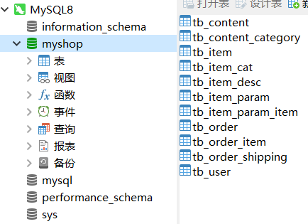


---


# 基于 Docker 安装 GitLab

## 1.docker启动gitlab

```yaml
version: '3'
services:
    web:
      image: 'twang2218/gitlab-ce-zh:10.5'
      restart: always
      # 也可以是域名
      hostname: '192.168.1.18'
      environment:
        TZ: 'Asia/Shanghai'
        # GITLAB_OMNIBUS_CONFIG在dockerfile中的env有定义
        GITLAB_OMNIBUS_CONFIG: |
          external_url 'http://192.168.1.18:28080'
          # ssh默认端口号是22
          gitlab_rails['gitlab_shell_ssh_port'] = 2222
          # 内部端口不需要管
          unicorn['port'] = 8888
          # nginx监听端口，被占用的话，需要修改
          nginx['listen_port'] = 18080
      ports:
      # 右边的端口号要与nginx['listen_port']一致
      # 左边与external_url的端口号对应
        - '28080:18080'
        - '9443:443'
        # 左边可能与gitlab_rails['gitlab_shell_ssh_port']有关系
        - '2222:22'
      volumes:
        - /home/jungle/docker/gitlab/config:/etc/gitlab
        - /home/jungle/docker/gitlab/data:/var/opt/gitlab
        - /home/jungle/docker/gitlab/logs:/var/log/gitlab
```

查看日志

```
docker logs -f 5ec306dc39fe
```

访问网址

```
192.168.1.18:28080
```


## 2.创建新用户

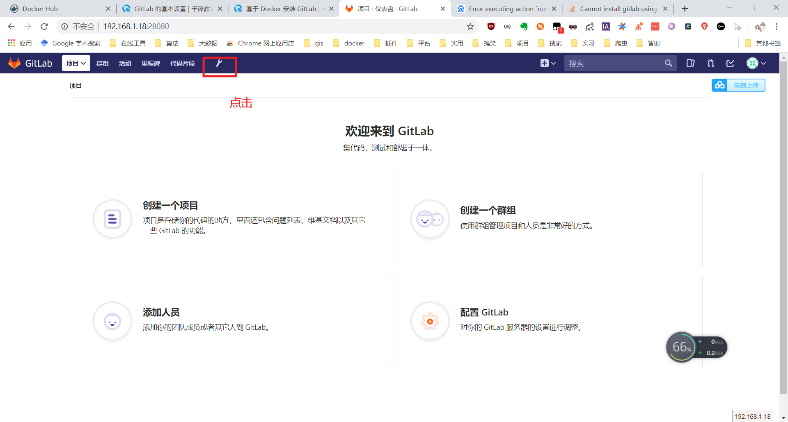

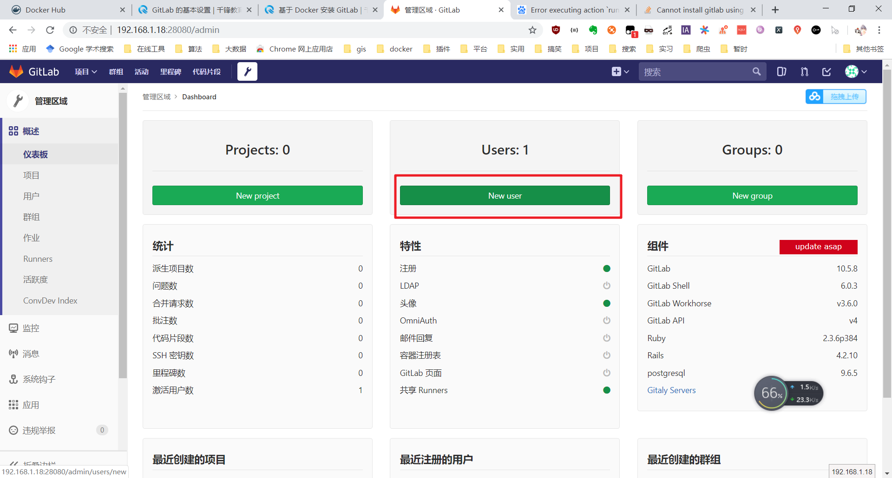

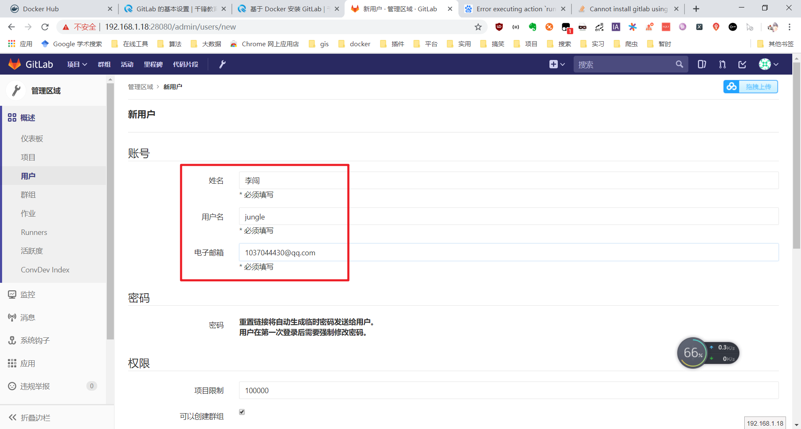

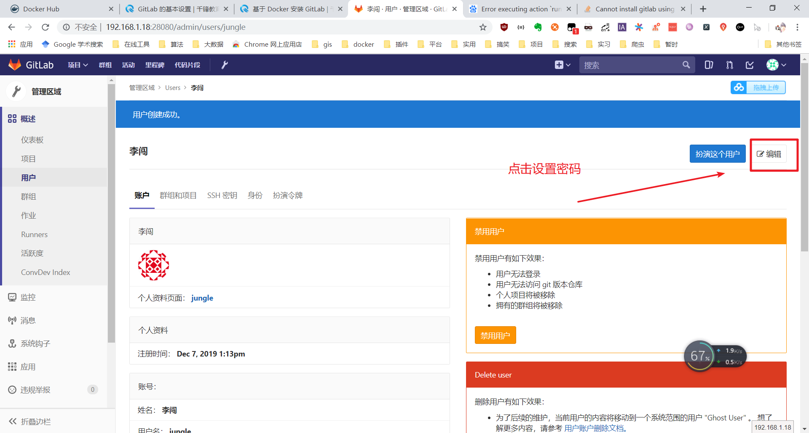

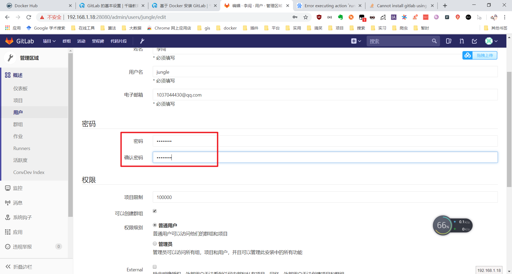

---

## 3. **使用 SSH免密登录**

生成 SSH KEY使用 ssh-keygen 工具生成，位置在 Git 安装目录下，我的是 C:\Program Files\Git\usr\bin

```
ssh-keygen -t rsa -C "1037044430@qq.com"
```

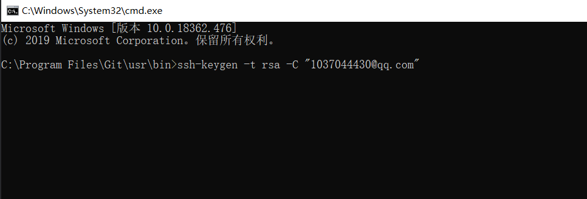

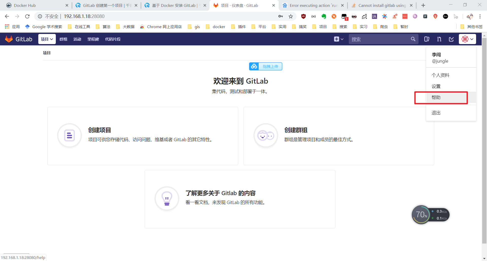

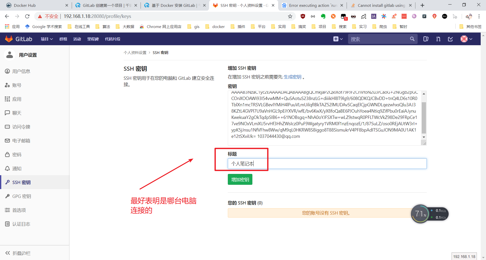

---

# 基于 Docker 安装 Nexus

```yaml
version: '3.1'
services:
  nexus:
    restart: always
    image: sonatype/nexus3
    container_name: nexus
    ports:
      - 18081:8081
    volumes:
      - /home/jungle/docker/nexus/data:/nexus-data
```

*注：* 启动时如果出现权限问题可以使用：`chmod 777 /home/jungle/docker/nexus/data` 赋予数据卷目录可读可写的权限

访问

```
192.168.1.18:18081
```

查看日志

```
docker-compose logs -f
```

---

第二种数据卷设置方式

```yaml
version: '3.1'
services:
  nexus:
    restart: always
    image: sonatype/nexus3
    container_name: nexus
    ports:
      - 28081:8081
    volumes:
      - nexus-data:/nexus-data
volumes:
  nexus-data:
```

通过`docker inspect cd3396b60a9b`查看数据卷的位置

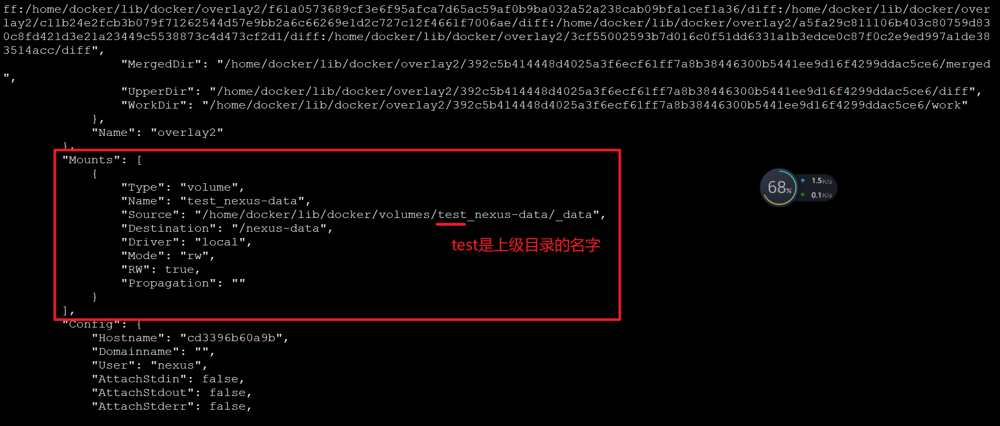

---

## 1.登录

用户名：admin

密码：在数据卷nexus-data的admin.password中

---

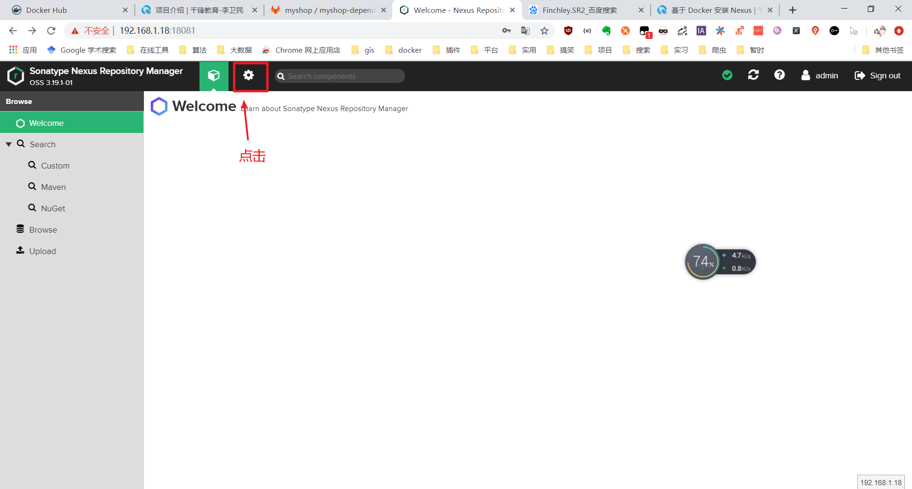

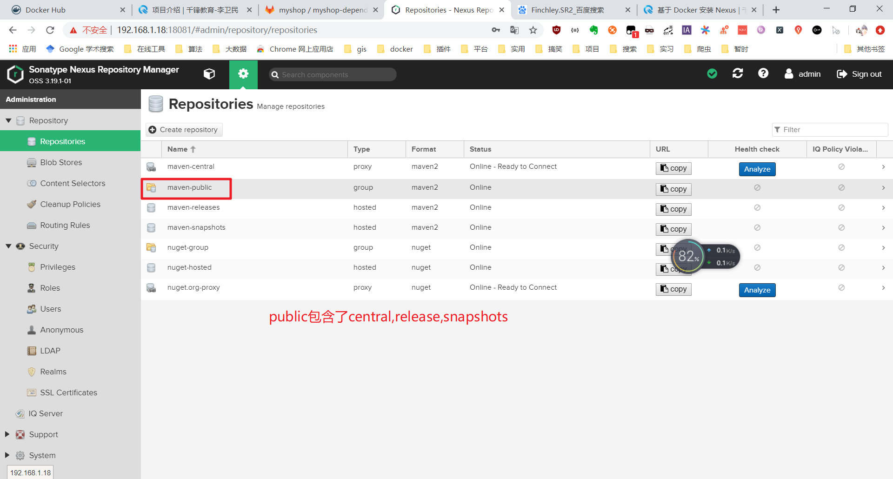

---

## 2.配置认证信息

在 Maven `settings.xml` 中添加 Nexus 认证信息 (**servers** 节点下)

```xml
<server>
		<id>nexus-releases</id>
		<username>admin</username>
		<password>123456</password>
	</server>
	<server>
		<id>nexus-snapshots</id>
		<username>admin</username>
		<password>123456</password>
	</server>
  </servers>
```

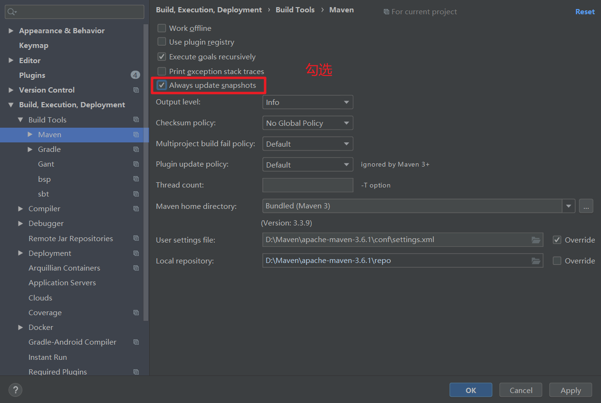

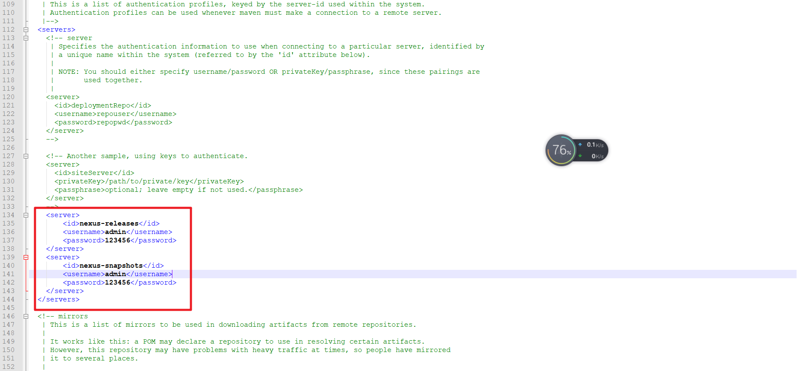


---

在 `pom.xml` 中添加如下代码

```xml
<distributionManagement>  
  <repository>  
    <id>nexus-releases</id>  
    <name>Nexus Release Repository</name>  
    <url>http://127.0.0.1:8081/repository/maven-releases/</url>  
  </repository>  
  <snapshotRepository>  
    <id>nexus-snapshots</id>  
    <name>Nexus Snapshot Repository</name>  
    <url>http://127.0.0.1:8081/repository/maven-snapshots/</url>  
  </snapshotRepository>  
</distributionManagement> 
```


**注意事项**

- ID 名称必须要与 `settings.xml` 中 Servers 配置的 ID 名称保持一致
- 项目版本号中有 `SNAPSHOT` 标识的，会发布到 Nexus Snapshots Repository， 否则发布到 Nexus Release Repository，并根据 ID 去匹配授权账号

---
配置代理仓库

```xml
<repositories>
    <repository>
        <id>nexus</id>
        <name>Nexus Repository</name>
        <url>http://127.0.0.1:8081/repository/maven-public/</url>
        <snapshots>
            <enabled>true</enabled>
        </snapshots>
        <releases>
            <enabled>true</enabled>
        </releases>
    </repository>
</repositories>
<pluginRepositories>
    <pluginRepository>
        <id>nexus</id>
        <name>Nexus Plugin Repository</name>
        <url>http://127.0.0.1:8081/repository/maven-public/</url>
        <snapshots>
            <enabled>true</enabled>
        </snapshots>
        <releases>
            <enabled>true</enabled>
        </releases>
    </pluginRepository>
</pluginRepositories>
```

---

## 3.部署到仓库上传私服

```
mvn deploy
```

```
mvn deploy -Dmaven.test.skip
```

## 4.手动上传第三方依赖

+ 方法一：

Nexus 3.1.x 开始支持页面上传第三方依赖功能，以下为手动上传命令

```
# 如第三方JAR包：aliyun-sdk-oss-2.2.3.jar
mvn deploy:deploy-file 
  -DgroupId=com.aliyun.oss 
  -DartifactId=aliyun-sdk-oss 
  -Dversion=2.2.3 
  -Dpackaging=jar 
  -Dfile=D:\aliyun-sdk-oss-2.2.3.jar 
  -Durl=http://127.0.0.1:8081/repository/maven-3rd/ 
  -DrepositoryId=nexus-releases
```

**注意事项**

- 建议在上传第三方 JAR 包时，创建单独的第三方 JAR 包管理仓库，便于管理有维护。（maven-3rd）
- `-DrepositoryId=nexus-releases` 对应的是 `settings.xml` 中 **Servers** 配置的 ID 名称。（授权）

---

+ 方法二：

举例：

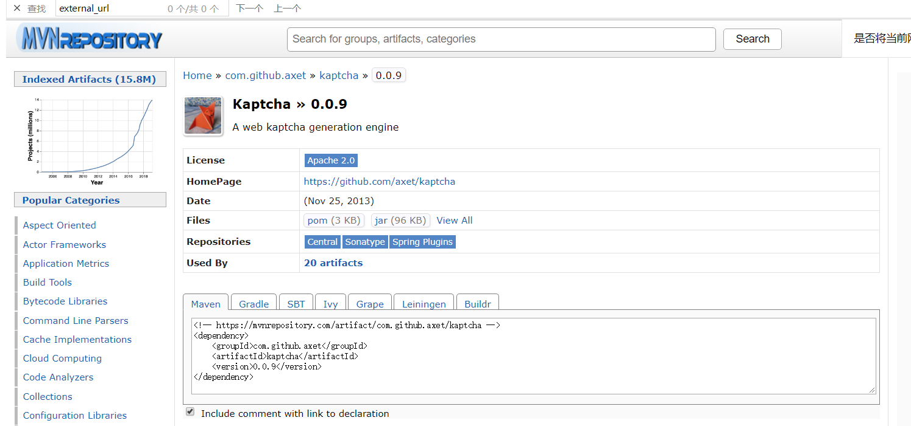

---


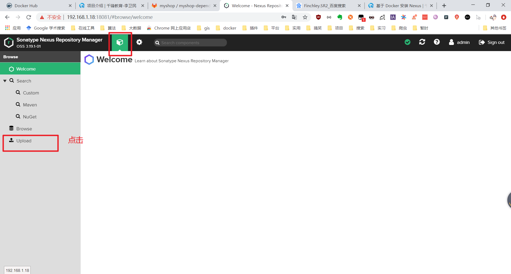

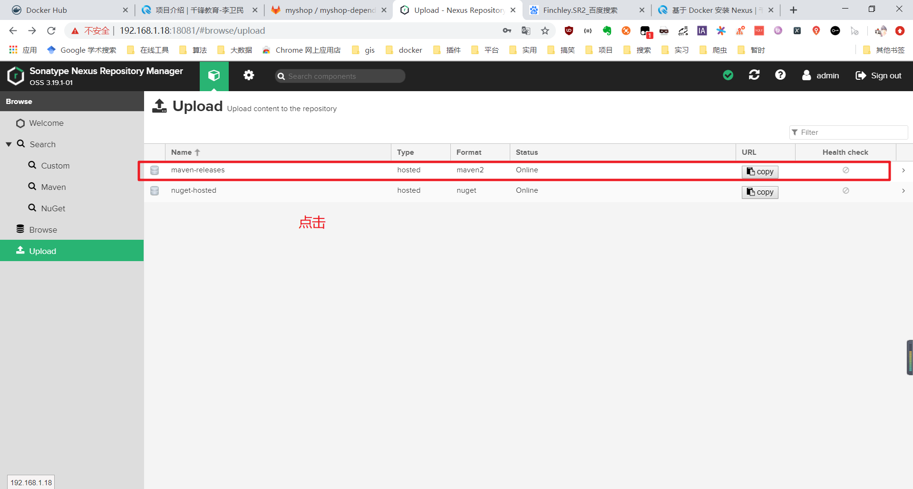

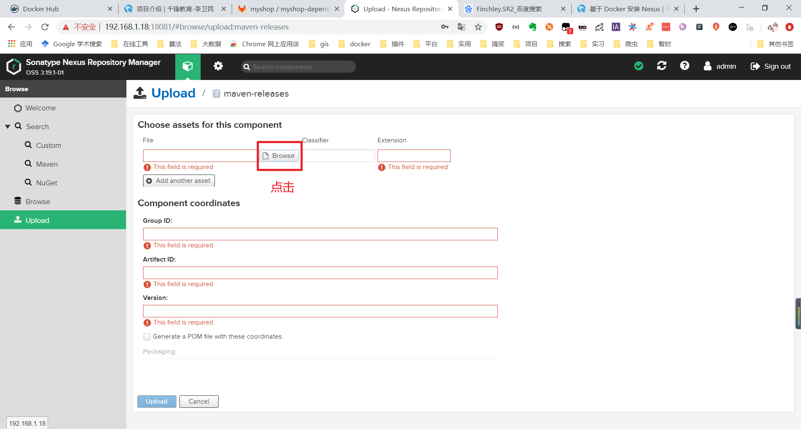

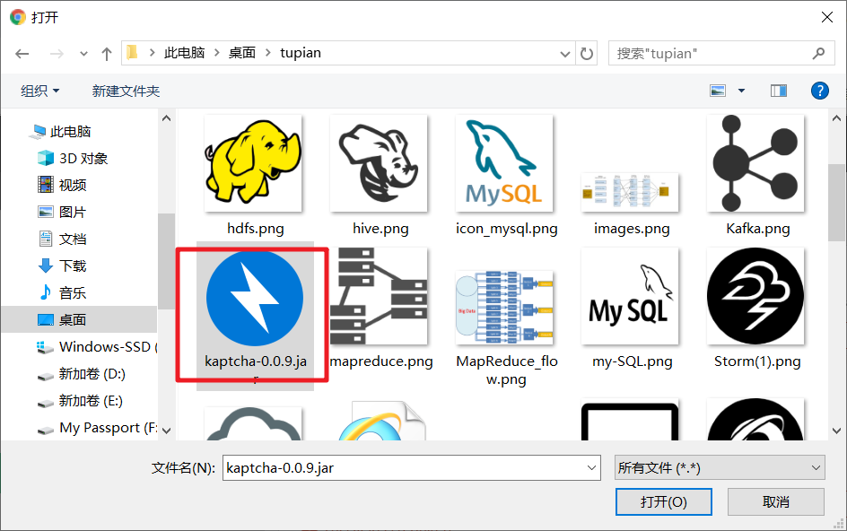


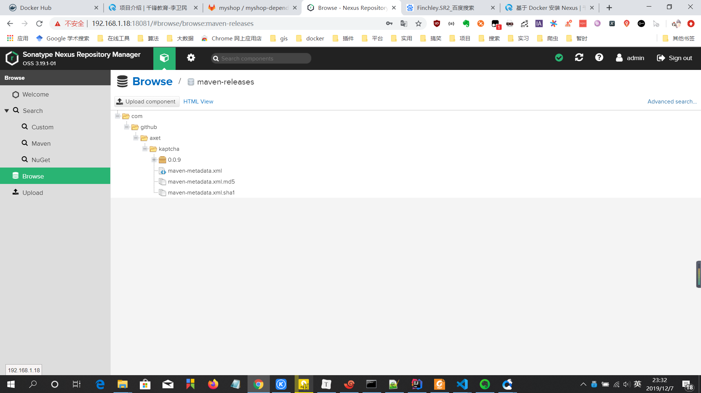

---

# 基于 Docker 安装 RocketMQ

## 1.docker-compose.yml

```yaml
version: '3'
services:
  rmqnamesrv:
    image: foxiswho/rocketmq:server
    container_name: rmqnamesrv
    ports:
      - 9876:9876
    volumes:
      - ./data/logs:/opt/logs
      - ./data/store:/opt/store
    networks:
        rmq:
          aliases:
            - rmqnamesrv

  rmqbroker:
    image: foxiswho/rocketmq:broker
    container_name: rmqbroker
    ports:
      - 10909:10909
      - 10911:10911
    volumes:
      - ./data/logs:/opt/logs
      - ./data/store:/opt/store
      - ./data/brokerconf/broker.conf:/etc/rocketmq/broker.conf
    environment:
        NAMESRV_ADDR: "rmqnamesrv:9876"
        JAVA_OPTS: " -Duser.home=/opt"
        JAVA_OPT_EXT: "-server -Xms128m -Xmx128m -Xmn128m"
    command: mqbroker -c /etc/rocketmq/broker.conf
    depends_on:
      - rmqnamesrv
    networks:
      rmq:
        aliases:
          - rmqbroker

  rmqconsole:
    image: styletang/rocketmq-console-ng
    container_name: rmqconsole
    ports:
      - 58080:8080
    environment:
        JAVA_OPTS: "-Drocketmq.namesrv.addr=rmqnamesrv:9876 -Dcom.rocketmq.sendMessageWithVIPChannel=false"
    depends_on:
      - rmqnamesrv
    networks:
      rmq:
        aliases:
          - rmqconsole

networks:
  rmq:
    # name: rmq
    driver: bridge
```

---

## 2.broker.conf

RocketMQ Broker 需要一个配置文件，按照上面的 Compose 配置，我们需要在 `./data/brokerconf/` 目录下创建一个名为 `broker.conf` 的配置文件，内容如下：

```conf
# Licensed to the Apache Software Foundation (ASF) under one or more
# contributor license agreements.  See the NOTICE file distributed with
# this work for additional information regarding copyright ownership.
# The ASF licenses this file to You under the Apache License, Version 2.0
# (the "License"); you may not use this file except in compliance with
# the License.  You may obtain a copy of the License at
#
#     http://www.apache.org/licenses/LICENSE-2.0
#
#  Unless required by applicable law or agreed to in writing, software
#  distributed under the License is distributed on an "AS IS" BASIS,
#  WITHOUT WARRANTIES OR CONDITIONS OF ANY KIND, either express or implied.
#  See the License for the specific language governing permissions and
#  limitations under the License.


# 所属集群名字
brokerClusterName=DefaultCluster

# broker 名字，注意此处不同的配置文件填写的不一样，如果在 broker-a.properties 使用: broker-a,
# 在 broker-b.properties 使用: broker-b
brokerName=broker-a

# 0 表示 Master，> 0 表示 Slave
brokerId=0

# nameServer地址，分号分割
# namesrvAddr=rocketmq-nameserver1:9876;rocketmq-nameserver2:9876

# 启动IP,如果 docker 报 com.alibaba.rocketmq.remoting.exception.RemotingConnectException: connect to <192.168.0.120:10909> failed
# 解决方式1 加上一句 producer.setVipChannelEnabled(false);，解决方式2 brokerIP1 设置宿主机IP，不要使用docker 内部IP
brokerIP1=192.168.1.18

# 在发送消息时，自动创建服务器不存在的topic，默认创建的队列数
defaultTopicQueueNums=4

# 是否允许 Broker 自动创建 Topic，建议线下开启，线上关闭 ！！！这里仔细看是 false，false，false
autoCreateTopicEnable=true

# 是否允许 Broker 自动创建订阅组，建议线下开启，线上关闭
autoCreateSubscriptionGroup=true

# Broker 对外服务的监听端口
listenPort=10911

# 删除文件时间点，默认凌晨4点
deleteWhen=04

# 文件保留时间，默认48小时
fileReservedTime=120

# commitLog 每个文件的大小默认1G
mapedFileSizeCommitLog=1073741824

# ConsumeQueue 每个文件默认存 30W 条，根据业务情况调整
mapedFileSizeConsumeQueue=300000

# destroyMapedFileIntervalForcibly=120000
# redeleteHangedFileInterval=120000
# 检测物理文件磁盘空间
diskMaxUsedSpaceRatio=88
# 存储路径
# storePathRootDir=/home/ztztdata/rocketmq-all-4.1.0-incubating/store
# commitLog 存储路径
# storePathCommitLog=/home/ztztdata/rocketmq-all-4.1.0-incubating/store/commitlog
# 消费队列存储
# storePathConsumeQueue=/home/ztztdata/rocketmq-all-4.1.0-incubating/store/consumequeue
# 消息索引存储路径
# storePathIndex=/home/ztztdata/rocketmq-all-4.1.0-incubating/store/index
# checkpoint 文件存储路径
# storeCheckpoint=/home/ztztdata/rocketmq-all-4.1.0-incubating/store/checkpoint
# abort 文件存储路径
# abortFile=/home/ztztdata/rocketmq-all-4.1.0-incubating/store/abort
# 限制的消息大小
maxMessageSize=65536

# flushCommitLogLeastPages=4
# flushConsumeQueueLeastPages=2
# flushCommitLogThoroughInterval=10000
# flushConsumeQueueThoroughInterval=60000

# Broker 的角色
# - ASYNC_MASTER 异步复制Master
# - SYNC_MASTER 同步双写Master
# - SLAVE
brokerRole=ASYNC_MASTER

# 刷盘方式
# - ASYNC_FLUSH 异步刷盘
# - SYNC_FLUSH 同步刷盘
flushDiskType=ASYNC_FLUSH

# 发消息线程池数量
# sendMessageThreadPoolNums=128
# 拉消息线程池数量
# pullMessageThreadPoolNums=128
```

注意：先写配置文件，再启动容器

---

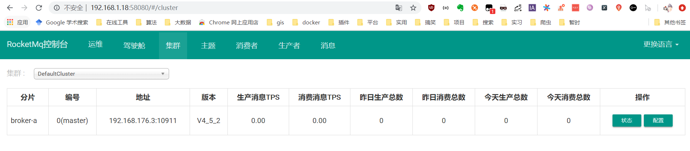

# Nacos 安装

## 1.Clone 项目

```
cd docker/
git clone https://github.com/nacos-group/nacos-docker.git
cd nacos-docker
```

## 2.单机模式

```
docker-compose -f example/standalone-mysql.yaml up -d
```

## 3.查看日志

```
docker-compose -f example/standalone-mysql.yaml up -d
```

## 4.Nacos 控制台

```
http://192.168.1.18:8848/nacos
```

- **账号：** nacos
- **密码：** nacos

---


# SkyWalking 服务端配置

## 1.基于 Docker 安装 ElasticSearch

```yaml
version: '3.3'
services:
  elasticsearch:
    image: wutang/elasticsearch-shanghai-zone:6.3.2
    container_name: elasticsearch
    restart: always
    ports:
      - 9200:9200
      - 9300:9300
    environment:
      cluster.name: elasticsearch
```

其中，`9200` 端口号为 SkyWalking 配置 ElasticSearch 所需端口号，`cluster.name` 为 SkyWalking 配置 ElasticSearch 集群的名称

测试是否启动成功

浏览器访问 http://192.168.1.18:9200/ ，浏览器返回如下信息即表示成功启动

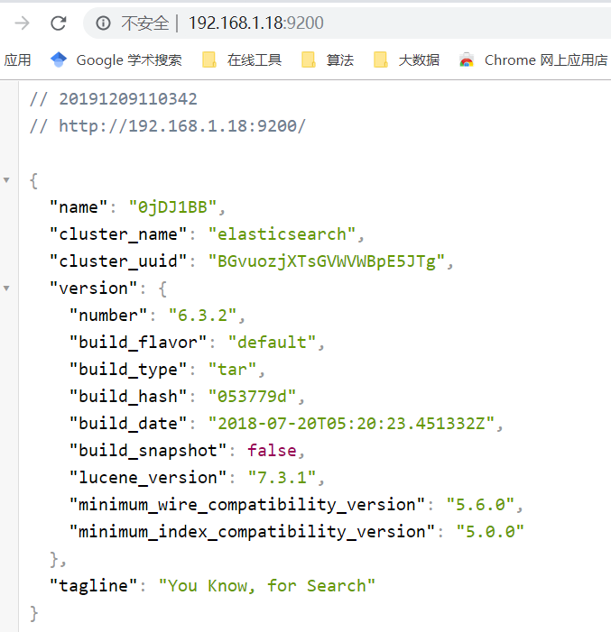

---

## 2.下载并启动 SkyWalking

官方已经为我们准备好了编译过的服务端版本，下载地址为 http://skywalking.apache.org/downloads/，这里我们需要下载 6.x releases 版本


```
wget https://archive.apache.org/dist/incubator/skywalking/6.0.0-beta/apache-skywalking-apm-incubating-6.0.0-beta.tar.gz
```

解压

```
tar -zvxf apache-skywalking-apm-incubating-6.0.0-beta.tar.gz -C ~/app/
```

---


## 3.配置 SkyWalking

下载完成后解压缩，进入 `apache-skywalking-apm-incubating/config` 目录并修改 `application.yml` 配置文件

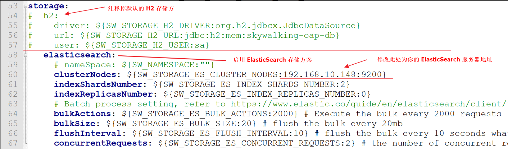

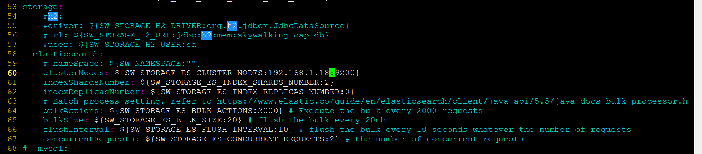

这里需要做三件事：

- 注释 H2 存储方案
- 启用 ElasticSearch 存储方案
- 修改 ElasticSearch 服务器地址

## 4.启动 SkyWalking

修改完配置后，进入 `apache-skywalking-apm-incubating\bin` 目录，运行 `startup.bat` 启动服务端

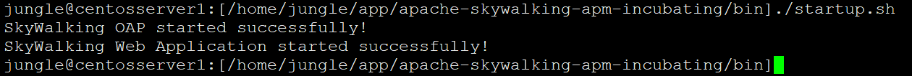

修改web端口号

```
vi webapp/webapp.yml
```

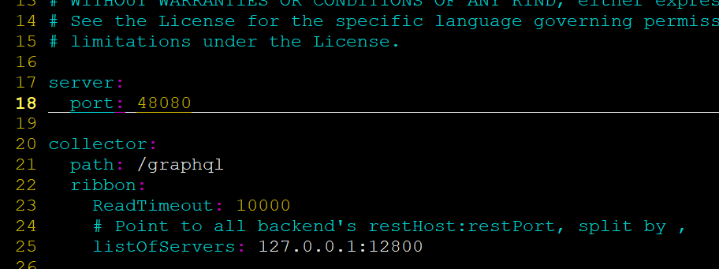

通过浏览器访问 http://192.168.1.18:48080 出现如下界面即表示启动成功

默认的用户名密码为：admin/admin，登录成功后，效果如下图

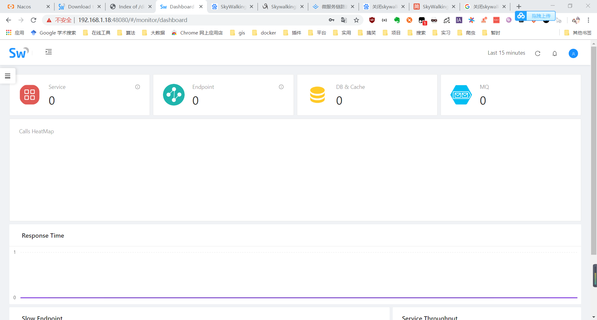

----


# 创建统一的依赖管理

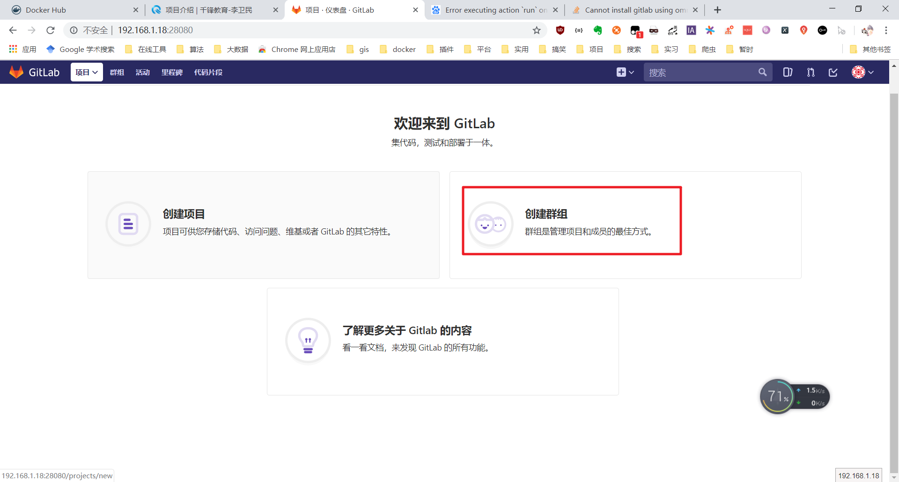

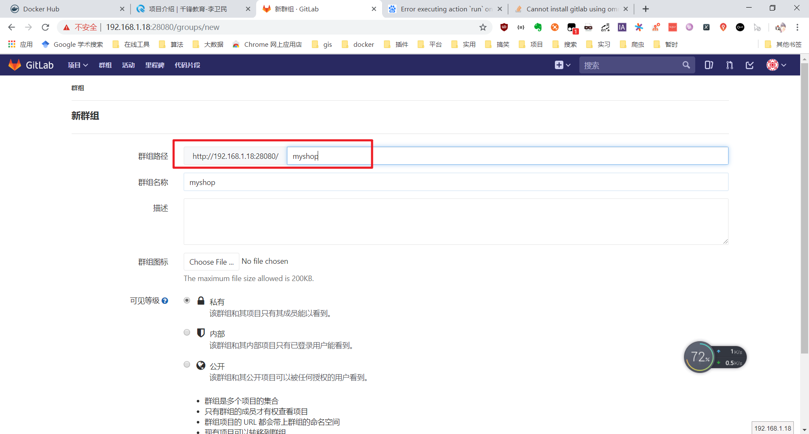

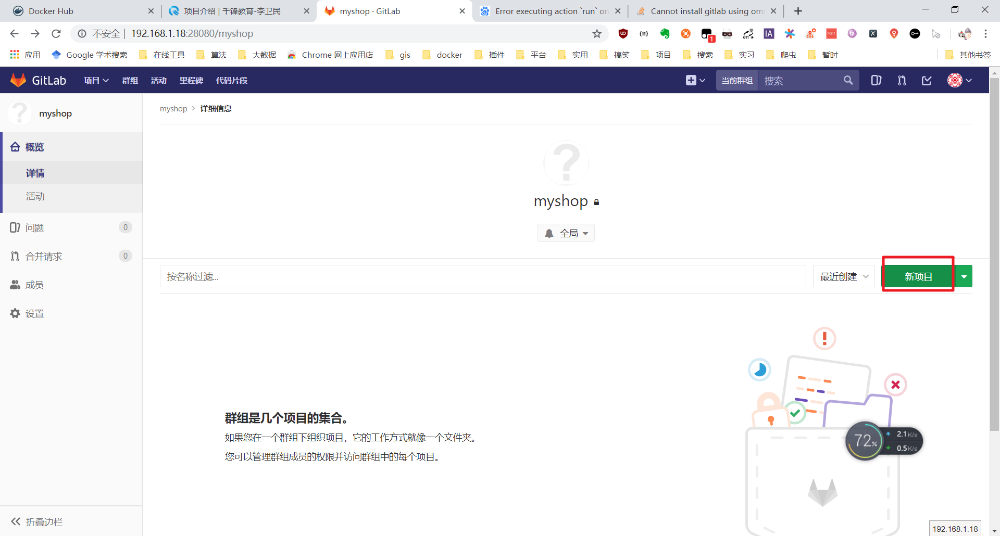


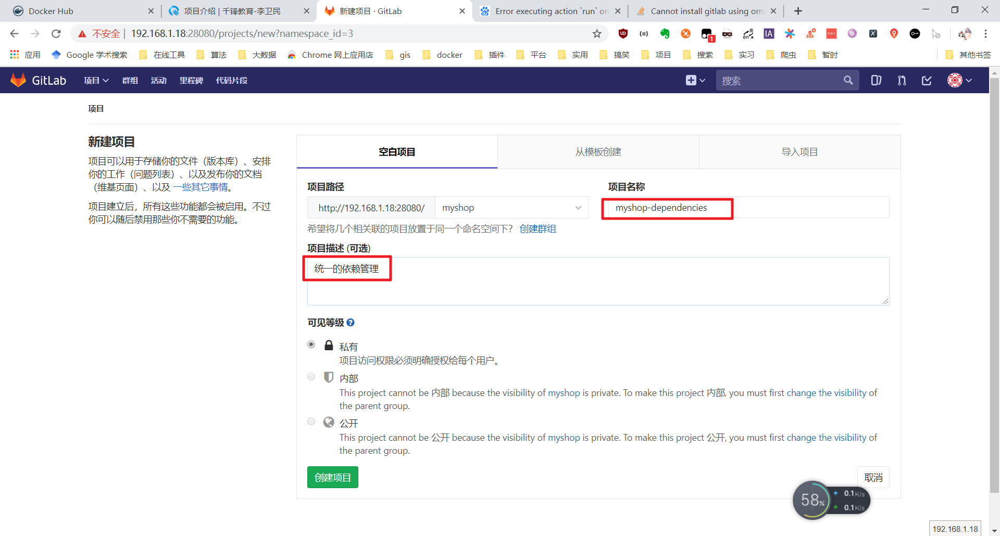

---

## 1.在本地新建目录

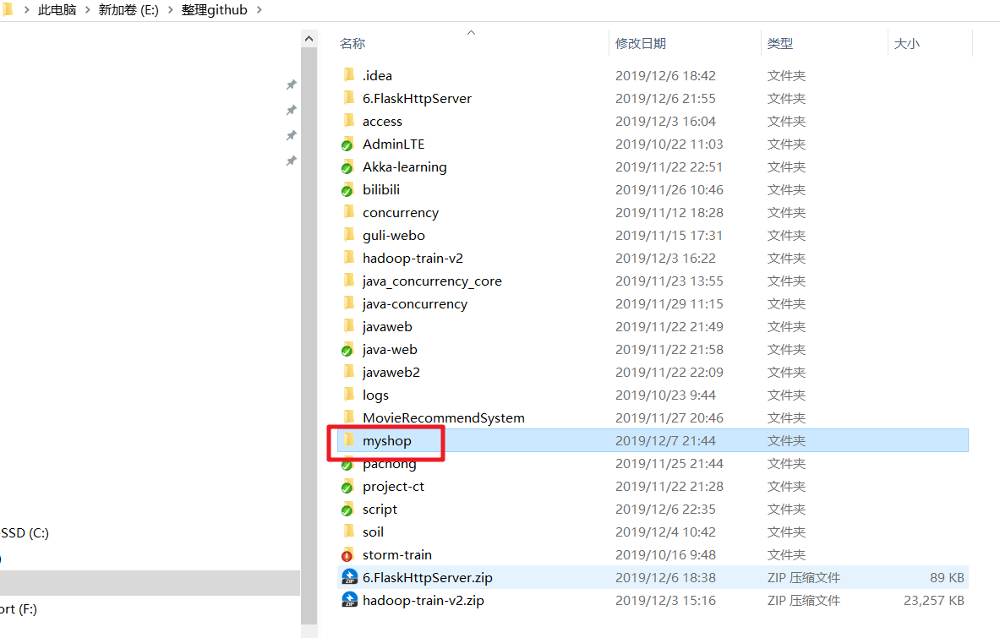

## 2.克隆项目到本地

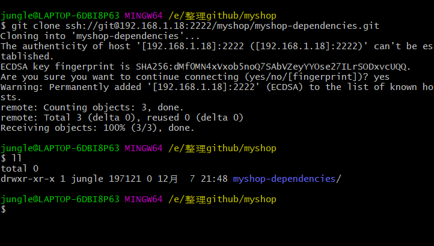

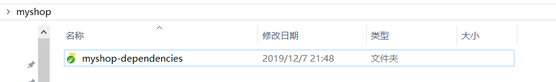

---


## 3.用idea打开项目

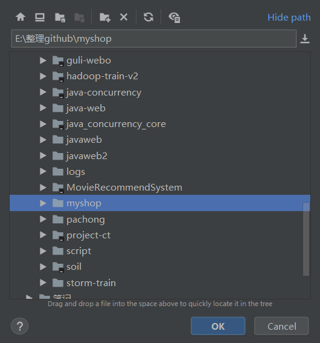

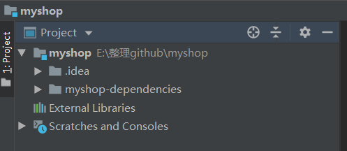

---


## 4.添加Git 过滤文件

+ ## .gitattributes

  ```
  # Windows-specific files that require CRLF:
  *.bat       eol=crlf
  *.txt       eol=crlf
  
  # Unix-specific files that require LF:
  *.java      eol=lf
  *.sh        eol=lf
  ```

+ ## .gitignore

  ```
  target/
  !.mvn/wrapper/maven-wrapper.jar
  
  ## STS ##
  .apt_generated
  .classpath
  .factorypath
  .project
  .settings
  .springBeans
  
  ## IntelliJ IDEA ##
  .idea
  *.iws
  *.iml
  *.ipr
  
  ## JRebel ##
  rebel.xml
  
  ## MAC ##
  .DS_Store
  
  ## Other ##
  logs/
  temp/
  ```

  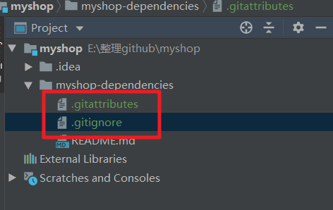

  ----

  


## 5.添加pom文件

--pom.xml

```xml
<?xml version="1.0" encoding="UTF-8"?>
<project xmlns="http://maven.apache.org/POM/4.0.0" xmlns:xsi="http://www.w3.org/2001/XMLSchema-instance"
         xsi:schemaLocation="http://maven.apache.org/POM/4.0.0 http://maven.apache.org/xsd/maven-4.0.0.xsd">
    <modelVersion>4.0.0</modelVersion>

    <parent>
        <groupId>org.springframework.boot</groupId>
        <artifactId>spring-boot-starter-parent</artifactId>
        <version>2.0.6.RELEASE</version>
    </parent>

    <groupId>com.funtl</groupId>
    <artifactId>myshop-dependencies</artifactId>
    <version>1.0.0-SNAPSHOT</version>
    <packaging>pom</packaging>

    <name>myshop-dependencies</name>
    <url>http://www.funtl.com</url>
    <inceptionYear>2018-Now</inceptionYear>

    <properties>
        <!-- Environment Settings -->
        <java.version>1.8</java.version>
        <project.build.sourceEncoding>UTF-8</project.build.sourceEncoding>
        <project.reporting.outputEncoding>UTF-8</project.reporting.outputEncoding>

        <!-- Spring Cloud Settings -->
        <spring-cloud.version>Finchley.SR2</spring-cloud.version>
        <spring-cloud-alibaba.version>0.2.1.RELEASE</spring-cloud-alibaba.version>

        <!-- Spring Boot Settings -->
        <spring-boot-alibaba-druid.version>1.1.10</spring-boot-alibaba-druid.version>
        <spring-boot-tk-mybatis.version>2.1.4</spring-boot-tk-mybatis.version>
        <spring-boot-pagehelper.version>1.2.10</spring-boot-pagehelper.version>

        <!-- Commons Settings -->
        <mysql.version>8.0.13</mysql.version>
    </properties>

    <dependencyManagement>
        <dependencies>
            <dependency>
                <groupId>org.springframework.cloud</groupId>
                <artifactId>spring-cloud-dependencies</artifactId>
                <version>${spring-cloud.version}</version>
                <type>pom</type>
                <scope>import</scope>
            </dependency>
            <dependency>
                <groupId>org.springframework.cloud</groupId>
                <artifactId>spring-cloud-alibaba-dependencies</artifactId>
                <version>${spring-cloud-alibaba.version}</version>
                <type>pom</type>
                <scope>import</scope>
            </dependency>

            <!-- Spring Boot Begin -->
            <dependency>
                <groupId>com.alibaba</groupId>
                <artifactId>druid-spring-boot-starter</artifactId>
                <version>${spring-boot-alibaba-druid.version}</version>
            </dependency>
            <dependency>
                <groupId>tk.mybatis</groupId>
                <artifactId>mapper-spring-boot-starter</artifactId>
                <version>${spring-boot-tk-mybatis.version}</version>
            </dependency>
            <dependency>
                <groupId>com.github.pagehelper</groupId>
                <artifactId>pagehelper-spring-boot-starter</artifactId>
                <version>${spring-boot-pagehelper.version}</version>
            </dependency>
            <!-- Spring Boot End -->

            <!-- Commons Begin -->
            <dependency>
                <groupId>mysql</groupId>
                <artifactId>mysql-connector-java</artifactId>
                <version>${mysql.version}</version>
            </dependency>
            <!-- Commons End -->
        </dependencies>
    </dependencyManagement>

    <build>
        <plugins>
            <!-- Compiler 插件, 设定 JDK 版本 -->
            <plugin>
                <groupId>org.apache.maven.plugins</groupId>
                <artifactId>maven-compiler-plugin</artifactId>
                <configuration>
                    <showWarnings>true</showWarnings>
                </configuration>
            </plugin>

            <!-- 打包 jar 文件时，配置 manifest 文件，加入 lib 包的 jar 依赖 -->
            <plugin>
                <groupId>org.apache.maven.plugins</groupId>
                <artifactId>maven-jar-plugin</artifactId>
                <configuration>
                    <archive>
                        <addMavenDescriptor>false</addMavenDescriptor>
                    </archive>
                </configuration>
                <executions>
                    <execution>
                        <configuration>
                            <archive>
                                <manifest>
                                    <!-- Add directory entries -->
                                    <addDefaultImplementationEntries>true</addDefaultImplementationEntries>
                                    <addDefaultSpecificationEntries>true</addDefaultSpecificationEntries>
                                    <addClasspath>true</addClasspath>
                                </manifest>
                            </archive>
                        </configuration>
                    </execution>
                </executions>
            </plugin>

            <!-- resource -->
            <plugin>
                <groupId>org.apache.maven.plugins</groupId>
                <artifactId>maven-resources-plugin</artifactId>
            </plugin>

            <!-- install -->
            <plugin>
                <groupId>org.apache.maven.plugins</groupId>
                <artifactId>maven-install-plugin</artifactId>
            </plugin>

            <!-- clean -->
            <plugin>
                <groupId>org.apache.maven.plugins</groupId>
                <artifactId>maven-clean-plugin</artifactId>
            </plugin>

            <!-- ant -->
            <plugin>
                <groupId>org.apache.maven.plugins</groupId>
                <artifactId>maven-antrun-plugin</artifactId>
            </plugin>

            <!-- dependency -->
            <plugin>
                <groupId>org.apache.maven.plugins</groupId>
                <artifactId>maven-dependency-plugin</artifactId>
            </plugin>
        </plugins>

        <pluginManagement>
            <plugins>
                <!-- Java Document Generate -->
                <plugin>
                    <groupId>org.apache.maven.plugins</groupId>
                    <artifactId>maven-javadoc-plugin</artifactId>
                    <executions>
                        <execution>
                            <phase>prepare-package</phase>
                            <goals>
                                <goal>jar</goal>
                            </goals>
                        </execution>
                    </executions>
                </plugin>

                <!-- YUI Compressor (CSS/JS压缩) -->
                <plugin>
                    <groupId>net.alchim31.maven</groupId>
                    <artifactId>yuicompressor-maven-plugin</artifactId>
                    <version>1.5.1</version>
                    <executions>
                        <execution>
                            <phase>prepare-package</phase>
                            <goals>
                                <goal>compress</goal>
                            </goals>
                        </execution>
                    </executions>
                    <configuration>
                        <encoding>UTF-8</encoding>
                        <jswarn>false</jswarn>
                        <nosuffix>true</nosuffix>
                        <linebreakpos>30000</linebreakpos>
                        <force>true</force>
                        <includes>
                            <include>**/*.js</include>
                            <include>**/*.css</include>
                        </includes>
                        <excludes>
                            <exclude>**/*.min.js</exclude>
                            <exclude>**/*.min.css</exclude>
                        </excludes>
                    </configuration>
                </plugin>
            </plugins>
        </pluginManagement>

        <!-- 资源文件配置 -->
        <resources>
            <resource>
                <directory>src/main/java</directory>
                <excludes>
                    <exclude>**/*.java</exclude>
                </excludes>
            </resource>
            <resource>
                <directory>src/main/resources</directory>
            </resource>
        </resources>
    </build>

    <distributionManagement>
        <repository>
            <id>nexus-releases</id>
            <name>Nexus Release Repository</name>
            <url>http://192.168.1.18:18081/repository/maven-releases/</url>
        </repository>
        <snapshotRepository>
            <id>nexus-snapshots</id>
            <name>Nexus Snapshot Repository</name>
            <url>http://192.168.1.18:18081/repository/maven-snapshots/</url>
        </snapshotRepository>
    </distributionManagement>

    <repositories>
        <repository>
            <id>nexus</id>
            <name>Nexus Repository</name>
            <url>http://192.168.1.18:18081/repository/maven-public/</url>
            <snapshots>
                <enabled>true</enabled>
            </snapshots>
            <releases>
                <enabled>true</enabled>
            </releases>
        </repository>

        <repository>
            <id>aliyun-repos</id>
            <name>Aliyun Repository</name>
            <url>http://maven.aliyun.com/nexus/content/groups/public</url>
            <releases>
                <enabled>true</enabled>
            </releases>
            <snapshots>
                <enabled>false</enabled>
            </snapshots>
        </repository>

        <repository>
            <id>sonatype-repos</id>
            <name>Sonatype Repository</name>
            <url>https://oss.sonatype.org/content/groups/public</url>
            <releases>
                <enabled>true</enabled>
            </releases>
            <snapshots>
                <enabled>false</enabled>
            </snapshots>
        </repository>
        <repository>
            <id>sonatype-repos-s</id>
            <name>Sonatype Repository</name>
            <url>https://oss.sonatype.org/content/repositories/snapshots</url>
            <releases>
                <enabled>false</enabled>
            </releases>
            <snapshots>
                <enabled>true</enabled>
            </snapshots>
        </repository>

        <repository>
            <id>spring-snapshots</id>
            <name>Spring Snapshots</name>
            <url>https://repo.spring.io/snapshot</url>
            <snapshots>
                <enabled>true</enabled>
            </snapshots>
        </repository>
        <repository>
            <id>spring-milestones</id>
            <name>Spring Milestones</name>
            <url>https://repo.spring.io/milestone</url>
            <snapshots>
                <enabled>false</enabled>
            </snapshots>
        </repository>
    </repositories>

    <pluginRepositories>
        <pluginRepository>
            <id>nexus</id>
            <name>Nexus Plugin Repository</name>
            <url>http://192.168.1.18:18081/repository/maven-public/</url>
            <snapshots>
                <enabled>true</enabled>
            </snapshots>
            <releases>
                <enabled>true</enabled>
            </releases>
        </pluginRepository>

        <pluginRepository>
            <id>aliyun-repos</id>
            <name>Aliyun Repository</name>
            <url>http://maven.aliyun.com/nexus/content/groups/public</url>
            <releases>
                <enabled>true</enabled>
            </releases>
            <snapshots>
                <enabled>false</enabled>
            </snapshots>
        </pluginRepository>
    </pluginRepositories>
</project>
```


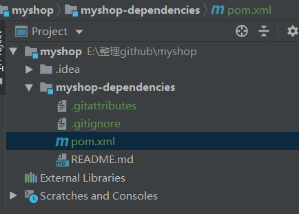

---

# 创建通用的工具类库

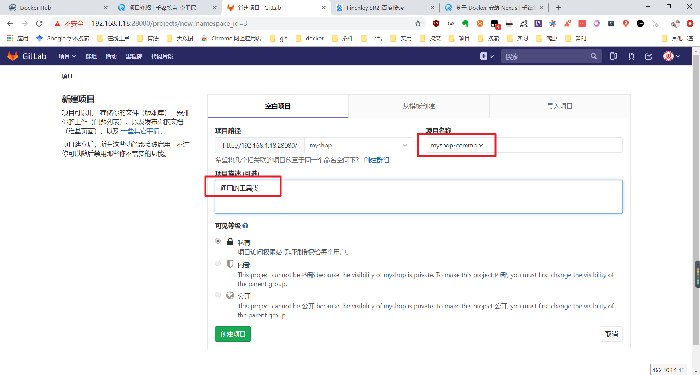

克隆到本地

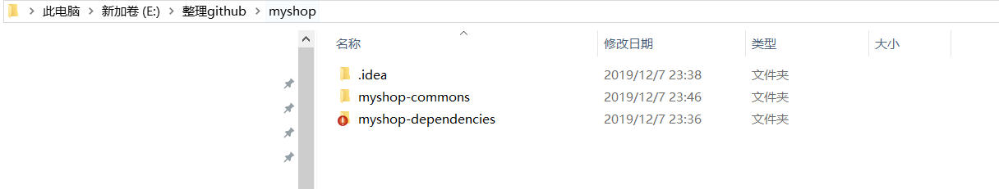

## 1.添加相关文件（pom）

--pom.xml

```xml
<?xml version="1.0" encoding="UTF-8"?>
<project xmlns="http://maven.apache.org/POM/4.0.0" xmlns:xsi="http://www.w3.org/2001/XMLSchema-instance"
         xsi:schemaLocation="http://maven.apache.org/POM/4.0.0 http://maven.apache.org/xsd/maven-4.0.0.xsd">
    <modelVersion>4.0.0</modelVersion>

    <parent>
        <groupId>com.funtl</groupId>
        <artifactId>myshop-dependencies</artifactId>
        <version>1.0.0-SNAPSHOT</version>
        <relativePath>../myshop-dependencies/pom.xml</relativePath>
    </parent>

    <artifactId>myshop-commons</artifactId>
    <packaging>jar</packaging>

    <name>myshop-commons</name>
    <url>http://www.funtl.com</url>
    <inceptionYear>2018-Now</inceptionYear>

    <dependencies>
        <dependency>
            <groupId>org.projectlombok</groupId>
            <artifactId>lombok</artifactId>
        </dependency>
    </dependencies>
</project>
```

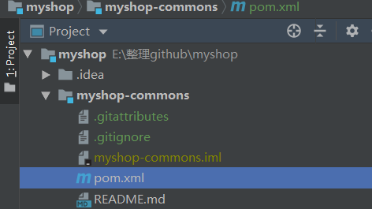

---

# 创建通用的领域模型


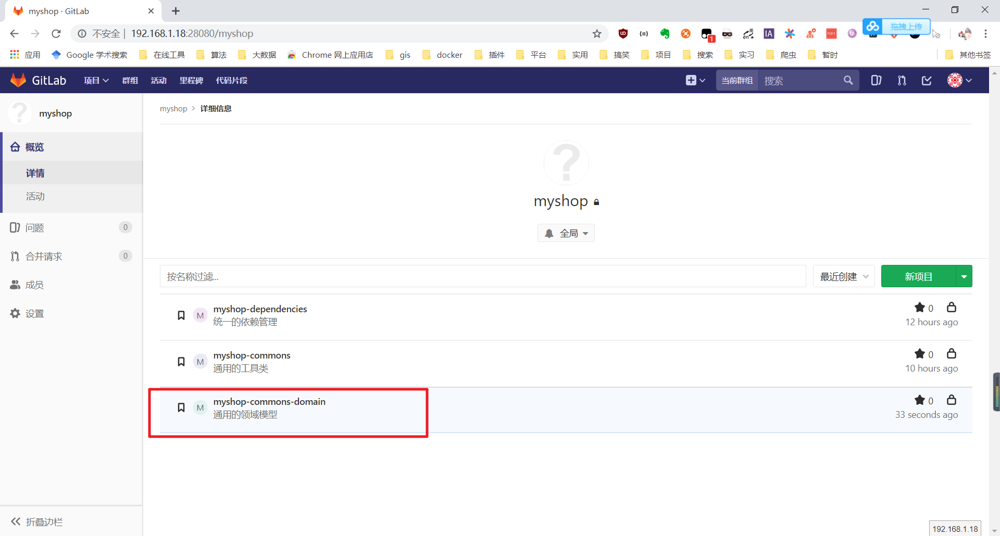

克隆到本地


## 1.添加相关文件（pom）

--pom.xml

```xml
<?xml version="1.0" encoding="UTF-8"?>
<project xmlns="http://maven.apache.org/POM/4.0.0" xmlns:xsi="http://www.w3.org/2001/XMLSchema-instance"
         xsi:schemaLocation="http://maven.apache.org/POM/4.0.0 http://maven.apache.org/xsd/maven-4.0.0.xsd">
    <modelVersion>4.0.0</modelVersion>

    <parent>
        <groupId>com.funtl</groupId>
        <artifactId>myshop-dependencies</artifactId>
        <version>1.0.0-SNAPSHOT</version>
        <relativePath>../myshop-dependencies/pom.xml</relativePath>
    </parent>

    <artifactId>myshop-commons-domain</artifactId>
    <packaging>jar</packaging>

    <name>myshop-commons-domain</name>
    <url>http://www.funtl.com</url>
    <inceptionYear>2018-Now</inceptionYear>

    <dependencies>
        <!-- Commons Begin -->
        <dependency>
            <groupId>org.hibernate.javax.persistence</groupId>
            <artifactId>hibernate-jpa-2.1-api</artifactId>
        </dependency>
        <!-- Commons End -->

        <!-- Projects Begin -->
        <dependency>
            <groupId>com.funtl</groupId>
            <artifactId>myshop-commons</artifactId>
            <version>${project.parent.version}</version>
        </dependency>
        <!-- Projects End -->
    </dependencies>
</project>
```

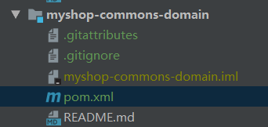

---

# 创建通用的数据访问

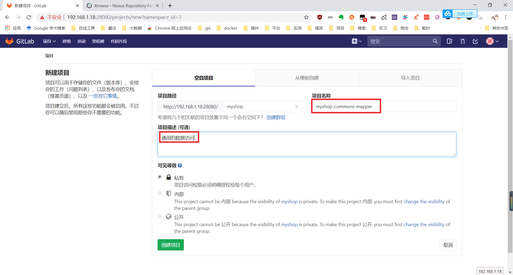

---

## 1.添加相关文件（pom）

pom.xml

```xml
<?xml version="1.0" encoding="UTF-8"?>
<project xmlns="http://maven.apache.org/POM/4.0.0" xmlns:xsi="http://www.w3.org/2001/XMLSchema-instance"
         xsi:schemaLocation="http://maven.apache.org/POM/4.0.0 http://maven.apache.org/xsd/maven-4.0.0.xsd">
    <modelVersion>4.0.0</modelVersion>

    <parent>
        <groupId>com.funtl</groupId>
        <artifactId>myshop-dependencies</artifactId>
        <version>1.0.0-SNAPSHOT</version>
        <relativePath>../myshop-dependencies/pom.xml</relativePath>
    </parent>

    <artifactId>myshop-commons-mapper</artifactId>
    <packaging>jar</packaging>

    <name>myshop-commons-mapper</name>
    <url>http://www.funtl.com</url>
    <inceptionYear>2018-Now</inceptionYear>

    <dependencies>
        <!-- Spring Boot Begin -->
        <dependency>
            <groupId>com.alibaba</groupId>
            <artifactId>druid-spring-boot-starter</artifactId>
        </dependency>
        <dependency>
            <groupId>tk.mybatis</groupId>
            <artifactId>mapper-spring-boot-starter</artifactId>
        </dependency>
        <dependency>
            <groupId>com.github.pagehelper</groupId>
            <artifactId>pagehelper-spring-boot-starter</artifactId>
        </dependency>
        <!-- Spring Boot End -->

        <!-- Commons Begin -->
        <dependency>
            <groupId>mysql</groupId>
            <artifactId>mysql-connector-java</artifactId>
            <scope>runtime</scope>
        </dependency>
        <!-- Commons End -->

        <!-- Projects Begin -->
        <dependency>
            <groupId>com.funtl</groupId>
            <artifactId>myshop-commons-domain</artifactId>
            <version>${project.parent.version}</version>
        </dependency>
        <!-- Projects End -->
    </dependencies>
</project>
```

---

## 2.创建相关目录

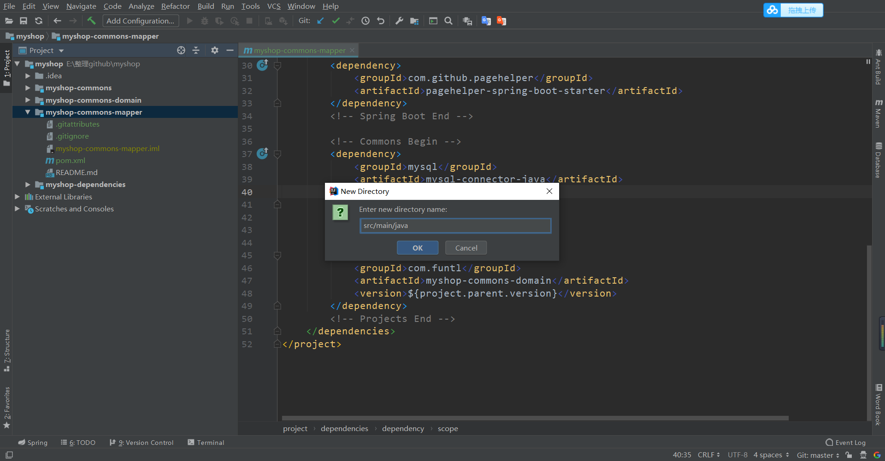

## 3.MyMapper


```java
package tk.mybatis.mapper;

import tk.mybatis.mapper.common.Mapper;
import tk.mybatis.mapper.common.MySqlMapper;

/**
 * 自己的 Mapper
 * 特别注意，该接口不能被扫描到，否则会出错
 * <p>Title: MyMapper</p>
 * <p>Description: </p>
 *
 * @author Lusifer
 * @version 1.0.0
 * @date 2018/5/29 0:57
 */
public interface MyMapper<T> extends Mapper<T>, MySqlMapper<T> {
}
```

---

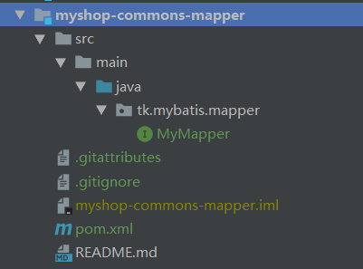

---

# 创建通用的业务逻辑


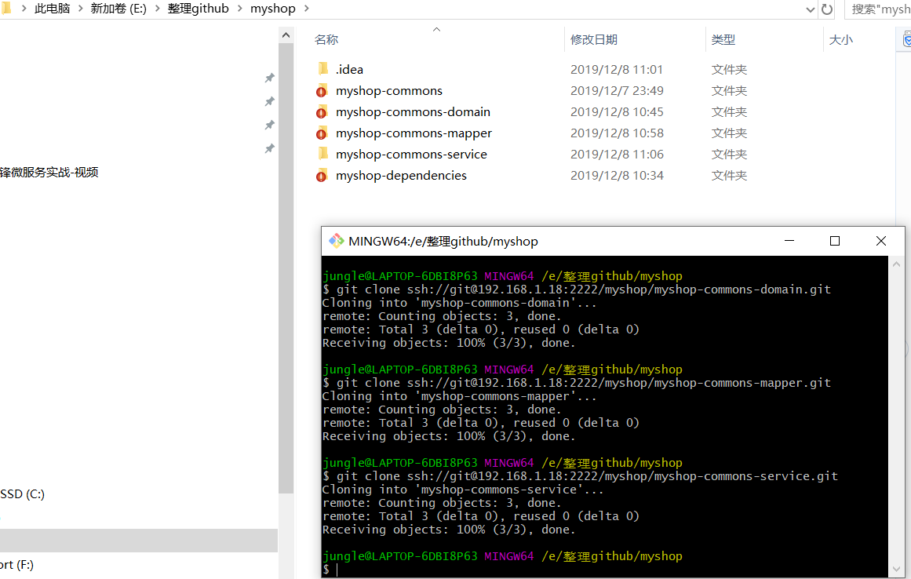

---

## 1.添加相关文件（pom）

pom.xml

```xml
<?xml version="1.0" encoding="UTF-8"?>
<project xmlns="http://maven.apache.org/POM/4.0.0" xmlns:xsi="http://www.w3.org/2001/XMLSchema-instance"
         xsi:schemaLocation="http://maven.apache.org/POM/4.0.0 http://maven.apache.org/xsd/maven-4.0.0.xsd">
    <modelVersion>4.0.0</modelVersion>

    <parent>
        <groupId>com.funtl</groupId>
        <artifactId>myshop-dependencies</artifactId>
        <version>1.0.0-SNAPSHOT</version>
        <relativePath>../myshop-dependencies/pom.xml</relativePath>
    </parent>

    <artifactId>myshop-commons-service</artifactId>
    <packaging>jar</packaging>

    <name>myshop-commons-service</name>
    <url>http://www.funtl.com</url>
    <inceptionYear>2018-Now</inceptionYear>

    <dependencies>
        <dependency>
            <groupId>com.funtl</groupId>
            <artifactId>myshop-commons-mapper</artifactId>
            <version>${project.parent.version}</version>
        </dependency>
    </dependencies>
</project>
```

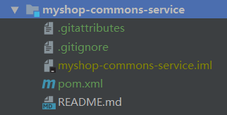

---

# 创建通用的代码生成

==作用：代码生成，生成的代码复制到指定的地方使用==

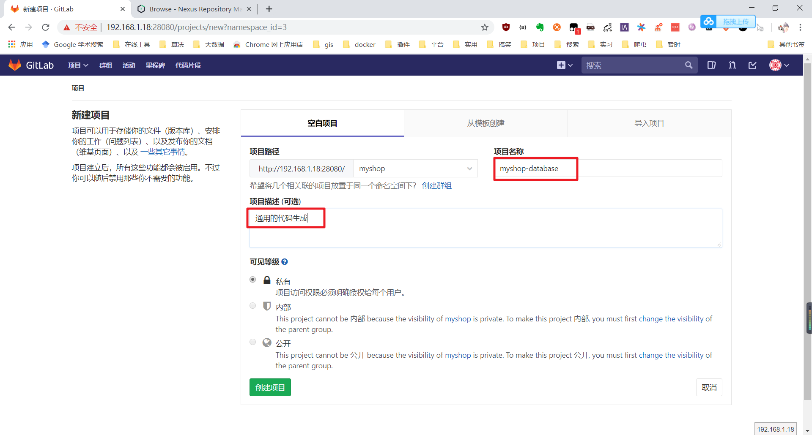

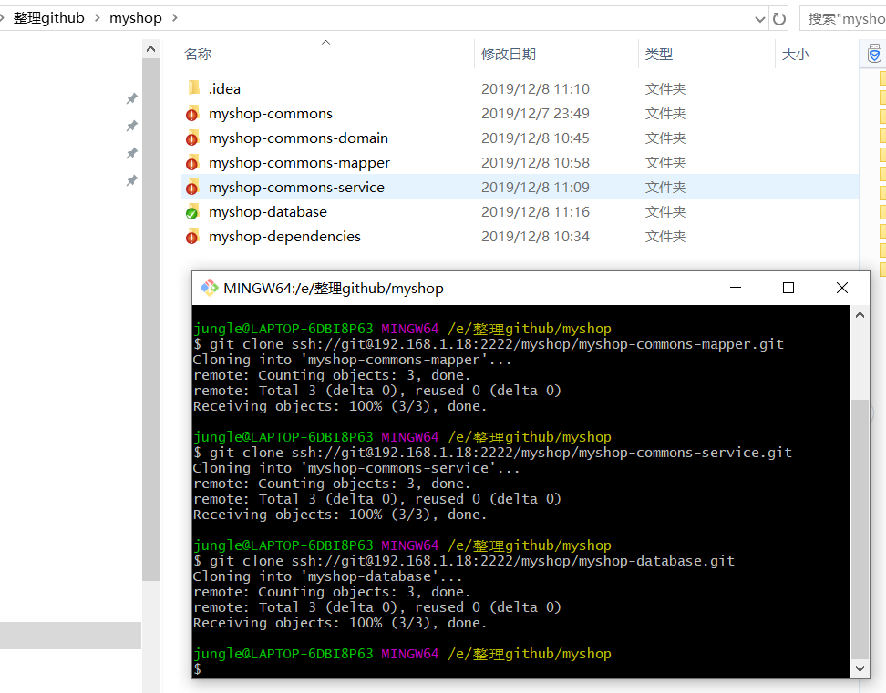

---

## 1.添加相关文件（pom）

pom.xml

```xml
<?xml version="1.0" encoding="UTF-8"?>
<project xmlns="http://maven.apache.org/POM/4.0.0" xmlns:xsi="http://www.w3.org/2001/XMLSchema-instance"
         xsi:schemaLocation="http://maven.apache.org/POM/4.0.0 http://maven.apache.org/xsd/maven-4.0.0.xsd">
    <modelVersion>4.0.0</modelVersion>

    <parent>
        <groupId>com.funtl</groupId>
        <artifactId>myshop-dependencies</artifactId>
        <version>1.0.0-SNAPSHOT</version>
        <relativePath>../myshop-dependencies/pom.xml</relativePath>
    </parent>

    <artifactId>myshop-database</artifactId>
    <packaging>jar</packaging>

    <name>myshop-database</name>
    <url>http://www.funtl.com</url>
    <inceptionYear>2018-Now</inceptionYear>

    <dependencies>
        <dependency>
            <groupId>tk.mybatis</groupId>
            <artifactId>mapper</artifactId>
            <version>4.1.4</version>
        </dependency>
    </dependencies>

    <build>
        <plugins>
            <plugin>
                <groupId>org.mybatis.generator</groupId>
                <artifactId>mybatis-generator-maven-plugin</artifactId>
                <version>1.3.5</version>
                <configuration>
                    <configurationFile>${basedir}/src/main/resources/generator/generatorConfig.xml</configurationFile>
                    <overwrite>true</overwrite>
                    <verbose>true</verbose>
                </configuration>
                <dependencies>
                    <dependency>
                        <groupId>mysql</groupId>
                        <artifactId>mysql-connector-java</artifactId>
                        <version>8.0.13</version>
                    </dependency>
                    <dependency>
                        <groupId>tk.mybatis</groupId>
                        <artifactId>mapper</artifactId>
                        <version>4.1.4</version>
                    </dependency>
                </dependencies>
            </plugin>
        </plugins>
    </build>
</project>
```

---

## 2.自动生成的配置

在 `src/main/resources/generator/` 目录下创建 `generatorConfig.xml` 配置文件：

```xml
<?xml version="1.0" encoding="UTF-8"?>
<!DOCTYPE generatorConfiguration
        PUBLIC "-//mybatis.org//DTD MyBatis Generator Configuration 1.0//EN"
        "http://mybatis.org/dtd/mybatis-generator-config_1_0.dtd">

<generatorConfiguration>
    <!-- 引入数据库连接配置 -->
    <properties resource="jdbc.properties"/>

    <context id="Mysql" targetRuntime="MyBatis3Simple" defaultModelType="flat">
        <property name="beginningDelimiter" value="`"/>
        <property name="endingDelimiter" value="`"/>

        <!-- 配置 tk.mybatis 插件 -->
        <plugin type="tk.mybatis.mapper.generator.MapperPlugin">
            <property name="mappers" value="tk.mybatis.mapper.MyMapper"/>
        </plugin>

        <!-- 配置数据库连接 -->
        <jdbcConnection
                driverClass="${jdbc.driverClass}"
                connectionURL="${jdbc.connectionURL}"
                userId="${jdbc.username}"
                password="${jdbc.password}">
        </jdbcConnection>

        <!-- 配置实体类存放路径 -->
        <javaModelGenerator targetPackage="com.funtl.myshop.commons.domain" targetProject="src/main/java"/>

        <!-- 配置 XML 存放路径 -->
        <sqlMapGenerator targetPackage="mapper" targetProject="src/main/resources"/>

        <!-- 配置 DAO 存放路径 -->
        <javaClientGenerator
                targetPackage="com.funtl.myshop.commons.mapper"
                targetProject="src/main/java"
                type="XMLMAPPER"/>

        <!-- 配置需要指定生成的数据库和表，% 代表所有表 -->
        <table catalog="myshop" tableName="%">
            <!-- mysql 配置 -->
            <generatedKey column="id" sqlStatement="Mysql" identity="true"/>
        </table>
    </context>
</generatorConfiguration>
```

---

在 `src/main/java/tk/mybatis/mapper/` 目录下创建 MyMapper.interface 配置文件：

```java
package tk.mybatis.mapper;


import tk.mybatis.mapper.common.Mapper;
import tk.mybatis.mapper.common.MySqlMapper;

/**
 * 自己的 Mapper
 * 特别注意，该接口不能被扫描到，否则会出错
 * <p>Title: MyMapper</p>
 * <p>Description: </p>
 *
 * @author Lusifer
 * @version 1.0.0
 * @date 2018/5/29 0:57
 */
public interface MyMapper<T> extends Mapper<T>, MySqlMapper<T> {
}
```

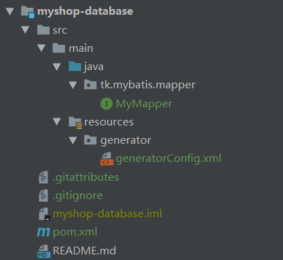

---

## 3.配置数据源

在 `src/main/resources` 目录下创建 `jdbc.properties` 数据源配置：

```properties
jdbc.driverClass=com.mysql.cj.jdbc.Driver
jdbc.connectionURL=jdbc:mysql://192.168.1.18:13306/myshop?useUnicode=true&characterEncoding=utf-8&useSSL=false
jdbc.username=root
jdbc.password=123456
```

## 4.生成代码

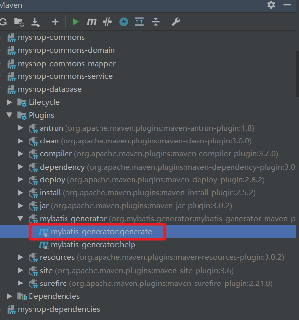

---

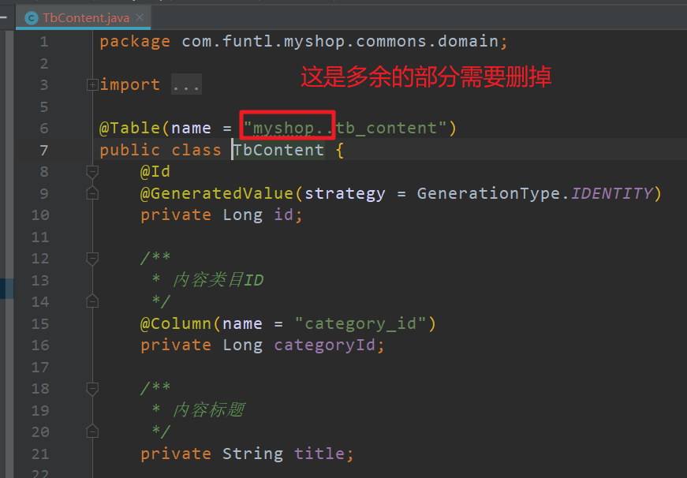

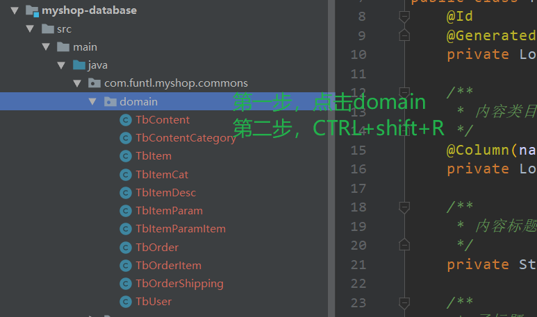

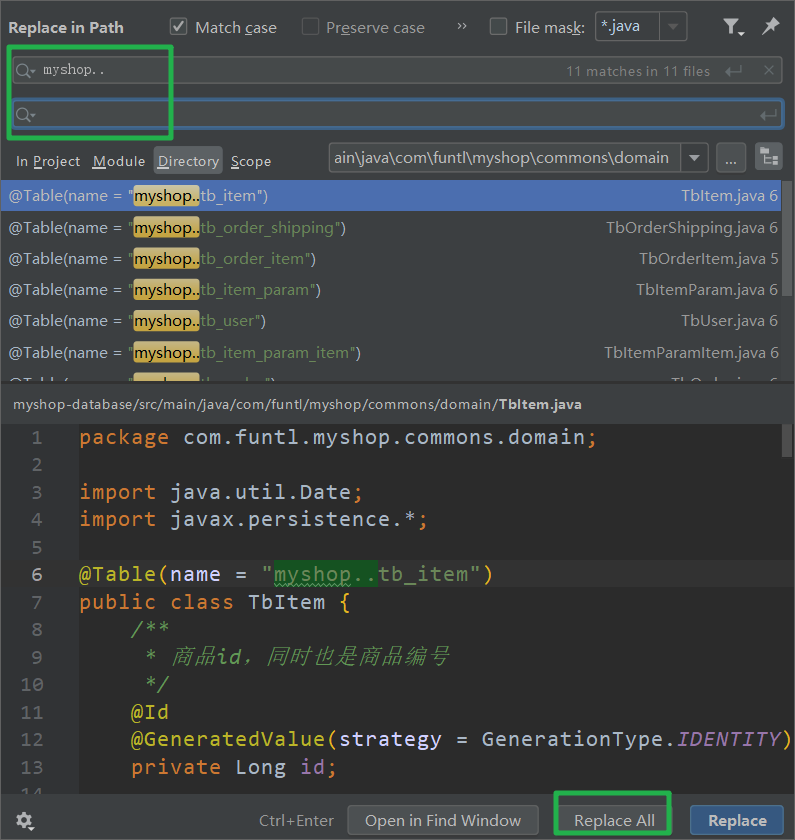

---

## 5.复制domain文件到domain项目

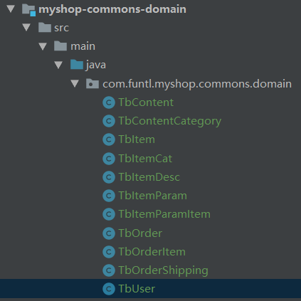

## 6.复制mapper项目文件到mapper项目

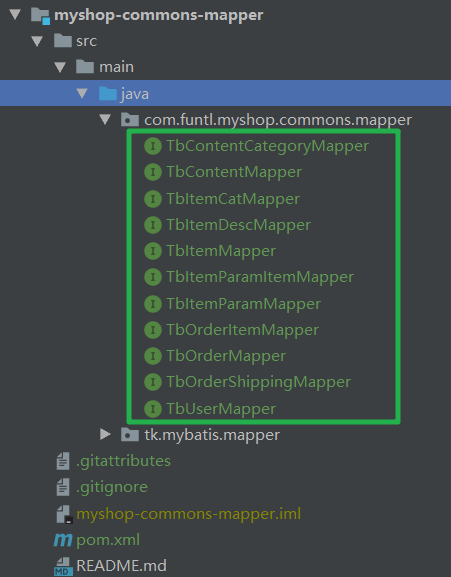

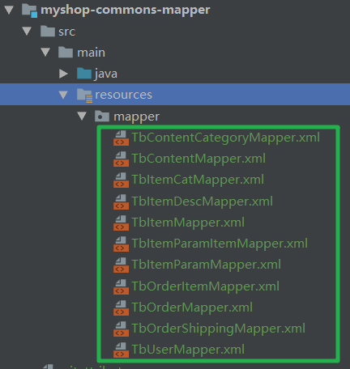

---

# 创建外部的链路追踪

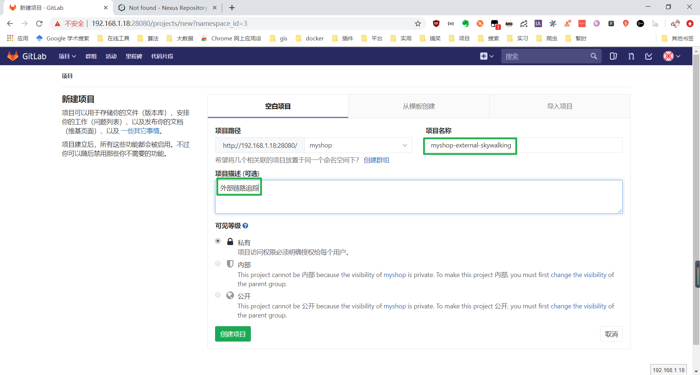

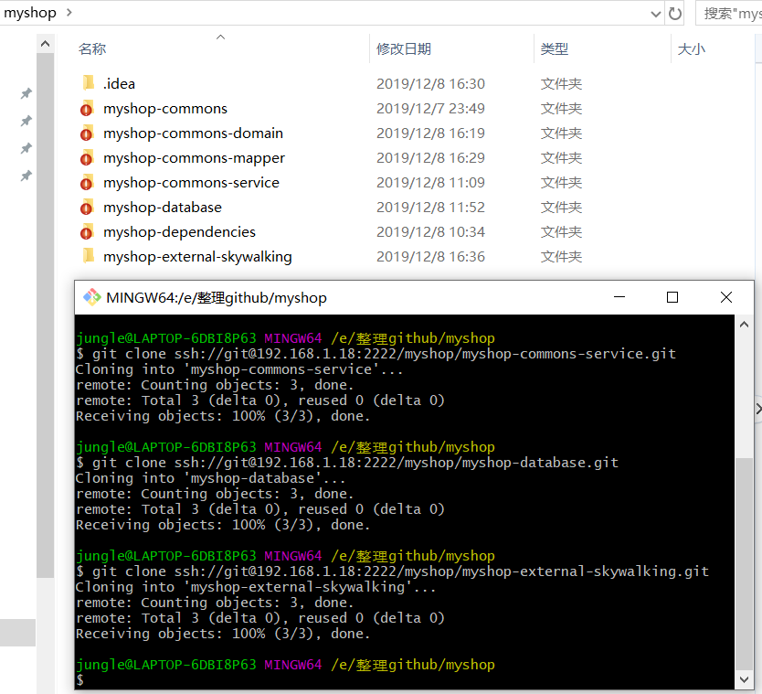

---

## 1.添加相关文件（pom）

pom.xml

```xml
<?xml version="1.0" encoding="UTF-8"?>
<project xmlns="http://maven.apache.org/POM/4.0.0" xmlns:xsi="http://www.w3.org/2001/XMLSchema-instance"
         xsi:schemaLocation="http://maven.apache.org/POM/4.0.0 http://maven.apache.org/xsd/maven-4.0.0.xsd">
    <modelVersion>4.0.0</modelVersion>

    <parent>
        <groupId>com.funtl</groupId>
        <artifactId>myshop-dependencies</artifactId>
        <version>1.0.0-SNAPSHOT</version>
        <relativePath>../myshop-dependencies/pom.xml</relativePath>
    </parent>

    <artifactId>myshop-external-skywalking</artifactId>
    <packaging>jar</packaging>

    <name>myshop-external-skywalking</name>
    <url>http://www.funtl.com</url>
    <inceptionYear>2018-Now</inceptionYear>

    <build>
        <plugins>
            <plugin>
                <groupId>org.apache.maven.plugins</groupId>
                <artifactId>maven-assembly-plugin</artifactId>
                <executions>
                    <!-- 配置执行器 -->
                    <execution>
                        <id>make-assembly</id>
                        <!-- 绑定到 package 生命周期阶段上 -->
                        <phase>package</phase>
                        <goals>
                            <!-- 只运行一次 -->
                            <goal>single</goal>
                        </goals>
                        <configuration>
                            <finalName>skywalking</finalName>
                            <descriptors>
                                <!-- 配置描述文件路径 -->
                                <descriptor>src/main/assembly/assembly.xml</descriptor>
                            </descriptors>
                        </configuration>
                    </execution>
                </executions>
            </plugin>
        </plugins>
    </build>
</project>
```

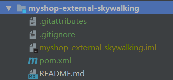

---

## 2.打包归档文件的配置

创建 `src/main/assembly/assembly.xml` 配置文件

```xml
<assembly>
    <id>6.0.0-Beta</id>
    <formats>
        <!-- 打包的文件格式，支持 zip、tar.gz、tar.bz2、jar、dir、war -->
        <format>tar.gz</format>
    </formats>
    <!-- tar.gz 压缩包下是否生成和项目名相同的根目录，有需要请设置成 true -->
    <includeBaseDirectory>false</includeBaseDirectory>
    <dependencySets>
        <dependencySet>
            <!-- 是否把本项目添加到依赖文件夹下，有需要请设置成 true -->
            <useProjectArtifact>false</useProjectArtifact>
            <outputDirectory>lib</outputDirectory>
            <!-- 将 scope 为 runtime 的依赖包打包 -->
            <scope>runtime</scope>
        </dependencySet>
    </dependencySets>
    <fileSets>
        <fileSet>
            <!-- 设置需要打包的文件路径 -->
            <directory>agent</directory>
            <!-- 打包后的输出路径 -->
            <outputDirectory></outputDirectory>
        </fileSet>
    </fileSets>
</assembly>
```

---

## 3.复制agent文件夹到该目录下

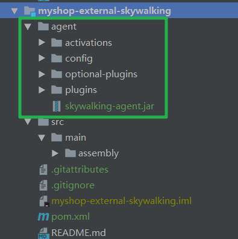

---

## 4.测试使用

```
cd myshop-external-skywalking
mvn clean package
```

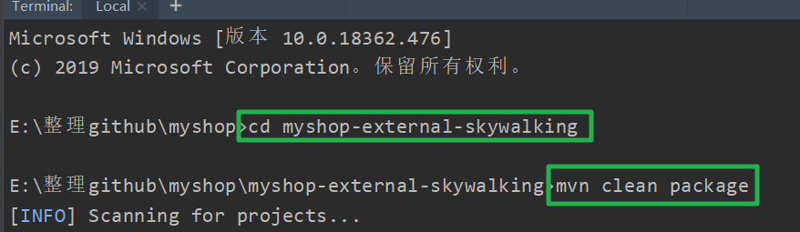

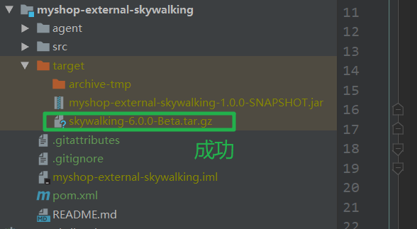

# 提交项目到gitlab

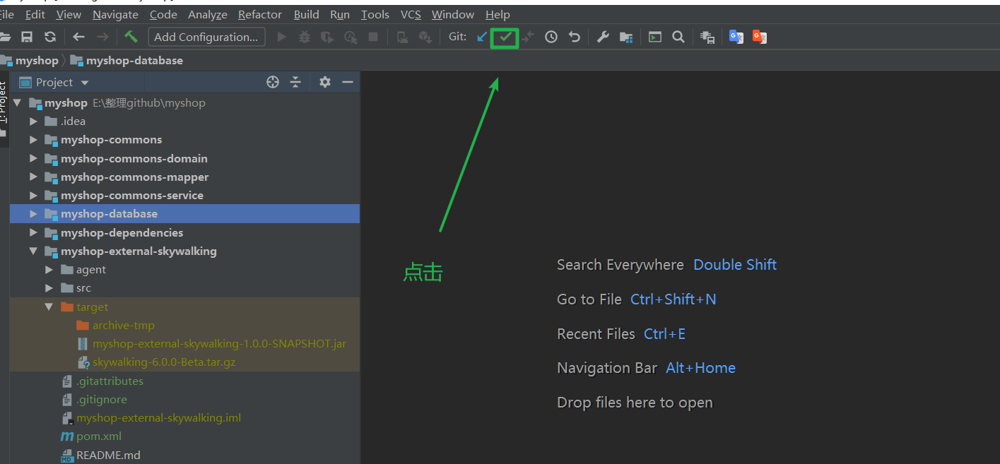

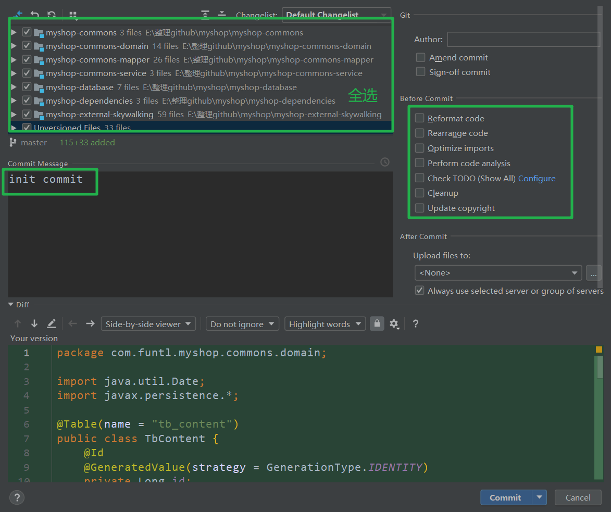


---

# 创建用户注册服务

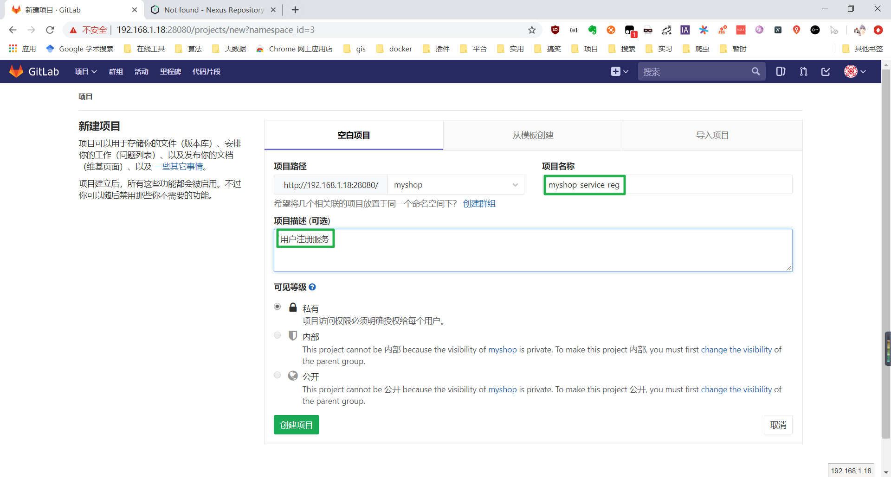

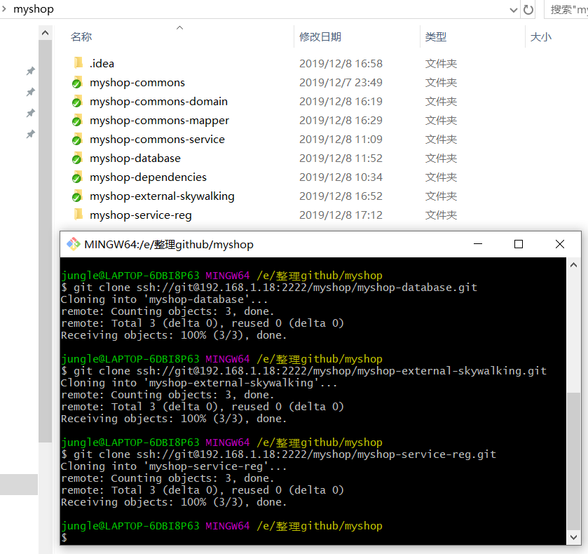

---

## 1.添加相关文件（pom）

pom.xml

```xml
<?xml version="1.0" encoding="UTF-8"?>
<project xmlns="http://maven.apache.org/POM/4.0.0" xmlns:xsi="http://www.w3.org/2001/XMLSchema-instance"
         xsi:schemaLocation="http://maven.apache.org/POM/4.0.0 http://maven.apache.org/xsd/maven-4.0.0.xsd">
    <modelVersion>4.0.0</modelVersion>

    <parent>
        <groupId>com.funtl</groupId>
        <artifactId>myshop-dependencies</artifactId>
        <version>1.0.0-SNAPSHOT</version>
        <relativePath>../myshop-dependencies/pom.xml</relativePath>
    </parent>

    <artifactId>myshop-service-reg</artifactId>
    <packaging>jar</packaging>

    <name>myshop-service-reg</name>
    <url>http://www.funtl.com</url>
    <inceptionYear>2018-Now</inceptionYear>

    <dependencies>
        <!-- Spring Boot Begin -->
        <dependency>
            <groupId>org.springframework.boot</groupId>
            <artifactId>spring-boot-starter-web</artifactId>
        </dependency>
        <dependency>
            <groupId>org.springframework.boot</groupId>
            <artifactId>spring-boot-starter-actuator</artifactId>
        </dependency>
        <dependency>
            <groupId>org.springframework.boot</groupId>
            <artifactId>spring-boot-starter-test</artifactId>
            <scope>test</scope>
        </dependency>
        <!-- Spring Boot End -->

        <!-- Spring Cloud Begin -->
        <dependency>
            <groupId>org.springframework.cloud</groupId>
            <artifactId>spring-cloud-starter-alibaba-nacos-config</artifactId>
        </dependency>
        <dependency>
            <groupId>org.springframework.cloud</groupId>
            <artifactId>spring-cloud-starter-alibaba-nacos-discovery</artifactId>
        </dependency>
        <dependency>
            <groupId>org.springframework.cloud</groupId>
            <artifactId>spring-cloud-starter-alibaba-sentinel</artifactId>
        </dependency>
        <!-- Spring Cloud End -->

        <!-- Projects Begin -->
        <dependency>
            <groupId>com.funtl</groupId>
            <artifactId>myshop-commons-service</artifactId>
            <version>${project.parent.version}</version>
        </dependency>
        <!-- Projects End -->
    </dependencies>

    <build>
        <plugins>
            <plugin>
                <groupId>org.springframework.boot</groupId>
                <artifactId>spring-boot-maven-plugin</artifactId>
                <configuration>
                    <mainClass>com.funtl.myshop.service.reg.MyShopServiceRegApplication</mainClass>
                </configuration>
            </plugin>
        </plugins>
    </build>
</project>
```

## 2.创建相关目录

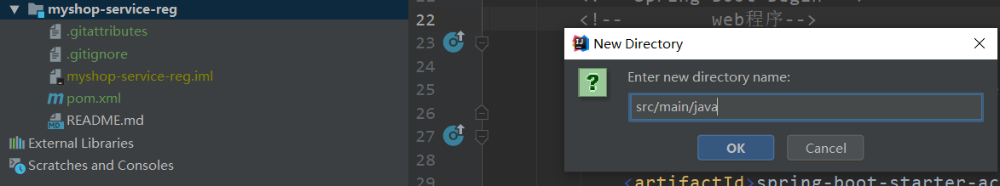

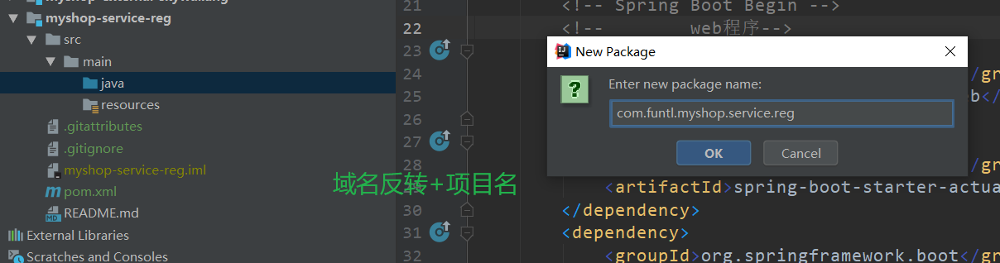

## 3.Application

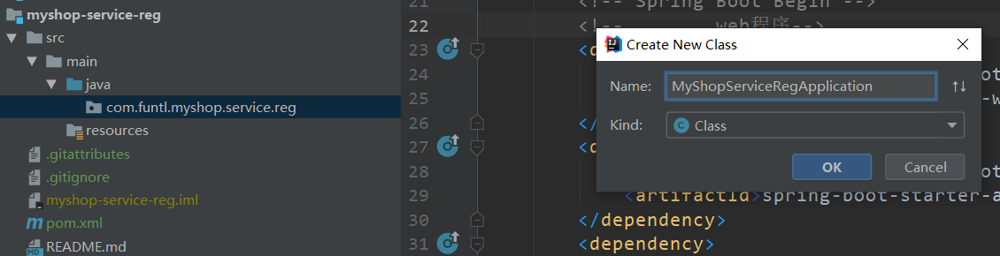

```java
package com.funtl.myshop.service.reg;

import org.springframework.boot.SpringApplication;
import org.springframework.boot.autoconfigure.SpringBootApplication;
import org.springframework.cloud.client.discovery.EnableDiscoveryClient;
import tk.mybatis.spring.annotation.MapperScan;

@SpringBootApplication
@EnableDiscoveryClient
@MapperScan(basePackages = "com.funtl.myshop.commons.mapper")
public class MyShopServiceRegApplication {
    public static void main(String[] args) {
        SpringApplication.run(MyShopServiceRegApplication.class, args);
    }
}
```


---

## 4.配置文件

在`src/main/resources`目录下

- bootstrap.properties

```properties
spring.application.name=myshop-service-reg-config
spring.cloud.nacos.config.file-extension=yaml
spring.cloud.nacos.config.server-addr=192.168.1.18:8848
```

- bootstrap-prod.properties

```properties
spring.profiles.active=prod
spring.application.name=myshop-service-reg-config
spring.cloud.nacos.config.file-extension=yaml
spring.cloud.nacos.config.server-addr=192.168.1.18:8848
```

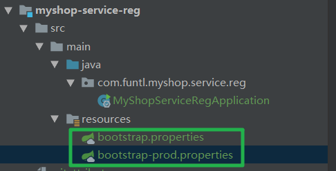

---

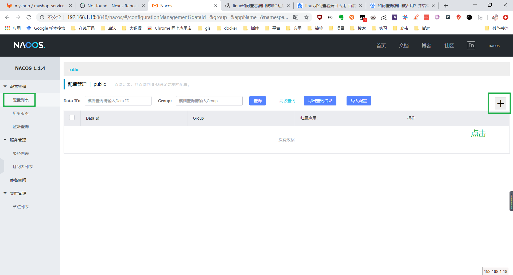

Data ID:myshop-service-reg-config.yaml

**Group:**DEFAULT_GROUP

**配置格式:**YAML

**配置内容:**

```yaml
spring:
  application:
    name: myshop-service-reg
  datasource:
    druid:
      url: jdbc:mysql://192.168.1.18:13306/myshop?useUnicode=true&characterEncoding=utf-8&useSSL=false
      username: root
      password: 123456
      initial-size: 1
      min-idle: 1
      max-active: 20
      test-on-borrow: true
      driver-class-name: com.mysql.cj.jdbc.Driver
  cloud:
    nacos:
      discovery:
        server-addr: 192.168.1.18:8848
    sentinel:
      transport:
        port: 8719
        dashboard: 192.168.1.18:38080

server:
  port: 9501

mybatis:
    type-aliases-package: com.funtl.myshop.commons.domain
    mapper-locations: classpath:mapper/*.xml
# 健康检查
management:
  endpoints:
    web:
      exposure:
        include: "*"
```

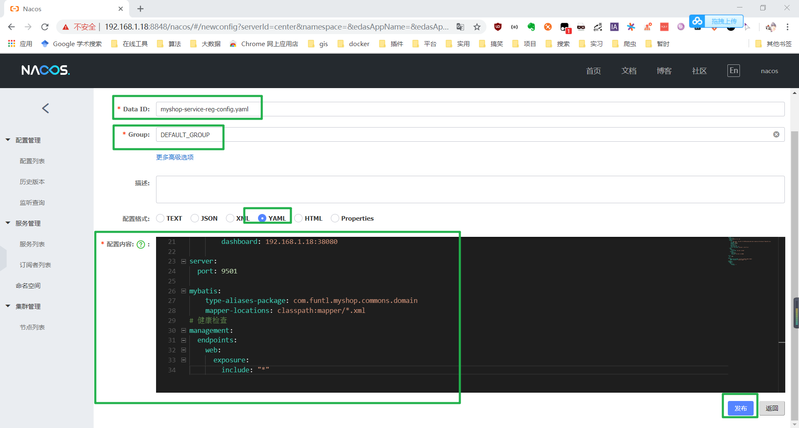

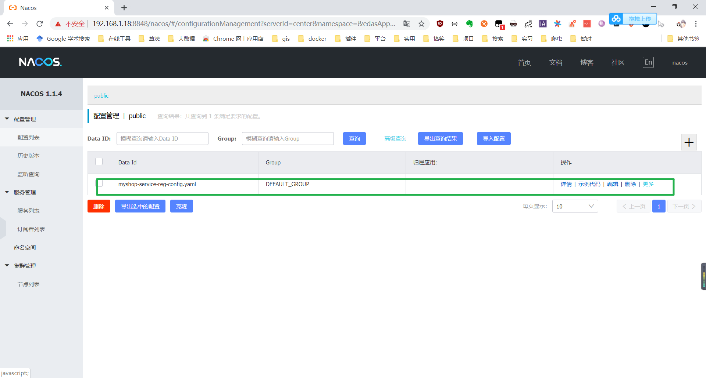

---

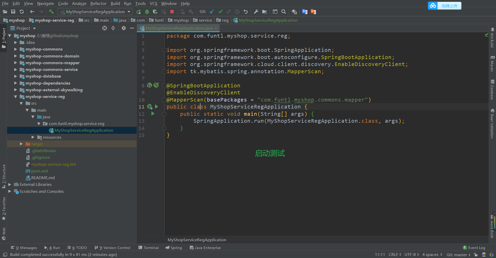

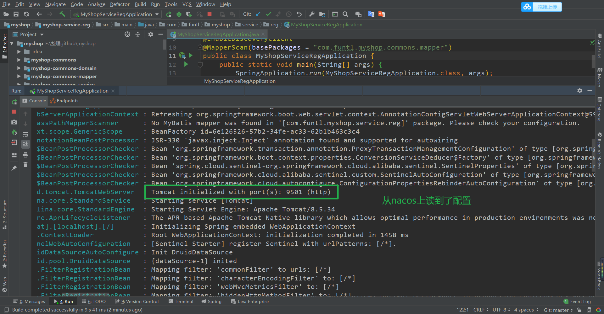


## 5.SkyWalking

```
-javaagent:E:\cleangithub\myshop\myshop-external-skywalking\agent\skywalking-agent.jar
-Dskywalking.agent.service_name=myshop-service-reg
-Dskywalking.collector.backend_service=192.168.1.18:11800
```

javaagent要换成自己本地的地址

注意：javaagent中不能出现中文，否则找不到

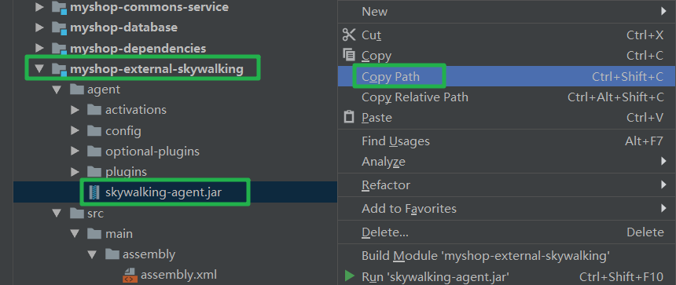


----

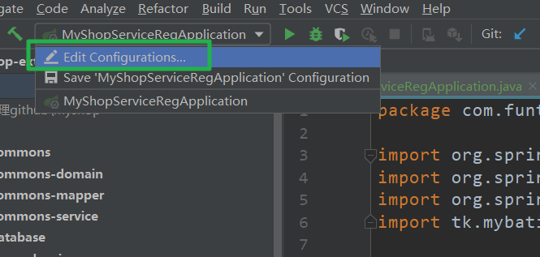

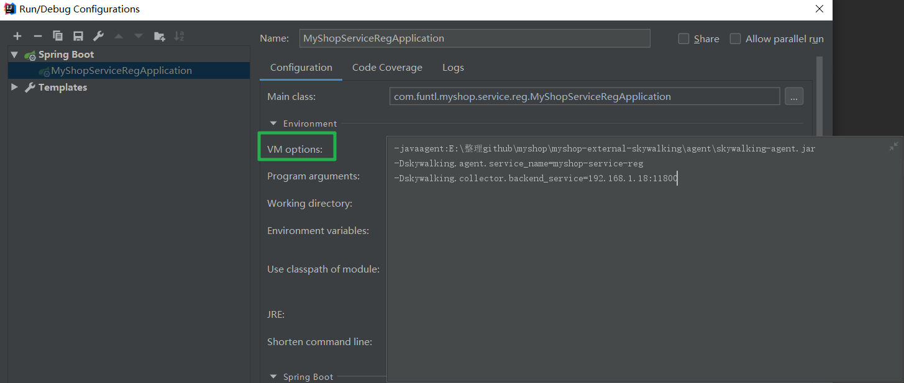

---


## 6.测试

这里测试用，只建cntroller层，数据访问，业务逻辑都在这层

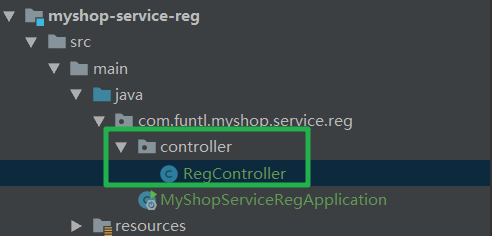

```java
package com.funtl.myshop.service.reg.controller;

import com.funtl.myshop.commons.domain.TbContent;
import com.funtl.myshop.commons.domain.TbUser;
import com.funtl.myshop.commons.mapper.TbContentMapper;
import com.funtl.myshop.commons.mapper.TbUserMapper;
import org.springframework.beans.factory.annotation.Autowired;
import org.springframework.web.bind.annotation.GetMapping;
import org.springframework.web.bind.annotation.PathVariable;
import org.springframework.web.bind.annotation.RequestMapping;
import org.springframework.web.bind.annotation.RestController;

@RestController
@RequestMapping(value = "reg")

public class RegController {

    @Autowired
    private TbUserMapper tbUserMapper;

    @GetMapping(value = {"{id}"})
    public String reg(@PathVariable long id) {

        TbUser tbUser = tbUserMapper.selectByPrimaryKey(id);
        return tbUser.getUsername();
    }
}

```

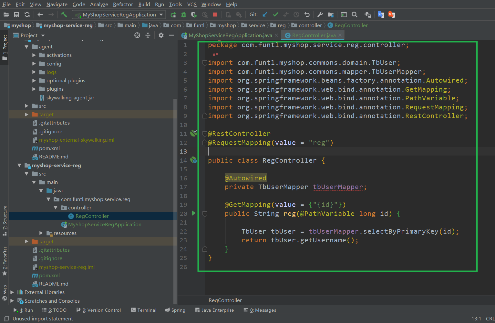

SkyWalking参数也配置好了

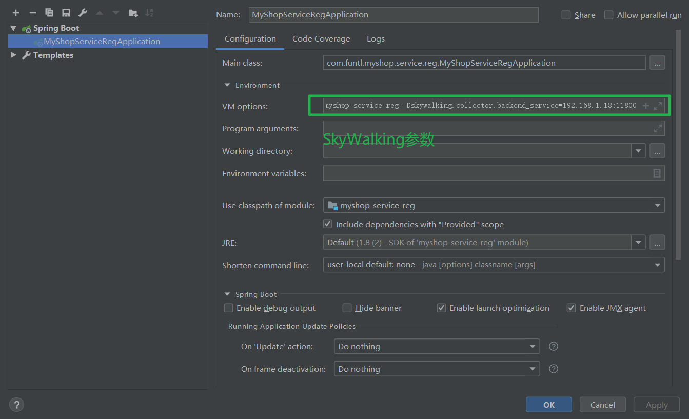

启动

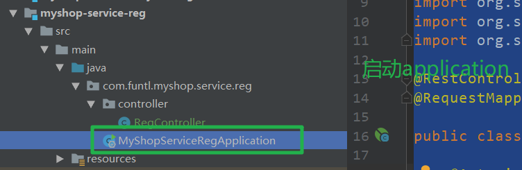

---


1. 访问

```
http://localhost:9501/reg/10
```

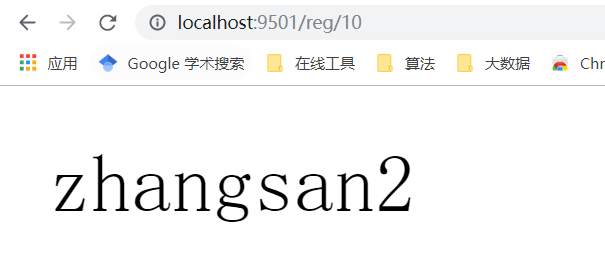

2.nacos

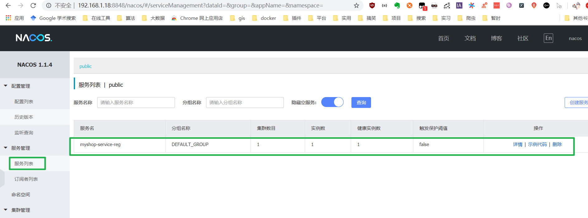

3.skywalking

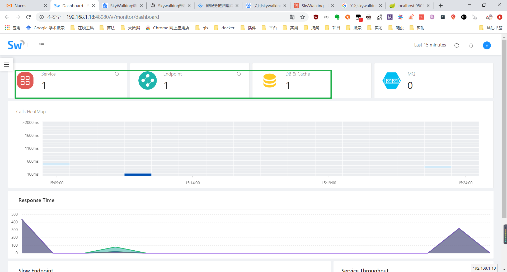

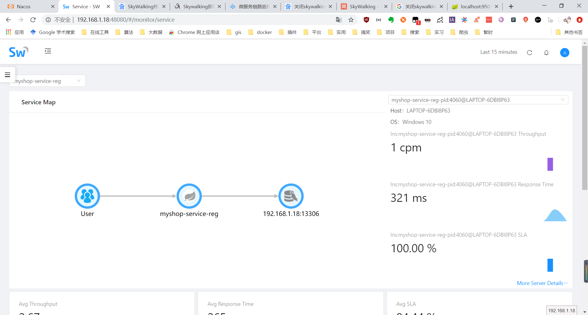

---

# 实现 RESTful 风格的 API

用了几个设计模式：简单工厂模式。单例模式，外观模式

通用的响应结构所以放在myshop-commons项目中

数据传输对象dto

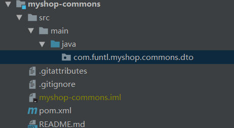

---

## 1.POM

主要在 `myshop-commons` 项目增加了如下依赖：

```xml
<dependency>
    <groupId>com.fasterxml.jackson.core</groupId>
    <artifactId>jackson-databind</artifactId>
</dependency>
<dependency>
    <groupId>com.github.ben-manes.caffeine</groupId>
    <artifactId>guava</artifactId>
</dependency>
<dependency>
    <groupId>org.apache.commons</groupId>
    <artifactId>commons-lang3</artifactId>
</dependency>
```

## 2.相关工具类

主要在 `myshop-commons` 项目中增加了如下工具类

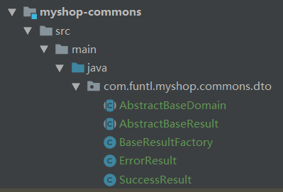

#### AbstractBaseResult

```java
package com.funtl.myshop.commons.dto;

import com.fasterxml.jackson.annotation.JsonInclude;
import lombok.Data;

import java.io.Serializable;

/**
 * 通用的响应结果
 * <p>Title: AbstractBaseResult</p>
 * <p>Description: </p>
 *
 * @author Lusifer
 * @version 1.0.0
 * @date 2019/1/23 15:10
 */
@Data
public abstract class AbstractBaseResult implements Serializable {

    @Data
    @JsonInclude(JsonInclude.Include.NON_NULL)//引入的包是jackson-databind
    protected static class Links {
        private String self;
        private String next;
        private String last;
    }

    @Data
    @JsonInclude(JsonInclude.Include.NON_NULL)//json不会包含为null的数据
    protected static class DataBean<T extends AbstractBaseDomain> {
        private String type;
        private Long id;
        private T attributes;
        private T relationships;
        private Links links;
    }
}
```

#### AbstractBaseDomain

```java
package com.funtl.myshop.commons.dto;

import lombok.Data;

import java.io.Serializable;

/**
 * 通用的领域模型
 * <p>Title: AbstractBaseDomain</p>
 * <p>Description: </p>
 *
 * @author Lusifer
 * @version 1.0.0
 * @date 2019/1/23 15:50
 */
@Data
public abstract class AbstractBaseDomain implements Serializable {
    private Long id;
}
```


#### SuccessResult

```java
package com.funtl.myshop.commons.dto;

import com.google.common.collect.Lists;
import lombok.Data;
import lombok.EqualsAndHashCode;
import org.apache.commons.lang3.StringUtils;

import java.util.List;

/**
 * 请求成功
 * <p>Title: SuccessResult</p>
 * <p>Description: </p>
 *
 * @author Lusifer
 * @version 1.0.0
 * @date 2019/1/23 15:07
 */
@Data
@EqualsAndHashCode(callSuper = false)
public class SuccessResult<T extends AbstractBaseDomain> extends AbstractBaseResult {
    private Links links;
    private List<DataBean> data;

    public SuccessResult(String self, T attributes) {
        links = new Links();
        links.setSelf(self);

        createDataBean(null, attributes);
    }

    public SuccessResult(String self, int next, int last, List<T> attributes) {
        links = new Links();
        links.setSelf(self);
        links.setNext(self + "?page=" + next);
        links.setLast(self + "?page=" + last);

        attributes.forEach(attribute -> createDataBean(self, attribute));
    }

    private void createDataBean(String self, T attributes) {
        if (data == null) {
            data = Lists.newArrayList();//可以这么写，是因为引入了guava这个包
        }

        DataBean dataBean = new DataBean();
        dataBean.setId(attributes.getId());
        dataBean.setType(attributes.getClass().getSimpleName());//得到实体类的名字
        dataBean.setAttributes(attributes);

        if (StringUtils.isNotBlank(self)) {//判断是否为空，引用了commons-lang3这个包
            Links links = new Links();
            links.setSelf(self + "/" + attributes.getId());
            dataBean.setLinks(links);
        }

        data.add(dataBean);
    }
}
```


#### ErrorResult

```Java
package com.funtl.myshop.commons.dto;

import com.fasterxml.jackson.annotation.JsonInclude;
import lombok.AllArgsConstructor;
import lombok.Data;
import lombok.EqualsAndHashCode;

/**
 * 请求失败
 * <p>Title: ErrorResult</p>
 * <p>Description: </p>
 *
 * @author Lusifer
 * @version 1.0.0
 * @date 2019/1/23 15:07
 */
@Data
@AllArgsConstructor//使用后添加一个构造函数，该构造函数含有所有已声明字段属性参数
@EqualsAndHashCode(callSuper = false)
// JSON 不显示为 null 的属性
@JsonInclude(JsonInclude.Include.NON_NULL)
public class ErrorResult extends AbstractBaseResult {
    private int code;
    private String title;
    private String detail;
}
```


#### BaseResultFactory

简单工厂模式

```java
package com.funtl.myshop.commons.dto;

import java.util.List;

/**
 * 通用响应结构工厂
 * <p>Title: BaseResultFactory</p>
 * <p>Description: </p>
 *
 * @author Lusifer
 * @version 1.0.0
 * @date 2019/1/23 15:16
 */
public class BaseResultFactory<T extends AbstractBaseDomain> {

    private static final String LOGGER_LEVEL_DEBUG = "DEBUG";

    //下面是单例模块，目的是实例是点出来，而不是new出来
    private static BaseResultFactory baseResultFactory;

    private BaseResultFactory() {

    }

    //单例模式
    public static BaseResultFactory getInstance() {
        if (baseResultFactory == null) {
            synchronized (BaseResultFactory.class) {
                if (baseResultFactory == null) {
                    baseResultFactory = new BaseResultFactory();
                }
            }
        }
        return baseResultFactory;
    }

    /**
     * 构建单笔数据结果集
     *
     * @param self
     * @return
     */
    public AbstractBaseResult build(String self, T attributes) {
        return new SuccessResult(self, attributes);
    }

    /**
     * 构建多笔数据结果集
     *
     * @param self
     * @param next
     * @param last
     * @return
     */
    public AbstractBaseResult build(String self, int next, int last, List<T> attributes) {
        return new SuccessResult(self, next, last, attributes);
    }

    /**
     * 构建请求错误的响应结构
     *
     * @param code
     * @param title
     * @param detail
     * @param level  日志级别，只有 DEBUG 时才显示详情
     * @return
     */
    public AbstractBaseResult build(int code, String title, String detail, String level) {
        if (LOGGER_LEVEL_DEBUG.equals(level)) {
            return new ErrorResult(code, title, detail);
        } else {
            return new ErrorResult(code, title, null);
        }
    }
}
```

---


## 3.设置日志级别

```properties
logging.level.com.funtl.myshop=DEBUG
```

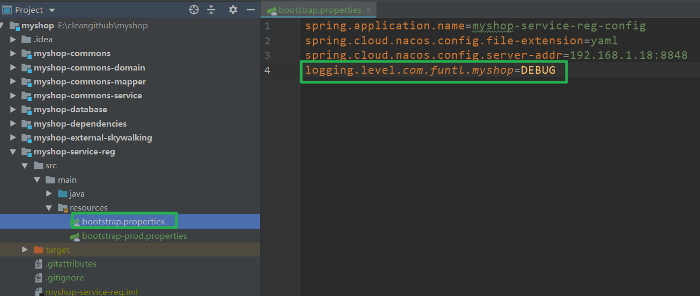

---

在 title 字段中给出错误信息，如果我们在本地或者开发环境想打出更多的调试堆栈信息，我们可以增加一个 detail 字段让调试更加方便。需要注意的一点是，**我们应该在生产环境屏蔽部分敏感信息，detail 字段最好在生产环境不可见。**

所以为DEBUG的时候detail是可见的，不写或是INFO等级，不可见

---

## 4.测试

用TbUser类进行测试

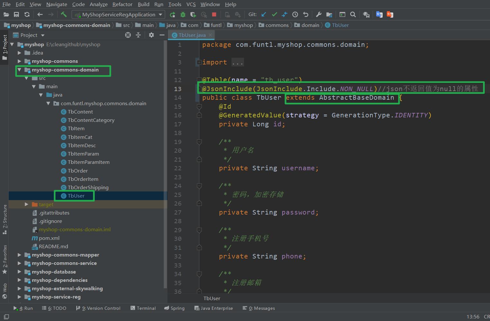

### TestController

```java
package com.funtl.myshop.service.reg.controller;

import com.funtl.myshop.commons.domain.TbUser;
import com.funtl.myshop.commons.dto.AbstractBaseResult;
import com.funtl.myshop.commons.dto.BaseResultFactory;
import com.google.common.collect.Lists;
import org.springframework.beans.factory.annotation.Autowired;
import org.springframework.context.ConfigurableApplicationContext;
import org.springframework.http.HttpStatus;
import org.springframework.web.bind.annotation.GetMapping;
import org.springframework.web.bind.annotation.PathVariable;
import org.springframework.web.bind.annotation.RequestMapping;
import org.springframework.web.bind.annotation.RestController;

import javax.servlet.http.HttpServletRequest;
import java.util.List;

@RestController
@RequestMapping(value = "test")
public class TestController {

    @Autowired
    private ConfigurableApplicationContext applicationContext;//动态刷新参数

    @GetMapping(value = "records/{id}")
    public AbstractBaseResult getById(HttpServletRequest request, @PathVariable long id) {
        TbUser tbUser = new TbUser();
        tbUser.setId(1L);
        tbUser.setUsername("和谷桐人");

        if (id == 1) {
            return BaseResultFactory.getInstance().build(request.getRequestURI(), tbUser);
        } else {
            return BaseResultFactory.getInstance().build(HttpStatus.UNAUTHORIZED.value(), "参数类型错误", "ID 只能为 1", applicationContext.getEnvironment().getProperty("logging.level.com.funtl.myshop"));
        }
    }

    @GetMapping(value = "records")
    public AbstractBaseResult getList(HttpServletRequest request) {
        TbUser tbUser1 = new TbUser();
        tbUser1.setId(1L);
        tbUser1.setUsername("和谷桐人");

        TbUser tbUser2 = new TbUser();
        tbUser2.setId(2L);
        tbUser2.setUsername("亚丝娜");

        List<TbUser> tbUsers = Lists.newArrayList();
        tbUsers.add(tbUser1);
        tbUsers.add(tbUser2);

        return BaseResultFactory.getInstance().build(request.getRequestURI(), 2, 10, tbUsers);
    }
}
```

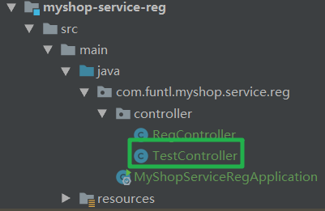

---

结果

```
http://localhost:9501/test/records/
```

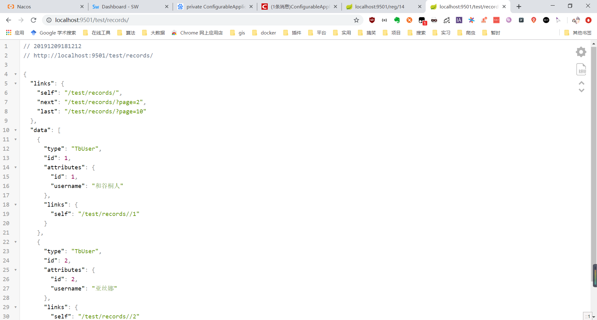

```
http://localhost:9501/test/records/1
```

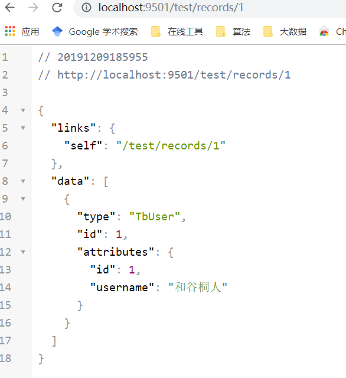

```
http://localhost:9501/test/records/2
```

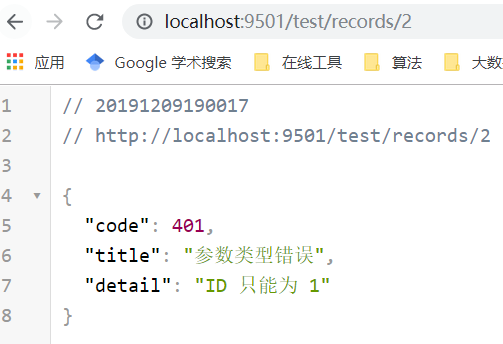

---

设置 Json 不返回 null 字段

```java
@JsonInclude(JsonInclude.Include.NON_NULL)
```

附：SpringMVC 返回状态码

```java
response.setHeader("Content-Type", "application/vnd.api+json");
response.setStatus(500);
```

----


# 完善用户注册服务

## 1.添加表单验证

在myshop-common-domain项目中

```xml
<dependency>
                <groupId>org.hibernate.validator</groupId>
                <artifactId>hibernate-validator</artifactId>
            </dependency>
```

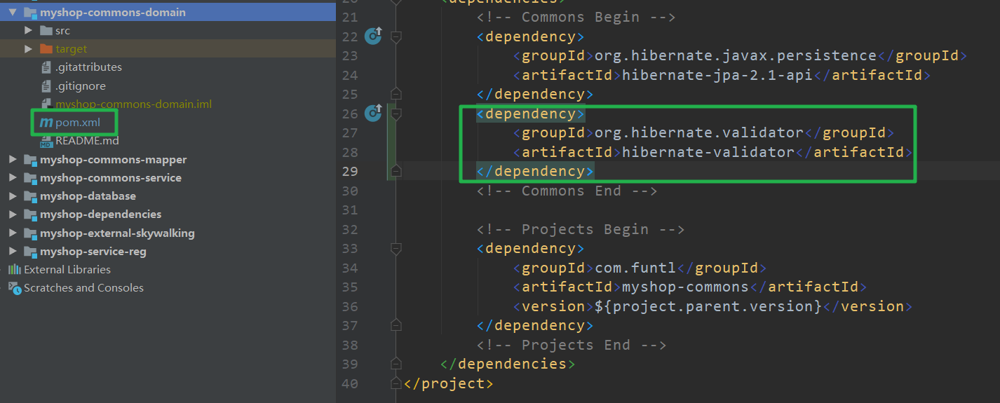

通用验证，验证实体类

----

在myshop-common-domain项目中添加spring的相关依赖

```xml
<!-- Spring Begin -->
        <dependency>
            <groupId>org.springframework</groupId>
            <artifactId>spring-context</artifactId>
        </dependency>
        <!-- Spring End -->
```

---


--BeanValidator

```java
package com.funtl.myshop.commons.validator;

import org.springframework.beans.factory.annotation.Autowired;
import org.springframework.stereotype.Component;

import javax.annotation.PostConstruct;
import javax.validation.ConstraintViolation;
import javax.validation.ConstraintViolationException;
import javax.validation.Validator;
import java.util.ArrayList;
import java.util.HashMap;
import java.util.List;
import java.util.Map;
import java.util.Set;

/**
 * JSR303 Validator(Hibernate Validator)工具类.
 * <p>
 * ConstraintViolation 中包含 propertyPath, message 和 invalidValue 等信息.
 * 提供了各种 convert 方法，适合不同的 i18n 需求:
 * 1. List<String>, String 内容为 message
 * 2. List<String>, String 内容为 propertyPath + separator + message
 * 3. Map<propertyPath, message>
 * <p>
 * 详情见wiki: https://github.com/springside/springside4/wiki/HibernateValidator
 *
 * <p>Title: BeanValidator</p>
 * <p>Description: </p>
 *
 * @author Lusifer
 * @version 1.0.0
 * @date 2018/6/26 17:21
 */
@Component
public class BeanValidator {

    @Autowired
    private Validator validatorInstance;

    private static Validator validator;

    @PostConstruct
    public void init() {
        BeanValidator.validator = validatorInstance;
    }

    /**
     * 调用 JSR303 的 validate 方法, 验证失败时抛出 ConstraintViolationException.
     */
    private static void validateWithException(Validator validator, Object object, Class<?>... groups) throws ConstraintViolationException {
        Set constraintViolations = validator.validate(object, groups);
        if (!constraintViolations.isEmpty()) {
            throw new ConstraintViolationException(constraintViolations);
        }
    }

    /**
     * 辅助方法, 转换 ConstraintViolationException 中的 Set<ConstraintViolations> 中为 List<message>.
     */
    private static List<String> extractMessage(ConstraintViolationException e) {
        return extractMessage(e.getConstraintViolations());
    }

    /**
     * 辅助方法, 转换 Set<ConstraintViolation> 为 List<message>
     */
    private static List<String> extractMessage(Set<? extends ConstraintViolation> constraintViolations) {
        List<String> errorMessages = new ArrayList<>();
        for (ConstraintViolation violation : constraintViolations) {
            errorMessages.add(violation.getMessage());
        }
        return errorMessages;
    }

    /**
     * 辅助方法, 转换 ConstraintViolationException 中的 Set<ConstraintViolations> 为 Map<property, message>.
     */
    private static Map<String, String> extractPropertyAndMessage(ConstraintViolationException e) {
        return extractPropertyAndMessage(e.getConstraintViolations());
    }

    /**
     * 辅助方法, 转换 Set<ConstraintViolation> 为 Map<property, message>.
     */
    private static Map<String, String> extractPropertyAndMessage(Set<? extends ConstraintViolation> constraintViolations) {
        Map<String, String> errorMessages = new HashMap<>();
        for (ConstraintViolation violation : constraintViolations) {
            errorMessages.put(violation.getPropertyPath().toString(), violation.getMessage());
        }
        return errorMessages;
    }

    /**
     * 辅助方法, 转换 ConstraintViolationException 中的 Set<ConstraintViolations> 为 List<propertyPath message>.
     */
    private static List<String> extractPropertyAndMessageAsList(ConstraintViolationException e) {
        return extractPropertyAndMessageAsList(e.getConstraintViolations(), " ");
    }

    /**
     * 辅助方法, 转换 Set<ConstraintViolations> 为 List<propertyPath message>.
     */
    private static List<String> extractPropertyAndMessageAsList(Set<? extends ConstraintViolation> constraintViolations) {
        return extractPropertyAndMessageAsList(constraintViolations, " ");
    }

    /**
     * 辅助方法, 转换 ConstraintViolationException 中的 Set<ConstraintViolations> 为 List<propertyPath + separator + message>.
     */
    private static List<String> extractPropertyAndMessageAsList(ConstraintViolationException e, String separator) {
        return extractPropertyAndMessageAsList(e.getConstraintViolations(), separator);
    }

    /**
     * 辅助方法, 转换 Set<ConstraintViolation> 为 List<propertyPath + separator + message>.
     */
    private static List<String> extractPropertyAndMessageAsList(Set<? extends ConstraintViolation> constraintViolations, String separator) {
        List<String> errorMessages = new ArrayList<>();
        for (ConstraintViolation violation : constraintViolations) {
            errorMessages.add(violation.getPropertyPath() + separator + violation.getMessage());
        }
        return errorMessages;
    }

    /**
     * 服务端参数有效性验证
     *
     * @param object 验证的实体对象
     * @param groups 验证组
     * @return 验证成功：返回 null；验证失败：返回错误信息
     */
    public static String validator(Object object, Class<?>... groups) {
        try {
            validateWithException(validator, object, groups);
        } catch (ConstraintViolationException ex) {
            List<String> list = extractMessage(ex);
            list.add(0, "数据验证失败：");

            // 封装错误消息为字符串
            StringBuilder sb = new StringBuilder();
            for (int i = 0; i < list.size(); i++) {
                String exMsg = list.get(i);
                if (i != 0) {
                    sb.append(String.format("%s. %s", i, exMsg)).append(list.size() > 1 ? "<br/>" : "");
                } else {
                    sb.append(exMsg).append(list.size() > 1 ? "<br/>" : "");
                }
            }

            return sb.toString();
        }

        return null;
    }
}

```

需加注解@Component,这样才能被spring扫描到

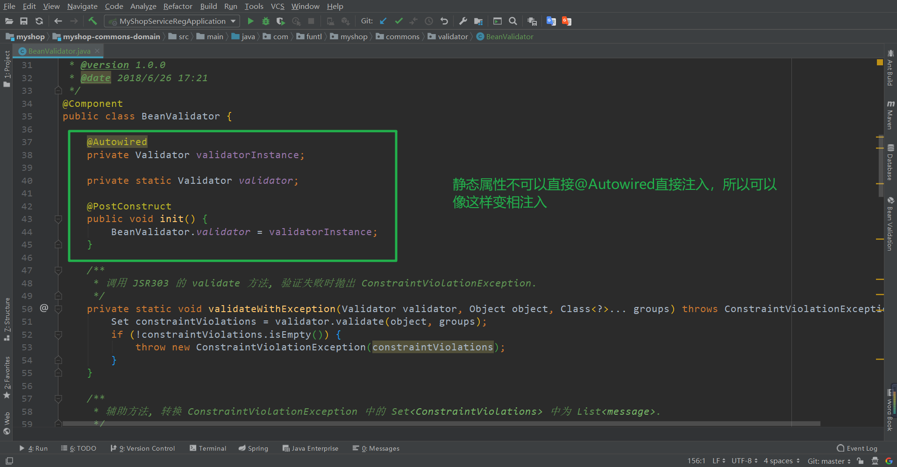

---


在myshop-commons添加工具类RegexpUtils

```java
package com.funtl.myshop.commons.utils;


/**
 * 正则表达式工具类
 * <p>Title: RegexpUtils</p>
 * <p>Description: </p>
 *
 * @author Lusifer
 * @version 1.0.0
 * @date 2018/6/16 23:48
 */
public class RegexpUtils {
    /**
     * 验证手机号
     */
    public static final String PHONE = "^((13[0-9])|(15[^4,\\D])|(18[0,5-9]))\\d{8}$";

    /**
     * 验证邮箱地址
     */
    public static final String EMAIL = "\\w+(\\.\\w)*@\\w+(\\.\\w{2,3}){1,3}";

    /**
     * 验证手机号
     * @param phone
     * @return
     */
    public static boolean checkPhone(String phone) {
        return phone.matches(PHONE);
    }

    /**
     * 验证邮箱
     * @param email
     * @return
     */
    public static boolean checkEmail(String email) {
        return email.matches(EMAIL);
    }
}
```

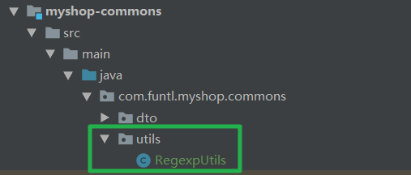

----

### 修改实体类

修改实体类，增加验证注解，以后我们只需要在实体类的属性上使用 JSR-303 注解即可完成相关数据的验证工作，关键代码如下：

```java
@Length(min = 6, max = 20, message = "用户名长度必须介于 6 和 20 之间")
private String username;
@Length(min = 6, max = 20, message = "密码长度必须介于 6 和 20 之间")
private String password;
@Pattern(regexp = RegexpUtils.PHONE, message = "手机号格式不正确")
private String phone;
@Pattern(regexp = RegexpUtils.EMAIL, message = "邮箱格式不正确")
private String email;
```


用TbUser类测试

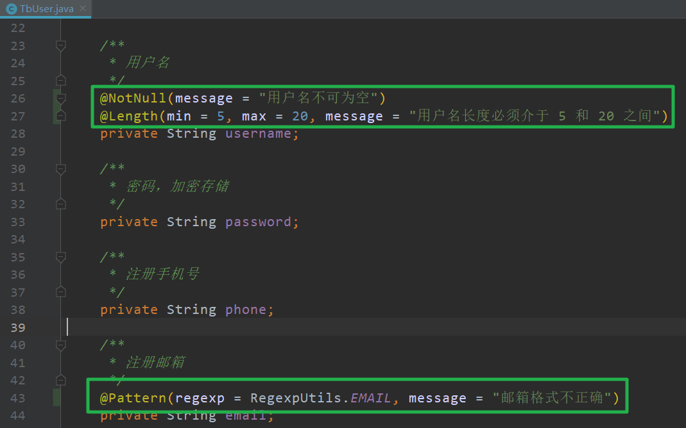


---

给MyShopServiceRegApplication添加注解

```
@SpringBootApplication(scanBasePackages = "com.funtl.myshop")
```

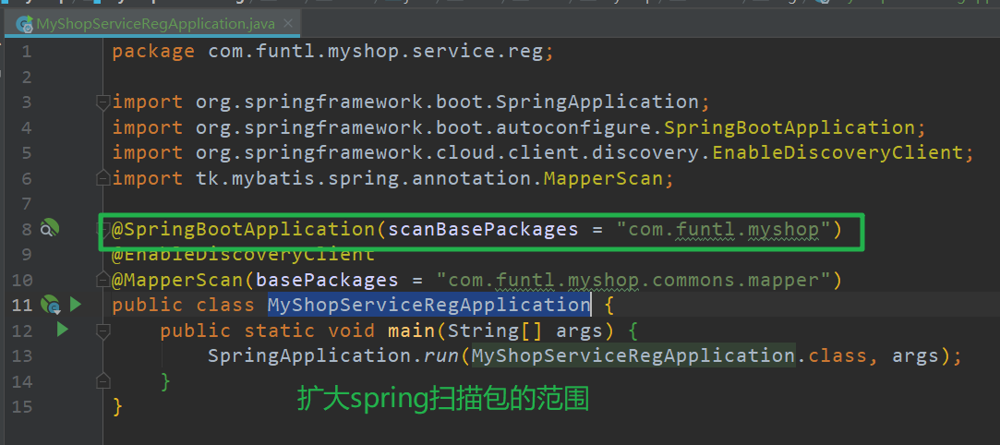

---

controller

```java
package com.funtl.myshop.service.reg.controller;

import com.funtl.myshop.commons.domain.TbUser;
import com.funtl.myshop.commons.dto.AbstractBaseResult;
import com.funtl.myshop.commons.dto.BaseResultFactory;
import com.funtl.myshop.commons.mapper.TbUserMapper;
import com.funtl.myshop.commons.validator.BeanValidator;
import org.apache.commons.lang3.StringUtils;
import org.springframework.beans.factory.annotation.Autowired;
import org.springframework.context.ConfigurableApplicationContext;
import org.springframework.http.HttpStatus;
import org.springframework.web.bind.annotation.*;


@RestController
@RequestMapping(value = "reg")

public class RegController {

    @Autowired
    private TbUserMapper tbUserMapper;

    @Autowired
    private ConfigurableApplicationContext applicationContext;


    @PostMapping(value = "")
   public AbstractBaseResult reg(TbUser tbUser) {

        String messsage = BeanValidator.validator(tbUser);

        if (StringUtils.isNoneBlank(messsage)) {

            return BaseResultFactory.getInstance().build(HttpStatus.UNAUTHORIZED.value(),messsage,null,applicationContext.getEnvironment().getProperty("logging.level.com.funtl.myshop"));

        }
        return null;
    }
}

```

---


启动验证

```
http://localhost:9501/reg
```

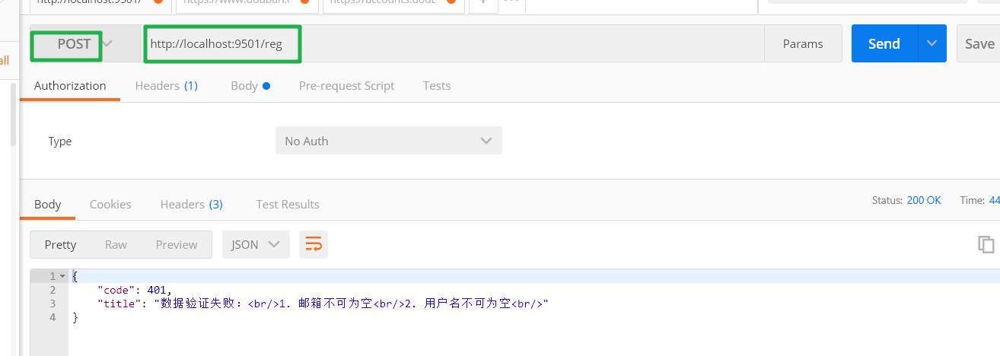

---

## 2.通用的业务逻辑（重构）

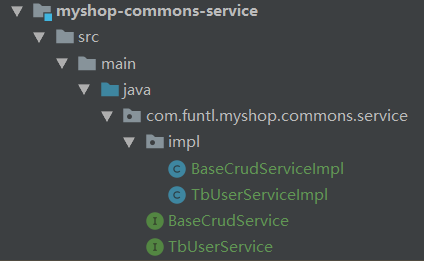

### BaseCrudService

```java
package com.funtl.myshop.commons.service;

import com.funtl.myshop.commons.dto.AbstractBaseDomain;
import com.github.pagehelper.PageInfo;

/**
 * 通用的业务逻辑
 * <p>Title: BaseCrudService</p>
 * <p>Description: </p>
 *
 * @author Lusifer
 * @version 1.0.0
 * @date 2019/1/25 9:43
 */
public interface BaseCrudService<T extends AbstractBaseDomain> {

    /**
     * 查询属性值是否唯一
     *
     * @param property
     * @param value
     * @return true/唯一，false/不唯一
     */
    default boolean unique(String property, String value) {
        return false;
    }

    /**
     * 保存
     *
     * @param domain
     * @return
     */
    default T save(T domain) {
        return null;
    }

    /**
     * 分页查询
     * @param domain
     * @param pageNum
     * @param pageSize
     * @return
     */
    default PageInfo<T> page(T domain, int pageNum, int pageSize) {
        return null;
    }
}

```

### BaseCrudServiceImpl

```java
package com.funtl.myshop.commons.service.impl;

import com.funtl.myshop.commons.dto.AbstractBaseDomain;
import com.funtl.myshop.commons.service.BaseCrudService;
import org.springframework.beans.factory.annotation.Autowired;
import tk.mybatis.mapper.MyMapper;
import tk.mybatis.mapper.entity.Example;

import java.lang.reflect.ParameterizedType;

public class BaseCrudServiceImpl<T extends AbstractBaseDomain, M extends MyMapper<T>> implements BaseCrudService<T> {

    @Autowired
    protected M mapper;

    //实例化泛型，获取泛型的class
    private Class<T> entityClass = (Class<T>) ((ParameterizedType) getClass().getGenericSuperclass()).getActualTypeArguments()[0];

    @Override
    public boolean unique(String property, String value) {
        Example example = new Example(entityClass);
        example.createCriteria().andEqualTo(property, value);
        int result = mapper.selectCountByExample(example);
        if (result > 0) {
            return false;
        }
        return true;
    }

}
```


---

BaseCrudService是通用的业务逻辑，TbUserService继承了它


### TbUserService

```java
package com.funtl.myshop.commons.service;

import com.funtl.myshop.commons.domain.TbUser;

public interface TbUserService extends BaseCrudService<TbUser> {
}
```


### TbUserServiceImpl

```java
package com.funtl.myshop.commons.service.impl;

import com.funtl.myshop.commons.domain.TbUser;
import com.funtl.myshop.commons.mapper.TbUserMapper;
import com.funtl.myshop.commons.service.TbUserService;
import org.springframework.stereotype.Service;

@Service
public class TbUserServiceImpl extends BaseCrudServiceImpl<TbUser, TbUserMapper> implements TbUserService {
}
```

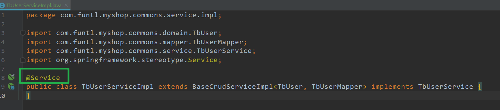

---

## 3.验证表单

### RegController

```java
package com.funtl.myshop.service.reg.controller;

import com.funtl.myshop.commons.domain.TbUser;
import com.funtl.myshop.commons.dto.AbstractBaseResult;
import com.funtl.myshop.commons.dto.BaseResultFactory;
import com.funtl.myshop.commons.mapper.TbUserMapper;
import com.funtl.myshop.commons.service.TbUserService;
import com.funtl.myshop.commons.validator.BeanValidator;
import org.apache.commons.lang3.StringUtils;
import org.springframework.beans.factory.annotation.Autowired;
import org.springframework.context.ConfigurableApplicationContext;
import org.springframework.http.HttpStatus;
import org.springframework.web.bind.annotation.*;
import tk.mybatis.mapper.entity.Example;

import javax.servlet.http.HttpServletRequest;
import javax.servlet.http.HttpServletResponse;


@RestController
@RequestMapping(value = "reg")

public class RegController {

    @Autowired
    private TbUserService tbUserService;


    @Autowired
    private ConfigurableApplicationContext applicationContext;


    @PostMapping(value = "")
   public AbstractBaseResult reg(TbUser tbUser) {

        //数据校验
        String messsage = BeanValidator.validator(tbUser);

        if (StringUtils.isNoneBlank(messsage)) {

            return BaseResultFactory.getInstance().build(HttpStatus.UNAUTHORIZED.value(),messsage,null,applicationContext.getEnvironment().getProperty("logging.level.com.funtl.myshop"));

        }


        // 验证用户名是否重复
        if (!tbUserService.unique("username", tbUser.getUsername())) {

            return BaseResultFactory.getInstance().build(HttpStatus.UNAUTHORIZED.value(),messsage,"用户名重复",applicationContext.getEnvironment().getProperty("logging.level.com.funtl.myshop"));

        }

        // 验证邮箱是否重复
        if (!tbUserService.unique("email", tbUser.getEmail())) {
            return BaseResultFactory.getInstance().build(HttpStatus.UNAUTHORIZED.value(),messsage,"邮箱重复",applicationContext.getEnvironment().getProperty("logging.level.com.funtl.myshop"));

        }


        return null;
    }
}

```

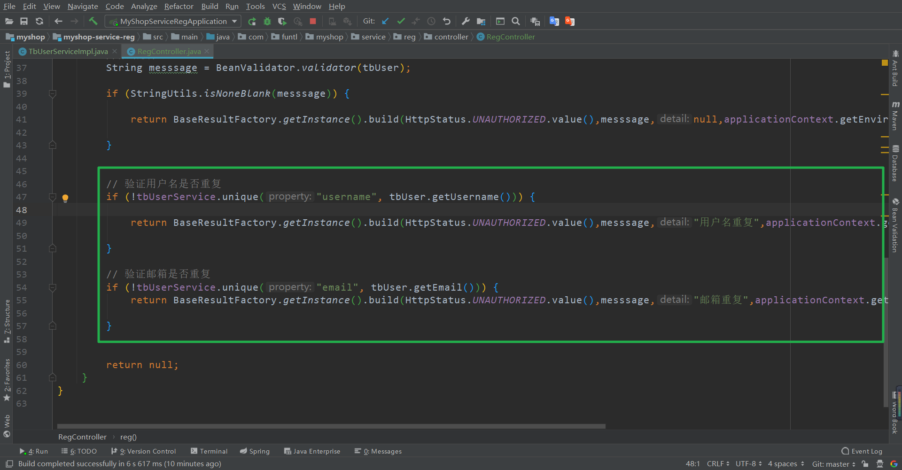

---

### 验证

启动application

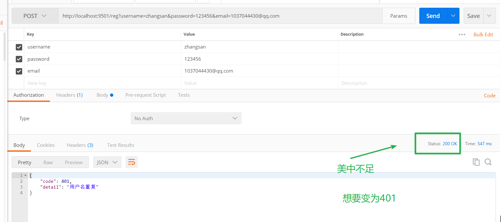

改进

```
HttpServletResponse response,
response.setStatus(HttpStatus.UNAUTHORIZED.value());
```

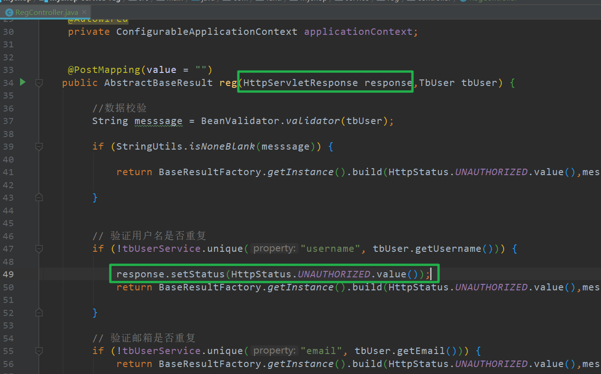

```java
package com.funtl.myshop.service.reg.controller;

import com.funtl.myshop.commons.domain.TbUser;
import com.funtl.myshop.commons.dto.AbstractBaseResult;
import com.funtl.myshop.commons.dto.BaseResultFactory;
import com.funtl.myshop.commons.mapper.TbUserMapper;
import com.funtl.myshop.commons.service.TbUserService;
import com.funtl.myshop.commons.validator.BeanValidator;
import org.apache.commons.lang3.StringUtils;
import org.springframework.beans.factory.annotation.Autowired;
import org.springframework.context.ConfigurableApplicationContext;
import org.springframework.http.HttpStatus;
import org.springframework.web.bind.annotation.*;
import tk.mybatis.mapper.entity.Example;

import javax.servlet.http.HttpServletRequest;
import javax.servlet.http.HttpServletResponse;


@RestController
@RequestMapping(value = "reg")

public class RegController {

    @Autowired
    private TbUserService tbUserService;


    @Autowired
    private ConfigurableApplicationContext applicationContext;


    @PostMapping(value = "")
   public AbstractBaseResult reg(HttpServletResponse response,TbUser tbUser) {

        //数据校验
        String messsage = BeanValidator.validator(tbUser);

        if (StringUtils.isNoneBlank(messsage)) {

            return BaseResultFactory.getInstance().build(HttpStatus.UNAUTHORIZED.value(),messsage,null,applicationContext.getEnvironment().getProperty("logging.level.com.funtl.myshop"));

        }


        // 验证用户名是否重复
        if (!tbUserService.unique("username", tbUser.getUsername())) {

            response.setStatus(HttpStatus.UNAUTHORIZED.value());
            return BaseResultFactory.getInstance().build(HttpStatus.UNAUTHORIZED.value(),messsage,"用户名重复",applicationContext.getEnvironment().getProperty("logging.level.com.funtl.myshop"));

        }

        // 验证邮箱是否重复
        if (!tbUserService.unique("email", tbUser.getEmail())) {
            return BaseResultFactory.getInstance().build(HttpStatus.UNAUTHORIZED.value(),messsage,"邮箱重复",applicationContext.getEnvironment().getProperty("logging.level.com.funtl.myshop"));

        }


        return null;
    }
}

```

重新运行

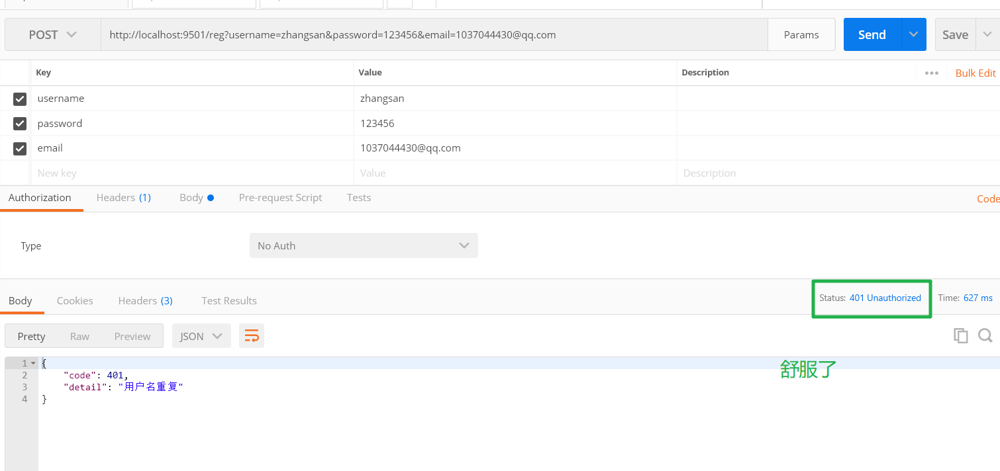

---

## 4.重构

### 添加依赖

```xml
<!-- Spring Begin -->
        <dependency>
            <groupId>org.apache.tomcat.embed</groupId>
            <artifactId>tomcat-embed-core</artifactId>
            <scope>provided</scope>
<!--            provided表明该包只在编译和测试的时候用-->
        </dependency>
        <!-- Spring End -->

        <!-- Commons Begin -->
```

添加这个依赖，是为了使用HttpServletRequest

```xml
<dependency>
            <groupId>org.springframework</groupId>
            <artifactId>spring-webmvc</artifactId>
            <scope>provided</scope>
        </dependency>
```

添加这个依赖，是为了使用注解

---

### BaseResultFactory

```java
package com.funtl.myshop.commons.dto;

import javax.servlet.http.HttpServletResponse;
import java.util.List;

/**
 * 通用响应结构工厂
 * <p>Title: BaseResultFactory</p>
 * <p>Description: </p>
 *
 * @author Lusifer
 * @version 1.0.0
 * @date 2019/1/23 15:16
 */
public class BaseResultFactory<T extends AbstractBaseDomain> {

    /**
     * 设置日志级别，用于限制发生错误时，是否显示调试信息(detail)
     *
     */
    private static final String LOGGER_LEVEL_DEBUG = "DEBUG";

    //下面是单例模块，目的是实例是点出来，而不是new出来
    private static BaseResultFactory baseResultFactory;

    private BaseResultFactory() {

    }

    // 设置通用的响应
    private static HttpServletResponse response;
    //单例模式
    public static BaseResultFactory getInstance(HttpServletResponse response) {
        if (baseResultFactory == null) {
            synchronized (BaseResultFactory.class) {
                if (baseResultFactory == null) {
                    baseResultFactory = new BaseResultFactory();
                }
            }
        }
        BaseResultFactory.response = response;
        // 设置通用响应
        baseResultFactory.initResponse();
        return baseResultFactory;
    }

    /**
     * 构建单笔数据结果集
     *
     * @param self
     * @return
     */
    public AbstractBaseResult build(String self, T attributes) {
        return new SuccessResult(self, attributes);
    }

    /**
     * 构建多笔数据结果集
     *
     * @param self
     * @param next
     * @param last
     * @return
     */
    public AbstractBaseResult build(String self, int next, int last, List<T> attributes) {
        return new SuccessResult(self, next, last, attributes);
    }

    /**
     * 构建请求错误的响应结构
     *
     * @param code
     * @param title
     * @param detail
     * @param level  日志级别，只有 DEBUG 时才显示详情
     * @return
     */
    public AbstractBaseResult build(int code, String title, String detail, String level) {

        // 设置请求失败的响应码
        response.setStatus(code);

        if (LOGGER_LEVEL_DEBUG.equals(level)) {
            return new ErrorResult(code, title, detail);
        } else {
            return new ErrorResult(code, title, null);
        }
    }

    /**
     * 初始化 HttpServletResponse
     */
    private void initResponse() {
        // 需要符合 JSON API 规范
        response.setHeader("Content-Type", "application/vnd.api+json");
    }
}
```


---

### AbstractBaseController

```java
package com.funtl.myshop.commons.web;

import com.funtl.myshop.commons.dto.AbstractBaseDomain;
import com.funtl.myshop.commons.dto.AbstractBaseResult;
import com.funtl.myshop.commons.dto.BaseResultFactory;
import org.springframework.beans.factory.annotation.Autowired;
import org.springframework.context.ConfigurableApplicationContext;
import org.springframework.http.HttpStatus;
import org.springframework.web.bind.annotation.ModelAttribute;

import javax.annotation.Resource;
import javax.servlet.http.HttpServletRequest;
import javax.servlet.http.HttpServletResponse;
import java.util.List;

/**
 * 通用的控制器
 * <p>Title: AbstractBaseController</p>
 * <p>Description: </p>
 *
 * @author Lusifer
 * @version 1.0.0
 * @date 2019/1/25 11:11
 */
public abstract class AbstractBaseController<T extends AbstractBaseDomain> {

    // 用于动态获取配置文件的属性值
    private static final String ENVIRONMENT_LOGGING_LEVEL_MY_SHOP = "logging.level.com.funtl.myshop";

    /**
     * protected HttpServletRequest request; 定义了一个 request 成员变量，目的是希望减少代码上的参数传递，使代码看上去简洁些，
     * 确无意间留下了可能的 线程安全 隐患；解决方法是在该成员变量上增加 @Resource 注解；区别在于有注解时创建的 HttpServletRequest 里
     * 绑定的 RequestAttributes 使用了 ThreadLocal
     * （作用是提供线程内的局部变量，这种变量在多线程环境下访问时能够保证各个线程里变量的独立性）
     */
    @Resource
    protected HttpServletRequest request;
    @Resource
    protected HttpServletResponse response;

    @Autowired
    private ConfigurableApplicationContext applicationContext;

    //@ModelAttribute注释的方法会在此controller每个方法执行前被执行
    @ModelAttribute
    public void initReqAndRes(HttpServletRequest request, HttpServletResponse response) {
        this.request = request;
        this.response = response;
    }

    /**
     * 请求成功
     * @param self
     * @param attribute
     * @return
     */
    protected AbstractBaseResult success(String self, T attribute) {
        return BaseResultFactory.getInstance(response).build(self, attribute);
    }

    /**
     * 请求成功
     * @param self
     * @param next
     * @param last
     * @param attributes
     * @return
     */
    protected AbstractBaseResult success(String self, int next, int last, List<T> attributes) {
        return BaseResultFactory.getInstance(response).build(self, next, last, attributes);
    }

    /**
     * 请求失败
     * @param title
     * @param detail
     * @return
     */
    protected AbstractBaseResult error(String title, String detail) {
        return error(HttpStatus.UNAUTHORIZED.value(), title, detail);
    }

    /**
     * 请求失败
     * @param code
     * @param title
     * @param detail
     * @return
     */
    protected AbstractBaseResult error(int code, String title, String detail) {
        return BaseResultFactory.getInstance(response).build(code, title, detail, applicationContext.getEnvironment().getProperty(ENVIRONMENT_LOGGING_LEVEL_MY_SHOP));
    }
}

```

---


### RegController

```java
package com.funtl.myshop.service.reg.controller;

import com.funtl.myshop.commons.domain.TbUser;
import com.funtl.myshop.commons.dto.AbstractBaseResult;
import com.funtl.myshop.commons.dto.BaseResultFactory;
import com.funtl.myshop.commons.service.TbUserService;
import com.funtl.myshop.commons.validator.BeanValidator;
import com.funtl.myshop.commons.web.AbstractBaseController;
import org.apache.commons.lang3.StringUtils;
import org.springframework.beans.factory.annotation.Autowired;
import org.springframework.web.bind.annotation.*;


@RestController
@RequestMapping(value = "reg")

public class RegController extends AbstractBaseController<TbUser> {

    @Autowired
    private TbUserService tbUserService;


    @PostMapping(value = "")
   public AbstractBaseResult reg(TbUser tbUser) {

        //数据校验
        String message = BeanValidator.validator(tbUser);

        if (StringUtils.isNoneBlank(message)) {

            return error(message, null);
        }


        // 验证用户名是否重复
        if (!tbUserService.unique("username", tbUser.getUsername())) {

            return error("用户名已存在", null);
        }

        // 验证邮箱是否重复
        if (!tbUserService.unique("email", tbUser.getEmail())) {
            return error("邮箱重复，请重试", null);
        }


        return null;
    }
}

```

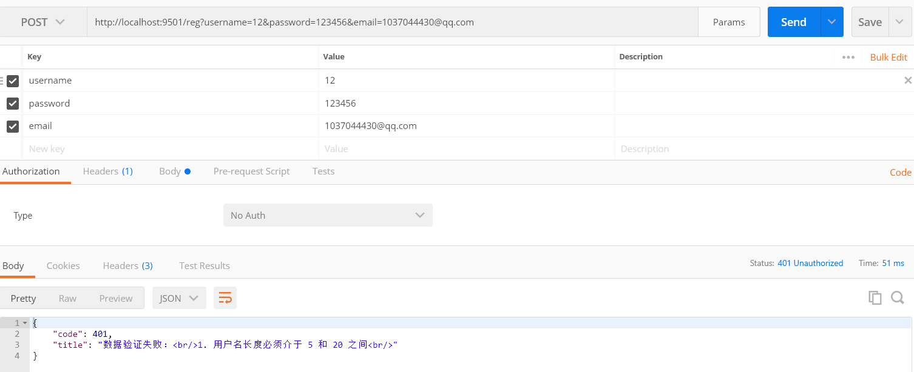


# 完善用户注册服务2

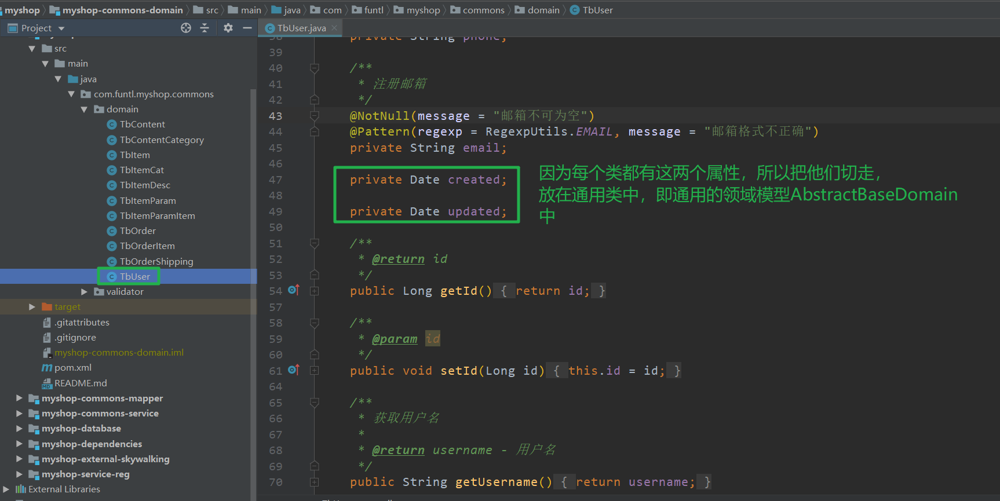

```java
package com.funtl.myshop.commons.domain;

import com.fasterxml.jackson.annotation.JsonInclude;
import com.funtl.myshop.commons.dto.AbstractBaseDomain;
import com.funtl.myshop.commons.utils.RegexpUtils;
import org.hibernate.validator.constraints.Length;

import javax.persistence.Table;
import javax.validation.constraints.NotNull;
import javax.validation.constraints.Pattern;

@Table(name = "tb_user")
@JsonInclude(JsonInclude.Include.NON_NULL)//json不返回值为null的属性
public class TbUser extends AbstractBaseDomain {

    /**
     * 用户名
     */
    @NotNull(message = "用户名不可为空")
    @Length(min = 5, max = 20, message = "用户名长度必须介于 5 和 20 之间")
    private String username;

    /**
     * 密码，加密存储
     */
    private String password;

    /**
     * 注册手机号
     */
    private String phone;

    /**
     * 注册邮箱
     */
    @NotNull(message = "邮箱不可为空")
    @Pattern(regexp = RegexpUtils.EMAIL, message = "邮箱格式不正确")
    private String email;


    /**
     * 获取用户名
     *
     * @return username - 用户名
     */
    public String getUsername() {
        return username;
    }

    /**
     * 设置用户名
     *
     * @param username 用户名
     */
    public void setUsername(String username) {
        this.username = username;
    }

    /**
     * 获取密码，加密存储
     *
     * @return password - 密码，加密存储
     */
    public String getPassword() {
        return password;
    }

    /**
     * 设置密码，加密存储
     *
     * @param password 密码，加密存储
     */
    public void setPassword(String password) {
        this.password = password;
    }

    /**
     * 获取注册手机号
     *
     * @return phone - 注册手机号
     */
    public String getPhone() {
        return phone;
    }

    /**
     * 设置注册手机号
     *
     * @param phone 注册手机号
     */
    public void setPhone(String phone) {
        this.phone = phone;
    }

    /**
     * 获取注册邮箱
     *
     * @return email - 注册邮箱
     */
    public String getEmail() {
        return email;
    }

    /**
     * 设置注册邮箱
     *
     * @param email 注册邮箱
     */
    public void setEmail(String email) {
        this.email = email;
    }


}
```


## AbstractBaseDomain

```java
package com.funtl.myshop.commons.dto;

import lombok.Data;

import javax.persistence.GeneratedValue;
import javax.persistence.GenerationType;
import javax.persistence.Id;
import java.io.Serializable;
import java.util.Date;

/**
 * 通用的领域模型
 * <p>Title: AbstractBaseDomain</p>
 * <p>Description: </p>
 *
 * @author Lusifer
 * @version 1.0.0
 * @date 2019/1/23 15:50
 */
@Data
public abstract class AbstractBaseDomain implements Serializable {

    /**
     * 该注解需要保留，用于 tk.mybatis 回显 ID
     */
    @Id
    @GeneratedValue(strategy = GenerationType.IDENTITY)//引用了hibernate-jpa-2.1-api包
    private Long id;
    private Date created;
    private Date updated;
}
```

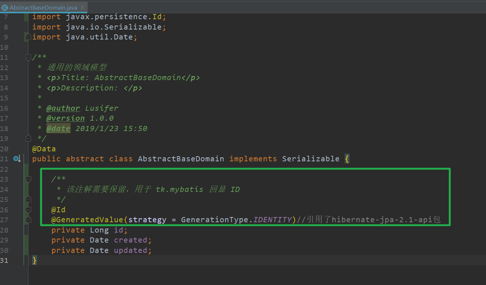

---


依赖

```xml
<dependency>
            <groupId>org.hibernate.javax.persistence</groupId>
            <artifactId>hibernate-jpa-2.1-api</artifactId>
        </dependency>
```

>  目的：
>
>    ```java
>  /** * 该注解需要保留，用于 tk.mybatis 回显 ID */@Id@GeneratedValue(strategy = GenerationType.IDENTITY)//引用了hibernate-jpa-2.1-api包
>    ```

---


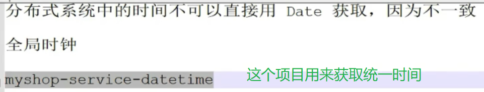


## BaseCrudService

```java
package com.funtl.myshop.commons.service;

import com.funtl.myshop.commons.dto.AbstractBaseDomain;

/**
 * 通用的业务逻辑
 * <p>Title: BaseCrudService</p>
 * <p>Description: </p>
 *
 * @author Lusifer
 * @version 1.0.0
 * @date 2019/1/25 9:43
 */
public interface BaseCrudService<T extends AbstractBaseDomain> {

    /**
     * 查询属性值是否唯一
     *
     * @param property
     * @param value
     * @return true/唯一，false/不唯一
     */
    default boolean unique(String property, String value) {
        return false;
    }

    /**
     * 保存
     * @param domain
     * @return
     */
    default T save(T domain) {
        return null;
    }
}
```


## BaseCrudServiceImpl

```java
package com.funtl.myshop.commons.service.impl;

import com.funtl.myshop.commons.dto.AbstractBaseDomain;
import com.funtl.myshop.commons.service.BaseCrudService;
import org.springframework.beans.factory.annotation.Autowired;
import tk.mybatis.mapper.MyMapper;
import tk.mybatis.mapper.entity.Example;

import java.lang.reflect.ParameterizedType;
import java.util.Date;

public class BaseCrudServiceImpl<T extends AbstractBaseDomain, M extends MyMapper<T>> implements BaseCrudService<T> {

    @Autowired
    protected M mapper;

    //实例化泛型，获取泛型的class
    private Class<T> entityClass = (Class<T>) ((ParameterizedType) getClass().getGenericSuperclass()).getActualTypeArguments()[0];

    @Override
    public boolean unique(String property, String value) {
        Example example = new Example(entityClass);
        example.createCriteria().andEqualTo(property, value);
        int result = mapper.selectCountByExample(example);
        if (result > 0) {
            return false;
        }
        return true;
    }

    @Override
    public T save(T domain) {
        int result = 0;

        Date currentDate = new Date();
        domain.setUpdated(currentDate);

        // 创建
        if (domain.getId() == null) {
            domain.setCreated(currentDate);

            /**
             * 用于自动回显 ID，领域模型中需要 @ID 注解的支持
             * {@link AbstractBaseDomain}
             */
            result = mapper.insertUseGeneratedKeys(domain);
        }

        // 更新
        else {
            result = mapper.updateByPrimaryKey(domain);
        }

        // 保存数据成功
        if (result > 0) {
            return domain;
        }

        // 保存数据失败
        return null;
    }
}
```

---

## RegController

```java
package com.funtl.myshop.service.reg.controller;

import com.funtl.myshop.commons.domain.TbUser;
import com.funtl.myshop.commons.dto.AbstractBaseResult;
import com.funtl.myshop.commons.dto.BaseResultFactory;
import com.funtl.myshop.commons.service.TbUserService;
import com.funtl.myshop.commons.validator.BeanValidator;
import com.funtl.myshop.commons.web.AbstractBaseController;
import org.apache.commons.lang3.StringUtils;
import org.springframework.beans.factory.annotation.Autowired;
import org.springframework.util.DigestUtils;
import org.springframework.web.bind.annotation.*;


@RestController
@RequestMapping(value = "reg")

public class RegController extends AbstractBaseController<TbUser> {

    @Autowired
    private TbUserService tbUserService;


    @PostMapping(value = "")
   public AbstractBaseResult reg(TbUser tbUser) {

        //数据校验
        String message = BeanValidator.validator(tbUser);

        if (StringUtils.isNoneBlank(message)) {

            return error(message, null);
        }


        // 验证用户名是否重复
        if (!tbUserService.unique("username", tbUser.getUsername())) {

            return error("用户名已存在", null);
        }

        // 验证邮箱是否重复
        if (!tbUserService.unique("email", tbUser.getEmail())) {
            return error("邮箱重复，请重试", null);
        }

        //注册用户
        tbUser.setPassword(DigestUtils.md5DigestAsHex(tbUser.getPassword().getBytes()));
        TbUser user = tbUserService.save(tbUser);

        if (user != null) {

            return success(request.getRequestURI(),user);
        }

        // 注册失败
        return error("注册失败，请重试", null);
    }
}

```

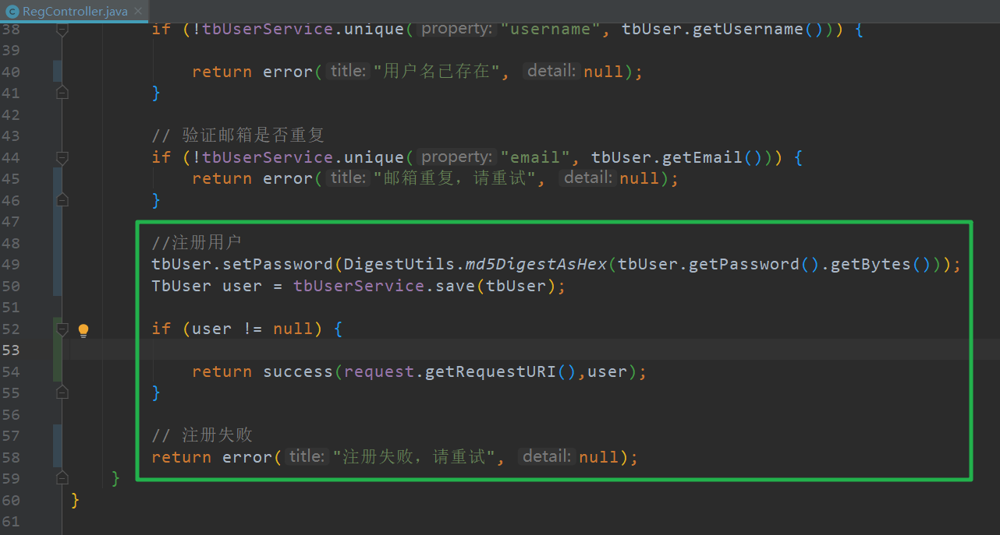

---

验证

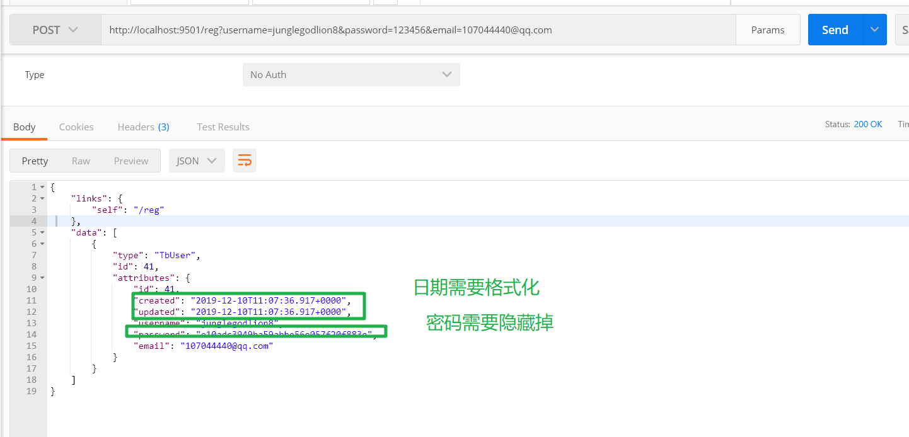

---

## 优化

### 隐藏密码

使用注解`@JsonIgnore`

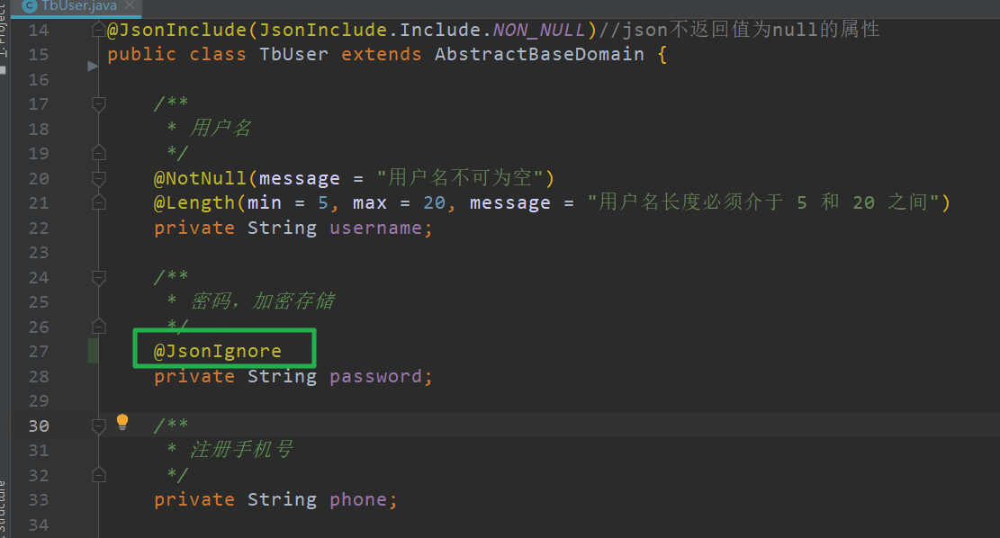

---

### 日期格式化

使用注解

```java
/**
     * 格式化日期，由于是北京时间（我们是在东八区），所以时区 +8
     */
    @JsonFormat(pattern = "yyyy-MM-dd HH:mm:ss", timezone = "GMT+8")
```

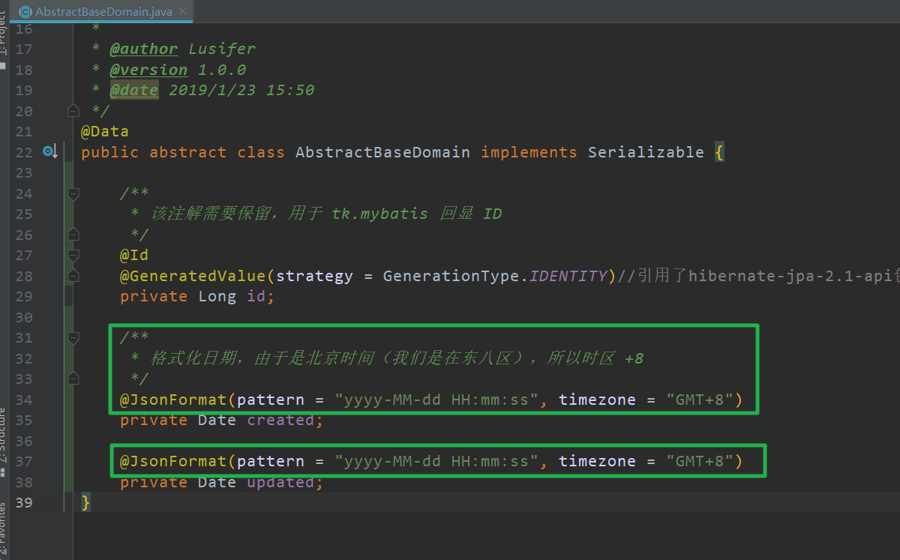

---

测试

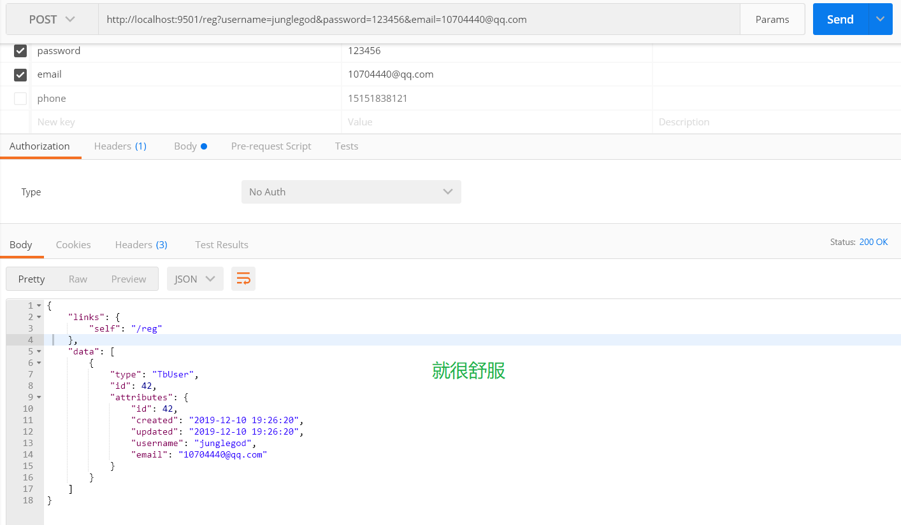

---


# 发送注册成功邮件

## 1.用户注册服务增加依赖

```xml
<dependency>
    <groupId>org.springframework.cloud</groupId>
    <artifactId>spring-cloud-starter-stream-rocketmq</artifactId>
</dependency>
```

## 2.Application

主要增加了 `@EnableBinding` 和 `@EnableAsync` 注解，其中 `@EnableAsync` 注解用于开启异步调用功能

```java
package com.funtl.myshop.service.reg;

import org.springframework.boot.SpringApplication;
import org.springframework.boot.autoconfigure.SpringBootApplication;
import org.springframework.cloud.client.discovery.EnableDiscoveryClient;
import org.springframework.cloud.stream.annotation.EnableBinding;
import org.springframework.cloud.stream.messaging.Source;
import org.springframework.scheduling.annotation.EnableAsync;
import tk.mybatis.spring.annotation.MapperScan;


@SpringBootApplication(scanBasePackages = "com.funtl.myshop")
@EnableDiscoveryClient
@MapperScan(basePackages = "com.funtl.myshop.commons.mapper")
@EnableBinding({Source.class})
@EnableAsync //允许异步。开启异步功能
public class MyShopServiceRegApplication {
    public static void main(String[] args) {
        SpringApplication.run(MyShopServiceRegApplication.class, args);
    }
}
```

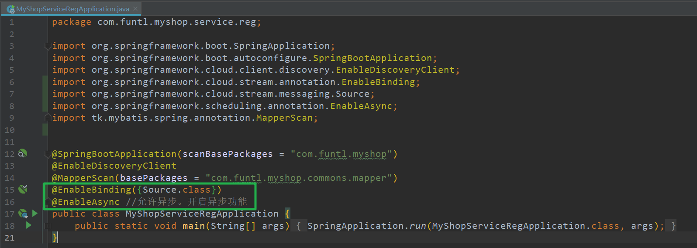

---

## 3.配置文件

>温馨提示
>
>RocketMQ 配置在 Nacos Config 配置中心会导致无法连接 RocketMQ Server 的问题，故我们还需要在项目中额外配置 `application.yml`

创建 `application.yml` 配置文件

```yaml
spring:
  cloud:
    stream:
      rocketmq:
        binder:
          namesrv-addr: 192.168.1.18:9876
      bindings:
        output: {destination: topic-email, content-type: application/json}
```

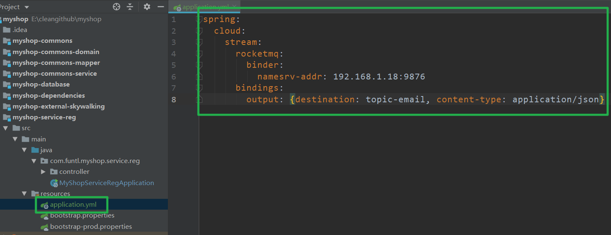

---

## 4.Service

-RegService

```java
package com.funtl.myshop.service.reg.service;

import com.funtl.myshop.commons.domain.TbUser;
import com.funtl.myshop.commons.utils.MapperUtils;
import org.springframework.beans.factory.annotation.Autowired;
import org.springframework.messaging.MessageChannel;
import org.springframework.messaging.support.MessageBuilder;
import org.springframework.scheduling.annotation.Async;
import org.springframework.stereotype.Service;

@Service
public class RegService {

    @Autowired
    private MessageChannel output;

    @Async //这里变成异步
    public void sendEmail(TbUser tbUser) {
        try {
            output.send(MessageBuilder.withPayload(MapperUtils.obj2json(tbUser)).build());
        } catch (Exception e) {
            e.printStackTrace();
        }
    }
}

```

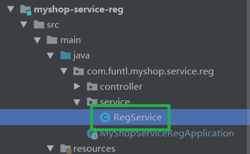

---

## 5.工具类

将对象变为json

MapperUtils

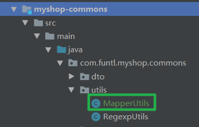

```java
package com.funtl.myshop.commons.utils;

import com.fasterxml.jackson.annotation.JsonInclude;
import com.fasterxml.jackson.core.type.TypeReference;
import com.fasterxml.jackson.databind.DeserializationFeature;
import com.fasterxml.jackson.databind.JavaType;
import com.fasterxml.jackson.databind.ObjectMapper;

import java.util.ArrayList;
import java.util.HashMap;
import java.util.List;
import java.util.Map;

/**
 * Jackson 工具类
 * <p>Title: MapperUtils</p>
 * <p>Description: </p>
 *
 * @author Lusifer
 * @version 1.0.0
 * @date 2018/3/4 21:50
 */
public class MapperUtils {
    private final static ObjectMapper objectMapper = new ObjectMapper();

    public static ObjectMapper getInstance() {
        return objectMapper;
    }

    /**
     * 转换为 JSON 字符串
     *
     * @param obj
     * @return
     * @throws Exception
     */
    public static String obj2json(Object obj) throws Exception {
        return objectMapper.writeValueAsString(obj);
    }

    /**
     * 转换为 JSON 字符串，忽略空值
     *
     * @param obj
     * @return
     * @throws Exception
     */
    public static String obj2jsonIgnoreNull(Object obj) throws Exception {
        ObjectMapper mapper = new ObjectMapper();
        mapper.setSerializationInclusion(JsonInclude.Include.NON_NULL);
        return mapper.writeValueAsString(obj);
    }

    /**
     * 转换为 JavaBean
     *
     * @param jsonString
     * @param clazz
     * @return
     * @throws Exception
     */
    public static <T> T json2pojo(String jsonString, Class<T> clazz) throws Exception {
        objectMapper.configure(DeserializationFeature.ACCEPT_SINGLE_VALUE_AS_ARRAY, true);
        return objectMapper.readValue(jsonString, clazz);
    }

    /**
     * 字符串转换为 Map<String, Object>
     *
     * @param jsonString
     * @return
     * @throws Exception
     */
    public static <T> Map<String, Object> json2map(String jsonString) throws Exception {
        ObjectMapper mapper = new ObjectMapper();
        mapper.setSerializationInclusion(JsonInclude.Include.NON_NULL);
        return mapper.readValue(jsonString, Map.class);
    }

    /**
     * 字符串转换为 Map<String, T>
     */
    public static <T> Map<String, T> json2map(String jsonString, Class<T> clazz) throws Exception {
        Map<String, Map<String, Object>> map = objectMapper.readValue(jsonString, new TypeReference<Map<String, T>>() {
        });
        Map<String, T> result = new HashMap<String, T>();
        for (Map.Entry<String, Map<String, Object>> entry : map.entrySet()) {
            result.put(entry.getKey(), map2pojo(entry.getValue(), clazz));
        }
        return result;
    }

    /**
     * 深度转换 JSON 成 Map
     *
     * @param json
     * @return
     */
    public static Map<String, Object> json2mapDeeply(String json) throws Exception {
        return json2MapRecursion(json, objectMapper);
    }

    /**
     * 把 JSON 解析成 List，如果 List 内部的元素存在 jsonString，继续解析
     *
     * @param json
     * @param mapper 解析工具
     * @return
     * @throws Exception
     */
    private static List<Object> json2ListRecursion(String json, ObjectMapper mapper) throws Exception {
        if (json == null) {
            return null;
        }

        List<Object> list = mapper.readValue(json, List.class);

        for (Object obj : list) {
            if (obj != null && obj instanceof String) {
                String str = (String) obj;
                if (str.startsWith("[")) {
                    obj = json2ListRecursion(str, mapper);
                } else if (obj.toString().startsWith("{")) {
                    obj = json2MapRecursion(str, mapper);
                }
            }
        }

        return list;
    }

    /**
     * 把 JSON 解析成 Map，如果 Map 内部的 Value 存在 jsonString，继续解析
     *
     * @param json
     * @param mapper
     * @return
     * @throws Exception
     */
    private static Map<String, Object> json2MapRecursion(String json, ObjectMapper mapper) throws Exception {
        if (json == null) {
            return null;
        }

        Map<String, Object> map = mapper.readValue(json, Map.class);

        for (Map.Entry<String, Object> entry : map.entrySet()) {
            Object obj = entry.getValue();
            if (obj != null && obj instanceof String) {
                String str = ((String) obj);

                if (str.startsWith("[")) {
                    List<?> list = json2ListRecursion(str, mapper);
                    map.put(entry.getKey(), list);
                } else if (str.startsWith("{")) {
                    Map<String, Object> mapRecursion = json2MapRecursion(str, mapper);
                    map.put(entry.getKey(), mapRecursion);
                }
            }
        }

        return map;
    }

    /**
     * 将 JSON 数组转换为集合
     *
     * @param jsonArrayStr
     * @param clazz
     * @return
     * @throws Exception
     */
    public static <T> List<T> json2list(String jsonArrayStr, Class<T> clazz) throws Exception {
        JavaType javaType = getCollectionType(ArrayList.class, clazz);
        List<T> list = (List<T>) objectMapper.readValue(jsonArrayStr, javaType);
        return list;
    }

    /**
     * 获取泛型的 Collection Type
     *
     * @param collectionClass 泛型的Collection
     * @param elementClasses  元素类
     * @return JavaType Java类型
     * @since 1.0
     */
    public static JavaType getCollectionType(Class<?> collectionClass, Class<?>... elementClasses) {
        return objectMapper.getTypeFactory().constructParametricType(collectionClass, elementClasses);
    }

    /**
     * 将 Map 转换为 JavaBean
     *
     * @param map
     * @param clazz
     * @return
     */
    public static <T> T map2pojo(Map map, Class<T> clazz) {
        return objectMapper.convertValue(map, clazz);
    }

    /**
     * 将 Map 转换为 JSON
     *
     * @param map
     * @return
     */
    public static String mapToJson(Map map) {
        try {
            return objectMapper.writeValueAsString(map);
        } catch (Exception e) {
            e.printStackTrace();
        }
        return "";
    }

    /**
     * 将 JSON 对象转换为 JavaBean
     *
     * @param obj
     * @param clazz
     * @return
     */
    public static <T> T obj2pojo(Object obj, Class<T> clazz) {
        return objectMapper.convertValue(obj, clazz);
    }
}

```

---

## 6.RegController

```java
package com.funtl.myshop.service.reg.controller;

import com.funtl.myshop.commons.domain.TbUser;
import com.funtl.myshop.commons.dto.AbstractBaseResult;
import com.funtl.myshop.commons.dto.BaseResultFactory;
import com.funtl.myshop.commons.service.TbUserService;
import com.funtl.myshop.commons.validator.BeanValidator;
import com.funtl.myshop.commons.web.AbstractBaseController;
import com.funtl.myshop.service.reg.service.RegService;
import org.apache.commons.lang3.StringUtils;
import org.springframework.beans.factory.annotation.Autowired;
import org.springframework.util.DigestUtils;
import org.springframework.web.bind.annotation.*;


@RestController
@RequestMapping(value = "reg")

public class RegController extends AbstractBaseController<TbUser> {

    @Autowired
    private TbUserService tbUserService;

    @Autowired
    private RegService regService;

    @PostMapping(value = "")
   public AbstractBaseResult reg(TbUser tbUser) {

        //数据校验
        String message = BeanValidator.validator(tbUser);

        if (StringUtils.isNoneBlank(message)) {

            return error(message, null);
        }


        // 验证用户名是否重复
        if (!tbUserService.unique("username", tbUser.getUsername())) {

            return error("用户名已存在", null);
        }

        // 验证邮箱是否重复
        if (!tbUserService.unique("email", tbUser.getEmail())) {
            return error("邮箱重复，请重试", null);
        }

        //注册用户
        tbUser.setPassword(DigestUtils.md5DigestAsHex(tbUser.getPassword().getBytes()));
        TbUser user = tbUserService.save(tbUser);

        if (user != null) {

            regService.sendEmail(user);
            return success(request.getRequestURI(),user);
        }

        // 注册失败
        return error("注册失败，请重试", null);
    }
}

```

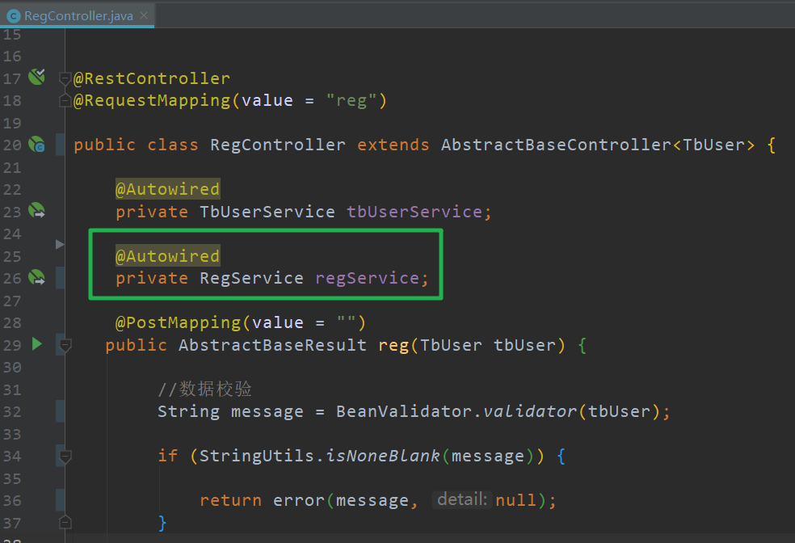

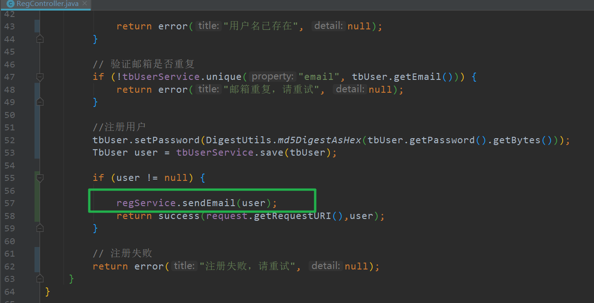

---

测试


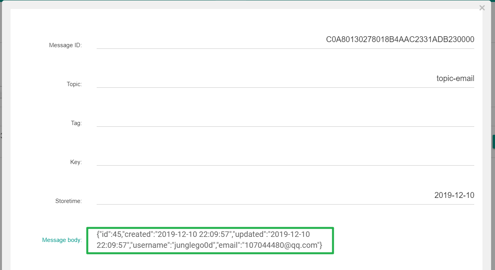

---

# 创建邮件服务

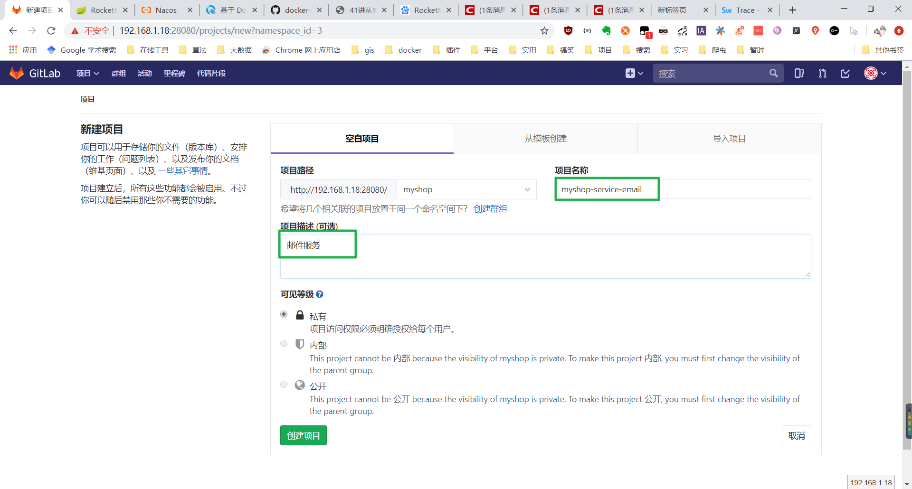

## 1.添加相关文件（pom）

pom.xml

```xml
<?xml version="1.0" encoding="UTF-8"?>
<project xmlns="http://maven.apache.org/POM/4.0.0" xmlns:xsi="http://www.w3.org/2001/XMLSchema-instance"
         xsi:schemaLocation="http://maven.apache.org/POM/4.0.0 http://maven.apache.org/xsd/maven-4.0.0.xsd">
    <modelVersion>4.0.0</modelVersion>

    <parent>
        <groupId>com.funtl</groupId>
        <artifactId>myshop-dependencies</artifactId>
        <version>1.0.0-SNAPSHOT</version>
        <relativePath>../myshop-dependencies/pom.xml</relativePath>
    </parent>

    <artifactId>myshop-service-email</artifactId>
    <packaging>jar</packaging>

    <name>myshop-service-email</name>
    <url>http://www.funtl.com</url>
    <inceptionYear>2018-Now</inceptionYear>

    <dependencies>
        <!-- Spring Boot Begin -->
        <dependency>
            <groupId>org.springframework.boot</groupId>
            <artifactId>spring-boot-starter-web</artifactId>
        </dependency>
        <dependency>
            <groupId>org.springframework.boot</groupId>
            <artifactId>spring-boot-starter-actuator</artifactId>
        </dependency>
        <dependency>
            <groupId>org.springframework.boot</groupId>
            <artifactId>spring-boot-starter-test</artifactId>
            <scope>test</scope>
        </dependency>

        <dependency>
            <groupId>org.springframework.boot</groupId>
            <artifactId>spring-boot-starter-mail</artifactId>
        </dependency>

        <dependency>
            <groupId>net.sourceforge.nekohtml</groupId>
            <artifactId>nekohtml</artifactId>
        </dependency>
        <dependency>
            <groupId>org.springframework.boot</groupId>
            <artifactId>spring-boot-starter-thymeleaf</artifactId>
        </dependency>
        <!-- Spring Boot End -->

        <!-- Spring Cloud Begin -->
        <dependency>
            <groupId>org.springframework.cloud</groupId>
            <artifactId>spring-cloud-starter-alibaba-nacos-config</artifactId>
        </dependency>
        <dependency>
            <groupId>org.springframework.cloud</groupId>
            <artifactId>spring-cloud-starter-alibaba-nacos-discovery</artifactId>
        </dependency>
        <dependency>
            <groupId>org.springframework.cloud</groupId>
            <artifactId>spring-cloud-starter-alibaba-sentinel</artifactId>
        </dependency>
        <dependency>
            <groupId>org.springframework.cloud</groupId>
            <artifactId>spring-cloud-starter-stream-rocketmq</artifactId>
        </dependency>
        <!-- Spring Cloud End -->

        <!-- Projects Begin -->
        <dependency>
            <groupId>com.funtl</groupId>
            <artifactId>myshop-commons-domain</artifactId>
            <version>${project.parent.version}</version>
        </dependency>
        <!-- Projects End -->
    </dependencies>

    <build>
        <plugins>
            <plugin>
                <groupId>org.springframework.boot</groupId>
                <artifactId>spring-boot-maven-plugin</artifactId>
                <configuration>
                    <mainClass>com.funtl.myshop.service.reg.MyShopServiceEmailApplication</mainClass>
                </configuration>
            </plugin>
        </plugins>
    </build>
</project>
```

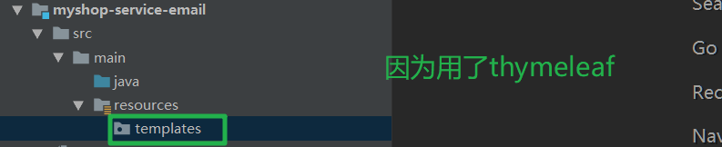

---

## 2.reg.html

```html
<!DOCTYPE html SYSTEM "http://www.thymeleaf.org/dtd/xhtml1-strict-thymeleaf-spring4-4.dtd">
<html xmlns="http://www.w3.org/1999/xhtml" xmlns:th="http://www.thymeleaf.org">
<head>
    <meta charset="UTF-8">
    <meta name="viewport"
          content="width=device-width, user-scalable=no, initial-scale=1.0, maximum-scale=1.0, minimum-scale=1.0">
    <meta http-equiv="X-UA-Compatible" content="ie=edge">
    <title>注册通知</title>
</head>
<body>
    <div>
        我来自 Thymeleaf 模板
        欢迎 <span th:text="${username}"></span> 加入 广州千锋 大家庭！！
    </div>
</body>
</html><!DOCTYPE html SYSTEM "http://www.thymeleaf.org/dtd/xhtml1-strict-thymeleaf-spring4-4.dtd">
<html xmlns="http://www.w3.org/1999/xhtml" xmlns:th="http://www.thymeleaf.org">
<head>
    <meta charset="UTF-8">
    <meta name="viewport"
          content="width=device-width, user-scalable=no, initial-scale=1.0, maximum-scale=1.0, minimum-scale=1.0">
    <meta http-equiv="X-UA-Compatible" content="ie=edge">
    <title>注册通知</title>
</head>
<body>
    <div>
        我来自 Thymeleaf 模板
        欢迎 <span th:text="${username}"></span> 加入 广州千锋 大家庭！！
    </div>
</body>
</html>
```

---

## 3.bootstrap.properties

```properties
spring.application.name=myshop-service-email-config
spring.cloud.nacos.config.file-extension=yaml
spring.cloud.nacos.config.server-addr=192.168.1.18:8848
```

## 4.application.yml

```yaml
spring:
  cloud:
    stream:
      rocketmq:
        binder:
          namesrv-addr: 192.168.1.18:9876
        bindings:
          input: {consumer.orderly: true}
      bindings:
        input: {destination: topic-email, content-type: application/json, group: group-email, consumer.maxAttempts: 1}
  thymeleaf:
    cache: false
    mode: HTML
    encoding: UTF-8
    servlet:
      content-type: text/html
```

---

## 5.新建nacos配置


**Data ID:**myshop-service-email-config.yaml

**Group:**DEFAULT_GROUP

**配置格式:**YAML

**配置内容:**

```yaml
spring:
  application:
    name: myshop-service-email
  mail:
    host: smtp.163.com
    # 你的邮箱授权码
    password: ########
    properties:
      mail:
        smtp:
          auth: true
          starttls:
            enable: true
            required: true
    # 发送邮件的邮箱地址
    username: junglegodlion@163.com
  cloud:
    nacos:
      discovery:
        server-addr: 192.168.1.18:8848
    sentinel:
      transport:
        port: 8719
        dashboard: 192.168.1.18:38080

server:
  port: 9507

management:
  endpoints:
    web:
      exposure:
        include: "*"
```


---

## 6.测试

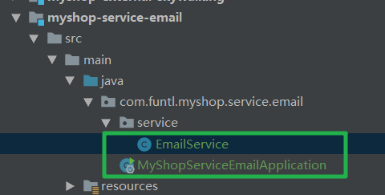

EmailService

```java
package com.funtl.myshop.service.email.service;

import com.funtl.myshop.commons.domain.TbUser;
import com.funtl.myshop.commons.utils.MapperUtils;
import org.springframework.cloud.stream.annotation.StreamListener;
import org.springframework.stereotype.Service;


@Service
public class EmailService {

    @StreamListener("input")
    public void receive(String json) {
        try {
            // 发送普通邮件
            TbUser tbUser = MapperUtils.json2pojo(json, TbUser.class);
            System.out.println(tbUser);

        } catch (Exception e) {
            e.printStackTrace();
        }
    }


}

```

MyShopServiceEmailApplication

```java
package com.funtl.myshop.service.email;

import org.springframework.boot.SpringApplication;
import org.springframework.boot.autoconfigure.SpringBootApplication;
import org.springframework.cloud.client.discovery.EnableDiscoveryClient;
import org.springframework.cloud.stream.annotation.EnableBinding;
import org.springframework.cloud.stream.messaging.Sink;
import org.springframework.scheduling.annotation.EnableAsync;

@SpringBootApplication(scanBasePackages = "com.funtl.myshop")
@EnableDiscoveryClient
@EnableBinding({Sink.class})
@EnableAsync
public class MyShopServiceEmailApplication {
    public static void main(String[] args) {
        SpringApplication.run(MyShopServiceEmailApplication.class, args);
    }
}

```

启动

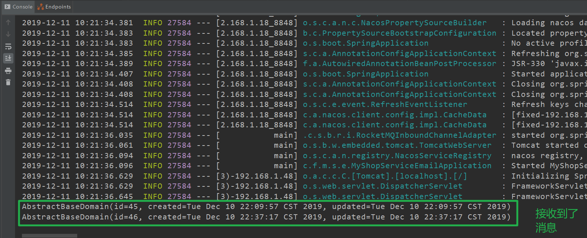

---

---

## 7.实现发送邮件

EmailService

```java
package com.funtl.myshop.service.email.service;

import com.funtl.myshop.commons.domain.TbUser;
import com.funtl.myshop.commons.utils.MapperUtils;
import org.springframework.beans.factory.annotation.Autowired;
import org.springframework.cloud.stream.annotation.StreamListener;
import org.springframework.context.ConfigurableApplicationContext;
import org.springframework.mail.SimpleMailMessage;
import org.springframework.mail.javamail.JavaMailSender;
import org.springframework.mail.javamail.MimeMessageHelper;
import org.springframework.scheduling.annotation.Async;
import org.springframework.stereotype.Service;
import org.thymeleaf.TemplateEngine;
import org.thymeleaf.context.Context;

import javax.mail.internet.MimeMessage;

@Service
public class EmailService {

    @Autowired
    private ConfigurableApplicationContext applicationContext;

    @Autowired
    private JavaMailSender javaMailSender;

    @Autowired
    private TemplateEngine templateEngine;

    @StreamListener("input")
    public void receive(String tbUserJson) {
        try {
            // 发送普通邮件
            TbUser tbUser = MapperUtils.json2pojo(tbUserJson, TbUser.class);
            sendEmail("欢迎注册", "欢迎 " + tbUser.getUsername() + " 加入广州千锋大家庭！", tbUser.getEmail());

            // 发送 HTML 模板邮件
            Context context = new Context();//这是thymeleaf的context
            context.setVariable("username", tbUser.getUsername());
            String emailTemplate = templateEngine.process("reg", context);
            sendTemplateEmail("欢迎注册", emailTemplate, tbUser.getEmail());
        } catch (Exception e) {
            e.printStackTrace();
        }
    }

    /**
     * 发送普通邮件
     * @param subject
     * @param body
     * @param to
     */
    @Async
    public void sendEmail(String subject, String body, String to) {
        SimpleMailMessage message = new SimpleMailMessage();
        message.setFrom(applicationContext.getEnvironment().getProperty("spring.mail.username"));
        message.setTo(to);
        message.setSubject(subject);
        message.setText(body);
        javaMailSender.send(message);
    }

    /**
     * 发送 HTML 模板邮件
     * @param subject
     * @param body
     * @param to
     */
    @Async
    public void sendTemplateEmail(String subject, String body, String to) {
        MimeMessage message = javaMailSender.createMimeMessage();
        try {
            MimeMessageHelper helper = new MimeMessageHelper(message, true);
            helper.setFrom(applicationContext.getEnvironment().getProperty("spring.mail.username"));
            helper.setTo(to);
            helper.setSubject(subject);
            helper.setText(body, true);
            javaMailSender.send(message);
        } catch (Exception e) {

        }
    }
}
```

---

启动

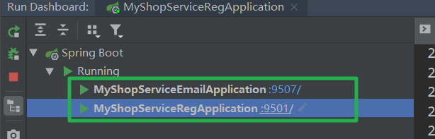

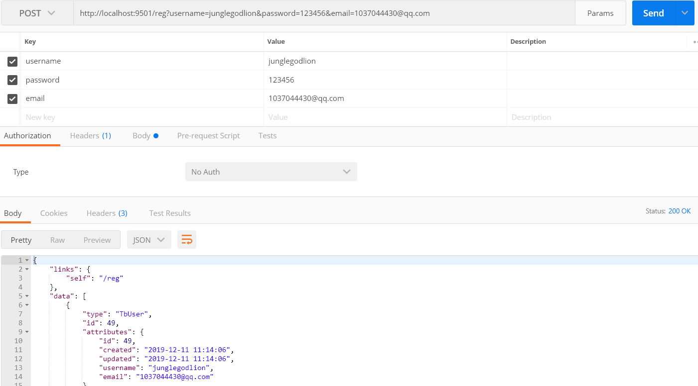

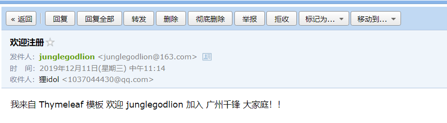

---

# 配置 Swagger2 接口文档引擎

## 1.Maven

在`myshop-dependencies`添加依赖

```xml
<swagger2.version>2.9.2</swagger2.version>


<!-- Swagger2 Begin -->
            <dependency>
                <groupId>io.springfox</groupId>
                <artifactId>springfox-swagger2</artifactId>
                <version>${swagger2.version}</version>
            </dependency>
            <dependency>
                <groupId>io.springfox</groupId>
                <artifactId>springfox-swagger-ui</artifactId>
                <version>${swagger2.version}</version>
            </dependency>
            <!-- Swagger2 End -->
```

所有的服务应该都会依赖`myshop-commons-service`，所以

在`myshop-commons-service`添加依赖

```xml
<dependency>
            <groupId>io.springfox</groupId>
            <artifactId>springfox-swagger2</artifactId>
        </dependency>
        <dependency>
            <groupId>io.springfox</groupId>
            <artifactId>springfox-swagger-ui</artifactId>
        </dependency>
```

---

## 2.配置 Swagger2

注意：`RequestHandlerSelectors.basePackage("com.funtl.myshop.service")` 为 Controller 包路径，不然生成的文档扫描不到接口

创建一个名为 `Swagger2Configuration` 的 Java 配置类，代码如下：

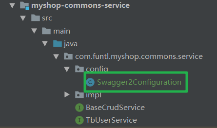

```java
package com.funtl.myshop.commons.service.config;

import org.springframework.context.annotation.Bean;
import org.springframework.context.annotation.Configuration;
import springfox.documentation.builders.ApiInfoBuilder;
import springfox.documentation.builders.PathSelectors;
import springfox.documentation.builders.RequestHandlerSelectors;
import springfox.documentation.service.ApiInfo;
import springfox.documentation.spi.DocumentationType;
import springfox.documentation.spring.web.plugins.Docket;

@Configuration
public class Swagger2Configuration {
    @Bean
    public Docket createRestApi() {
        return new Docket(DocumentationType.SWAGGER_2)
                .apiInfo(apiInfo())
                .select()
                .apis(RequestHandlerSelectors.basePackage("com.funtl.myshop.service"))//所以以这个开头的，都是业务逻辑，都有controller
                .paths(PathSelectors.any())
                .build();
    }

    private ApiInfo apiInfo() {
        return new ApiInfoBuilder()
                .title("MyShop API 文档")
                .description("MyShop API 网关接口，http://www.funtl.com")
                .termsOfServiceUrl("http://www.funtl.com")
                .version("1.0.0")
                .build();
    }
}
```


---

## 3.启用 Swagger2

Application 中加上注解 `@EnableSwagger2` 表示开启 Swagger

```java
package com.funtl.myshop.service.reg;

import org.springframework.boot.SpringApplication;
import org.springframework.boot.autoconfigure.SpringBootApplication;
import org.springframework.cloud.client.discovery.EnableDiscoveryClient;
import org.springframework.cloud.stream.annotation.EnableBinding;
import org.springframework.cloud.stream.messaging.Source;
import org.springframework.scheduling.annotation.EnableAsync;
import springfox.documentation.swagger2.annotations.EnableSwagger2;
import tk.mybatis.spring.annotation.MapperScan;


@SpringBootApplication(scanBasePackages = "com.funtl.myshop")
@EnableDiscoveryClient
@MapperScan(basePackages = "com.funtl.myshop.commons.mapper")
@EnableBinding({Source.class})
@EnableAsync //允许异步。开启异步功能
@EnableSwagger2
public class MyShopServiceRegApplication {
    public static void main(String[] args) {
        SpringApplication.run(MyShopServiceRegApplication.class, args);
    }
}
```

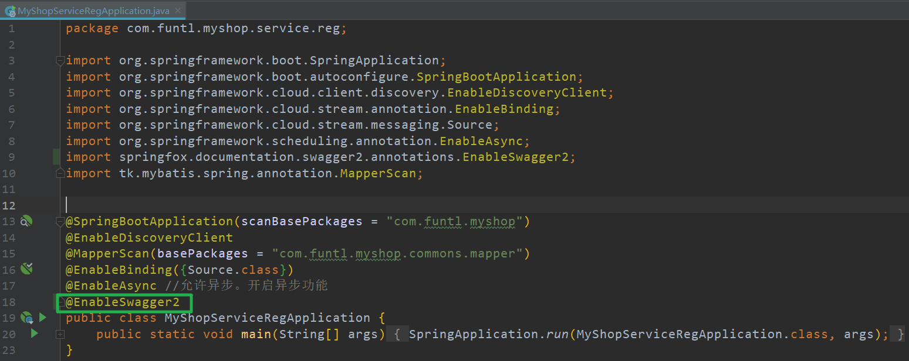


---

## 4.使用 Swagger2

在 Controller 中增加 Swagger2 相关注解，代码如下：

```java
package com.funtl.myshop.service.reg.controller;

import com.funtl.myshop.commons.domain.TbUser;
import com.funtl.myshop.commons.dto.AbstractBaseResult;
import com.funtl.myshop.commons.dto.BaseResultFactory;
import com.funtl.myshop.commons.service.TbUserService;
import com.funtl.myshop.commons.validator.BeanValidator;
import com.funtl.myshop.commons.web.AbstractBaseController;
import com.funtl.myshop.service.reg.service.RegService;
import io.swagger.annotations.ApiOperation;
import io.swagger.annotations.ApiParam;
import org.apache.commons.lang3.StringUtils;
import org.springframework.beans.factory.annotation.Autowired;
import org.springframework.util.DigestUtils;
import org.springframework.web.bind.annotation.*;


@RestController
@RequestMapping(value = "reg")

public class RegController extends AbstractBaseController<TbUser> {

    @Autowired
    private TbUserService tbUserService;

    @Autowired
    private RegService regService;

    @ApiOperation(value = "用户注册", notes = "以实体类为参数，注意用户名和邮箱不要重复")//value是方法是干什么的，notes是说明
    @PostMapping(value = "")
   public AbstractBaseResult reg(@ApiParam(name = "tbUser", value = "用户模型")TbUser tbUser) {//参数说明

        //数据校验
        String message = BeanValidator.validator(tbUser);

        if (StringUtils.isNoneBlank(message)) {

            return error(message, null);
        }


        // 验证用户名是否重复
        if (!tbUserService.unique("username", tbUser.getUsername())) {

            return error("用户名已存在", null);
        }

        // 验证邮箱是否重复
        if (!tbUserService.unique("email", tbUser.getEmail())) {
            return error("邮箱重复，请重试", null);
        }

        //注册用户
        tbUser.setPassword(DigestUtils.md5DigestAsHex(tbUser.getPassword().getBytes()));
        TbUser user = tbUserService.save(tbUser);

        if (user != null) {

            regService.sendEmail(user);
            return success(request.getRequestURI(),user);
        }

        // 注册失败
        return error("注册失败，请重试", null);
    }
}

```

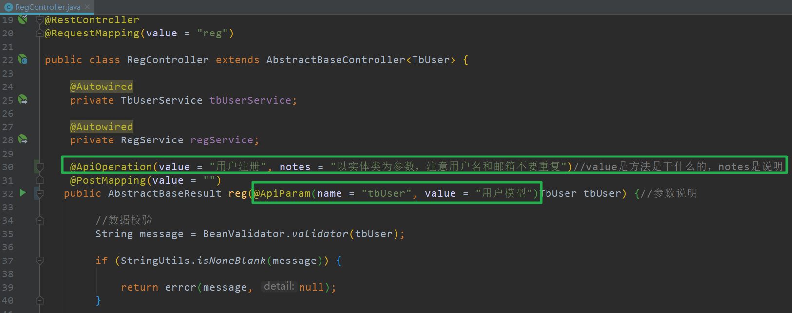


----


- `@ApiOperation`：描述一个类的一个方法，或者说一个接口
- `@ApiParam`：单个参数描述
- `@ApiImplicitParam`：一个请求参数
- `@ApiImplicitParams`：多个请求参数

---


## 5.访问 Swagger2

访问地址：http://ip:port/swagger-ui.html

```
http://localhost:9501/swagger-ui.html
```

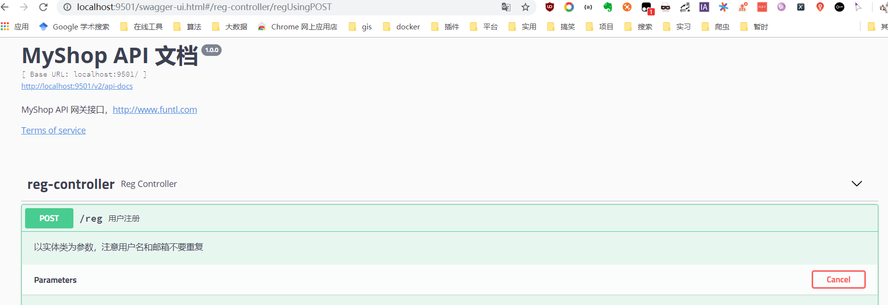

---


# 创建商品服务提供者

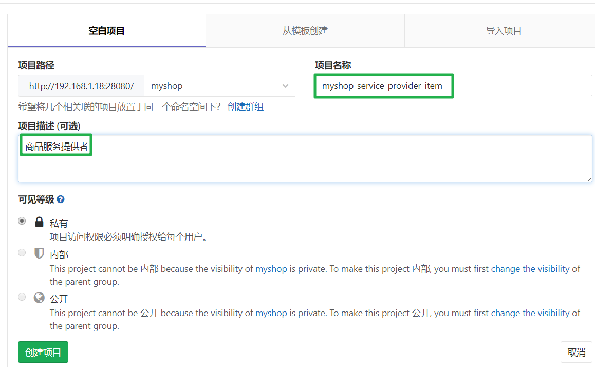

## 1.POM

```xml
<?xml version="1.0" encoding="UTF-8"?>
<project xmlns="http://maven.apache.org/POM/4.0.0" xmlns:xsi="http://www.w3.org/2001/XMLSchema-instance"
         xsi:schemaLocation="http://maven.apache.org/POM/4.0.0 http://maven.apache.org/xsd/maven-4.0.0.xsd">
    <modelVersion>4.0.0</modelVersion>

    <parent>
        <groupId>com.funtl</groupId>
        <artifactId>myshop-dependencies</artifactId>
        <version>1.0.0-SNAPSHOT</version>
        <relativePath>../myshop-dependencies/pom.xml</relativePath>
    </parent>

    <artifactId>myshop-service-provider-item</artifactId>
    <packaging>jar</packaging>

    <name>myshop-service-provider-item</name>
    <url>http://www.funtl.com</url>
    <inceptionYear>2018-Now</inceptionYear>

    <dependencies>
        <!-- Spring Boot Begin -->
        <dependency>
            <groupId>org.springframework.boot</groupId>
            <artifactId>spring-boot-starter-web</artifactId>
        </dependency>
        <dependency>
            <groupId>org.springframework.boot</groupId>
            <artifactId>spring-boot-starter-actuator</artifactId>
        </dependency>
        <dependency>
            <groupId>org.springframework.boot</groupId>
            <artifactId>spring-boot-starter-test</artifactId>
            <scope>test</scope>
        </dependency>
        <!-- Spring Boot End -->

        <!-- Spring Cloud Begin -->
        <dependency>
            <groupId>org.springframework.cloud</groupId>
            <artifactId>spring-cloud-starter-alibaba-nacos-config</artifactId>
        </dependency>
        <dependency>
            <groupId>org.springframework.cloud</groupId>
            <artifactId>spring-cloud-starter-alibaba-nacos-discovery</artifactId>
        </dependency>
        <dependency>
            <groupId>org.springframework.cloud</groupId>
            <artifactId>spring-cloud-starter-alibaba-sentinel</artifactId>
        </dependency>
        <!-- Spring Cloud End -->

        <!-- Projects Begin -->
        <dependency>
            <groupId>com.funtl</groupId>
            <artifactId>myshop-commons-service</artifactId>
            <version>${project.parent.version}</version>
        </dependency>
        <!-- Projects End -->
    </dependencies>

    <build>
        <plugins>
            <plugin>
                <groupId>org.springframework.boot</groupId>
                <artifactId>spring-boot-maven-plugin</artifactId>
                <configuration>
                    <mainClass>com.funtl.myshop.service.provider.item.MyShopServiceProviderItemApplication</mainClass>
                </configuration>
            </plugin>
        </plugins>
    </build>
</project>
```

---


## 2.bootstrap.properties

```properties
spring.application.name=myshop-service-provider-item-config
spring.cloud.nacos.config.file-extension=yaml
spring.cloud.nacos.config.server-addr=192.168.1.18:8848
```

---

## 3.新建nacos配置

**Data ID:**myshop-service-provider-item-config.yaml

**Group:**DEFAULT_GROUP

**配置格式:**YAML

**配置内容**

```yaml
spring:
  application:
    name: myshop-service-provider-item
  datasource:
    druid:
      url: jdbc:mysql://192.168.1.18:13306/myshop?useUnicode=true&characterEncoding=utf-8&useSSL=false
      username: root
      password: 123456
      initial-size: 1
      min-idle: 1
      max-active: 20
      test-on-borrow: true
      driver-class-name: com.mysql.cj.jdbc.Driver
  cloud:
    nacos:
      discovery:
        server-addr: 192.168.1.18:8848
    sentinel:
      transport:
        port: 8719
        dashboard: 192.168.1.18:38080

server:
  port: 10105

mybatis:
    type-aliases-package: com.funtl.myshop.commons.domain
    mapper-locations: classpath:mapper/*.xml

management:
  endpoints:
    web:
      exposure:
        include: "*"
```

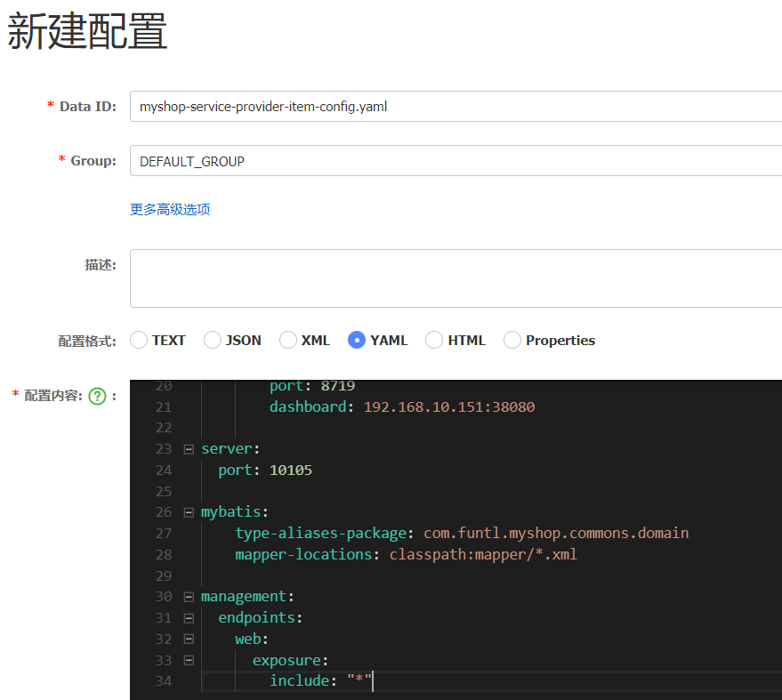

---


## 4.TbItem

对TbItem进行处理:id,created,updated字段，AbstractBaseDomain中都有，所以在TbItem中删去该字段

```java
package com.funtl.myshop.commons.domain;

import com.fasterxml.jackson.annotation.JsonInclude;
import com.funtl.myshop.commons.dto.AbstractBaseDomain;

import javax.persistence.*;
import java.util.Date;

@Table(name = "tb_item")
@JsonInclude(JsonInclude.Include.NON_NULL)//json不返回值为null的属性
public class TbItem extends AbstractBaseDomain {

    /**
     * 商品标题
     */
    private String title;

    /**
     * 商品卖点
     */
    @Column(name = "sell_point")
    private String sellPoint;

    /**
     * 商品价格，单位为：分
     */
    private Long price;

    /**
     * 库存数量
     */
    private Integer num;

    /**
     * 商品条形码
     */
    private String barcode;

    /**
     * 商品图片
     */
    private String image;

    /**
     * 所属类目，叶子类目
     */
    private Long cid;

    /**
     * 商品状态，1-正常，2-下架，3-删除
     */
    private Byte status;


    /**
     * 获取商品标题
     *
     * @return title - 商品标题
     */
    public String getTitle() {
        return title;
    }

    /**
     * 设置商品标题
     *
     * @param title 商品标题
     */
    public void setTitle(String title) {
        this.title = title;
    }

    /**
     * 获取商品卖点
     *
     * @return sell_point - 商品卖点
     */
    public String getSellPoint() {
        return sellPoint;
    }

    /**
     * 设置商品卖点
     *
     * @param sellPoint 商品卖点
     */
    public void setSellPoint(String sellPoint) {
        this.sellPoint = sellPoint;
    }

    /**
     * 获取商品价格，单位为：分
     *
     * @return price - 商品价格，单位为：分
     */
    public Long getPrice() {
        return price;
    }

    /**
     * 设置商品价格，单位为：分
     *
     * @param price 商品价格，单位为：分
     */
    public void setPrice(Long price) {
        this.price = price;
    }

    /**
     * 获取库存数量
     *
     * @return num - 库存数量
     */
    public Integer getNum() {
        return num;
    }

    /**
     * 设置库存数量
     *
     * @param num 库存数量
     */
    public void setNum(Integer num) {
        this.num = num;
    }

    /**
     * 获取商品条形码
     *
     * @return barcode - 商品条形码
     */
    public String getBarcode() {
        return barcode;
    }

    /**
     * 设置商品条形码
     *
     * @param barcode 商品条形码
     */
    public void setBarcode(String barcode) {
        this.barcode = barcode;
    }

    /**
     * 获取商品图片
     *
     * @return image - 商品图片
     */
    public String getImage() {
        return image;
    }

    /**
     * 设置商品图片
     *
     * @param image 商品图片
     */
    public void setImage(String image) {
        this.image = image;
    }

    /**
     * 获取所属类目，叶子类目
     *
     * @return cid - 所属类目，叶子类目
     */
    public Long getCid() {
        return cid;
    }

    /**
     * 设置所属类目，叶子类目
     *
     * @param cid 所属类目，叶子类目
     */
    public void setCid(Long cid) {
        this.cid = cid;
    }

    /**
     * 获取商品状态，1-正常，2-下架，3-删除
     *
     * @return status - 商品状态，1-正常，2-下架，3-删除
     */
    public Byte getStatus() {
        return status;
    }

    /**
     * 设置商品状态，1-正常，2-下架，3-删除
     *
     * @param status 商品状态，1-正常，2-下架，3-删除
     */
    public void setStatus(Byte status) {
        this.status = status;
    }
}
```

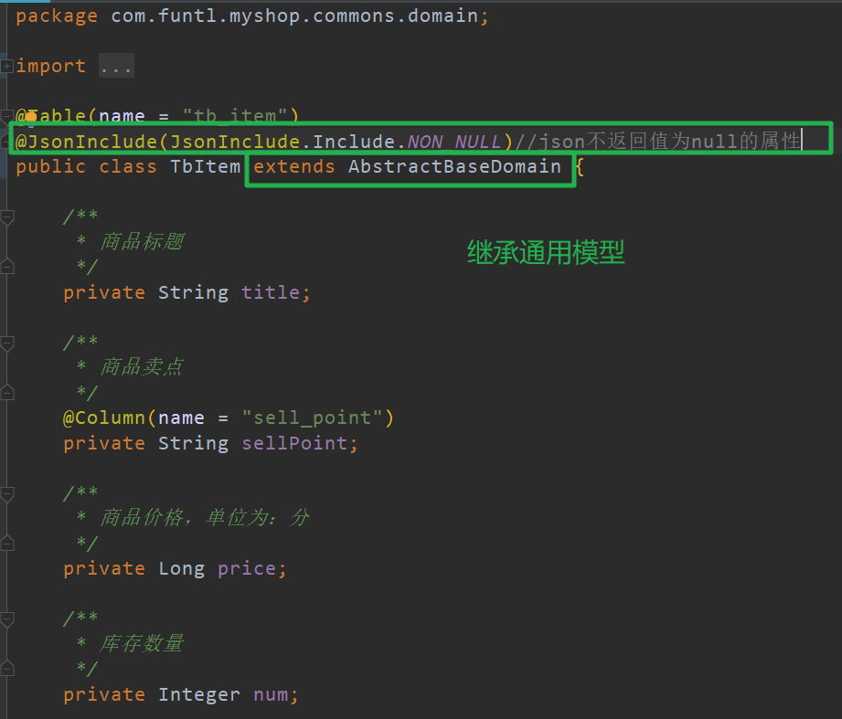

---


## 5.TbItemService

```java
package com.funtl.myshop.commons.service;

import com.funtl.myshop.commons.domain.TbItem;

public interface TbItemService extends BaseCrudService<TbItem> {
}

```


##  6.TbItemServiceImpl

```java
package com.funtl.myshop.commons.service.impl;

import com.funtl.myshop.commons.domain.TbItem;
import com.funtl.myshop.commons.mapper.TbItemMapper;
import com.funtl.myshop.commons.service.TbItemService;
import org.springframework.stereotype.Service;

@Service
public class TbItemServiceImpl extends BaseCrudServiceImpl<TbItem, TbItemMapper> implements TbItemService {

}

```


## 7.BaseCrudService

--分页查询

```java
/**
     * 分页查询
     * @param domain
     * @param pageNum
     * @param pageSize
     * @return
     */
    default PageInfo<T> page(T domain, int pageNum, int pageSize) {
        return null;
    }
```

## 8.BaseCrudServiceImpl

```java
/**
     * 分页查询
     * @param domain
     * @param pageNum
     * @param pageSize
     * @return
     */
    @Override
    public PageInfo<T> page(T domain, int pageNum, int pageSize) {
        Example example = new Example(entityClass);
        example.createCriteria().andEqualTo(domain);

        PageHelper.startPage(pageNum, pageSize);
        PageInfo<T> pageInfo = new PageInfo<>(mapper.selectByExample(example));
        return pageInfo;
    }
```


## 9.TbItemController

```Java
package com.funtl.myshop.service.provider.item.controller;

import com.funtl.myshop.commons.domain.TbItem;
import com.funtl.myshop.commons.service.TbItemService;
import com.funtl.myshop.commons.web.AbstractBaseController;
import com.github.pagehelper.PageInfo;
import org.springframework.beans.factory.annotation.Autowired;
import org.springframework.web.bind.annotation.*;

@RestController
@RequestMapping(value = "item")
public class TbItemController extends AbstractBaseController<TbItem> {
    @Autowired
    private TbItemService tbItemService;


    @GetMapping (value = "page/{pageNum}/{pageSize}")
    public PageInfo<TbItem> page(
            @PathVariable int pageNum,
            @PathVariable int pageSize
    ) {
        PageInfo<TbItem> page = tbItemService.page(null, pageNum, pageSize);
        return page;
    }
}

```

启动

测试

```
http://192.168.1.18:10105/item/page/1/10
```

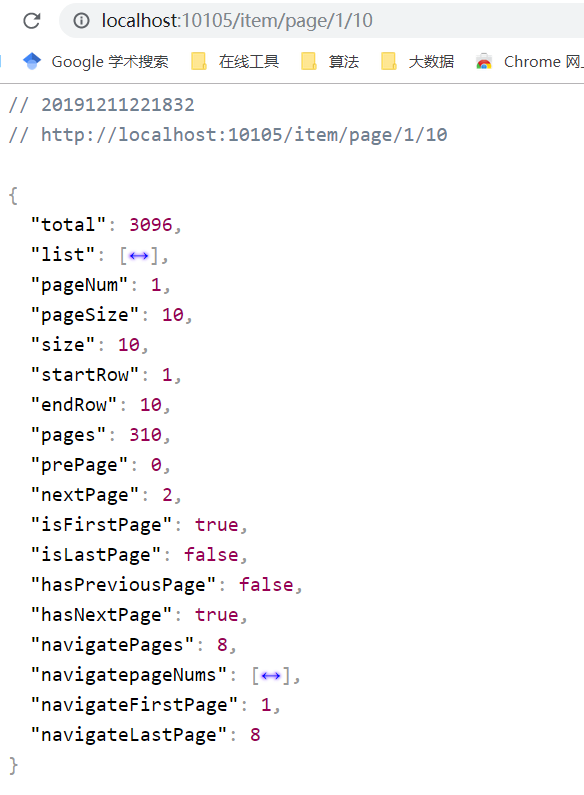

---

## 10.加入Swagger2

--TbItemController

```java
package com.funtl.myshop.service.provider.item.controller;

import com.funtl.myshop.commons.domain.TbItem;
import com.funtl.myshop.commons.service.TbItemService;
import com.funtl.myshop.commons.web.AbstractBaseController;
import com.github.pagehelper.PageInfo;
import io.swagger.annotations.ApiImplicitParam;
import io.swagger.annotations.ApiImplicitParams;
import io.swagger.annotations.ApiOperation;
import org.springframework.beans.factory.annotation.Autowired;
import org.springframework.web.bind.annotation.*;

@RestController
@RequestMapping(value = "item")
public class TbItemController extends AbstractBaseController<TbItem> {
    @Autowired
    private TbItemService tbItemService;

    @ApiOperation(value = "商品分页查询")
    @ApiImplicitParams({
            @ApiImplicitParam(name = "pageNum", value = "页码", required = true, paramType = "path"),
            @ApiImplicitParam(name = "pageSize", value = "笔数", required = true, paramType = "path")
    })
    @GetMapping (value = "page/{pageNum}/{pageSize}")
    public PageInfo<TbItem> page(
            @PathVariable int pageNum,
            @PathVariable int pageSize
    ) {
        PageInfo<TbItem> page = tbItemService.page(null, pageNum, pageSize);
        return page;
    }
}

```

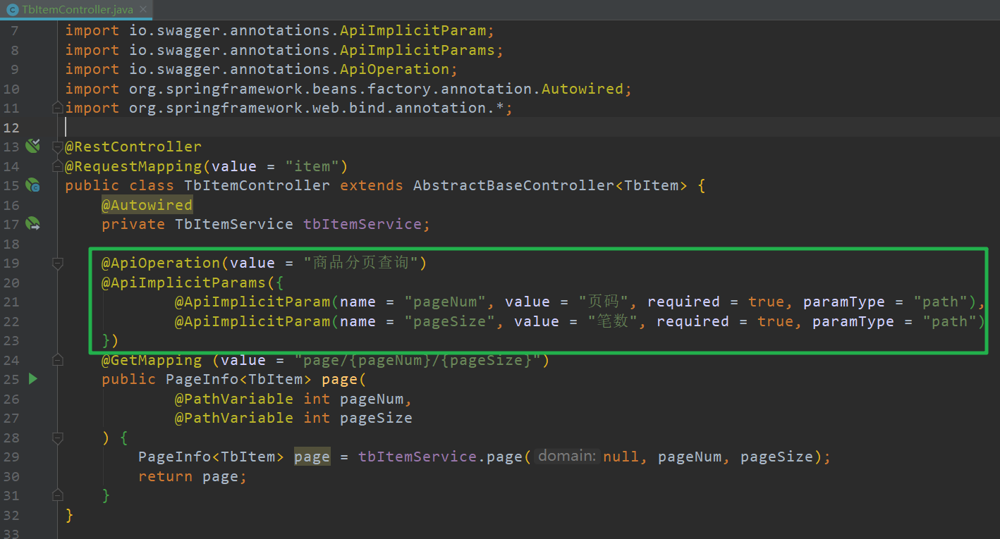

```
http://localhost:10105/swagger-ui.html
```

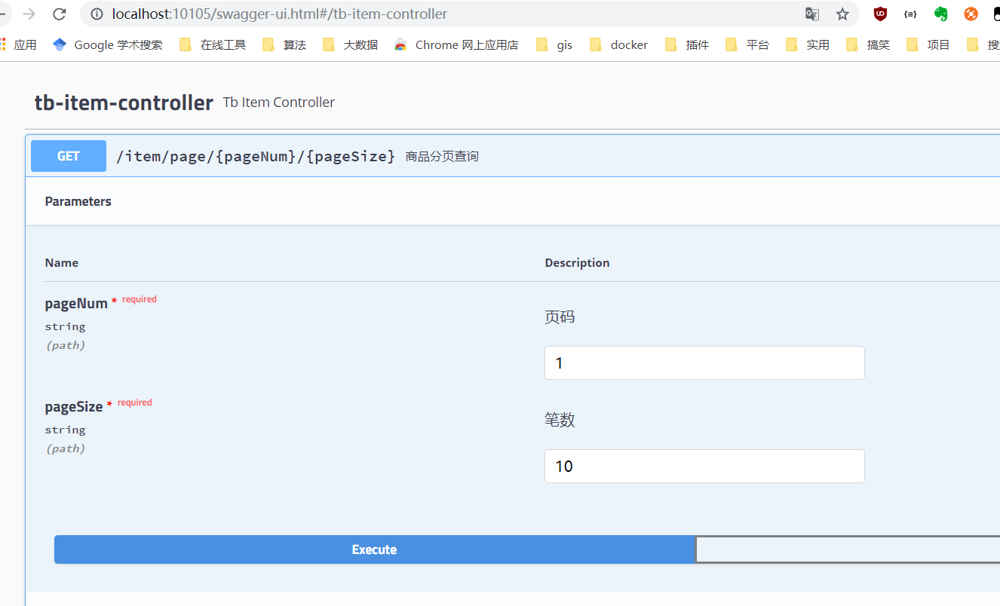

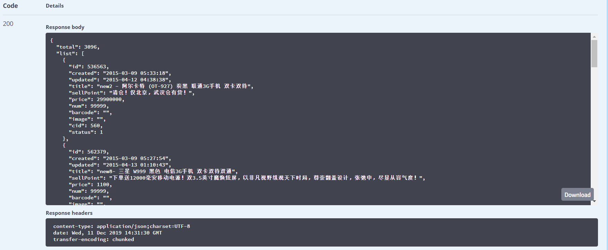

---

# 创建商品服务消费者


## 1.POM

```xml
<?xml version="1.0" encoding="UTF-8"?>
<project xmlns="http://maven.apache.org/POM/4.0.0" xmlns:xsi="http://www.w3.org/2001/XMLSchema-instance"
         xsi:schemaLocation="http://maven.apache.org/POM/4.0.0 http://maven.apache.org/xsd/maven-4.0.0.xsd">
    <modelVersion>4.0.0</modelVersion>

    <parent>
        <groupId>com.funtl</groupId>
        <artifactId>myshop-dependencies</artifactId>
        <version>1.0.0-SNAPSHOT</version>
        <relativePath>../myshop-dependencies/pom.xml</relativePath>
    </parent>

    <artifactId>myshop-service-provider-item</artifactId>
    <packaging>jar</packaging>

    <name>myshop-service-provider-item</name>
    <url>http://www.funtl.com</url>
    <inceptionYear>2018-Now</inceptionYear>

    <dependencies>
        <!-- Spring Boot Begin -->
        <dependency>
            <groupId>org.springframework.boot</groupId>
            <artifactId>spring-boot-starter-web</artifactId>
        </dependency>
        <dependency>
            <groupId>org.springframework.boot</groupId>
            <artifactId>spring-boot-starter-actuator</artifactId>
        </dependency>
        <dependency>
            <groupId>org.springframework.boot</groupId>
            <artifactId>spring-boot-starter-test</artifactId>
            <scope>test</scope>
        </dependency>
        <!-- Spring Boot End -->

        <!-- Spring Cloud Begin -->
        <dependency>
            <groupId>org.springframework.cloud</groupId>
            <artifactId>spring-cloud-starter-alibaba-nacos-config</artifactId>
        </dependency>
        <dependency>
            <groupId>org.springframework.cloud</groupId>
            <artifactId>spring-cloud-starter-alibaba-nacos-discovery</artifactId>
        </dependency>
        <dependency>
            <groupId>org.springframework.cloud</groupId>
            <artifactId>spring-cloud-starter-alibaba-sentinel</artifactId>
        </dependency>
        <!-- Spring Cloud End -->

        <!-- Projects Begin -->
        <dependency>
            <groupId>com.funtl</groupId>
            <artifactId>myshop-commons-service</artifactId>
            <version>${project.parent.version}</version>
        </dependency>
        <!-- Projects End -->
    </dependencies>

    <build>
        <plugins>
            <plugin>
                <groupId>org.springframework.boot</groupId>
                <artifactId>spring-boot-maven-plugin</artifactId>
                <configuration>
                    <mainClass>com.funtl.myshop.service.provider.item.MyShopServiceProviderItemApplication</mainClass>
                </configuration>
            </plugin>
        </plugins>
    </build>
</project>
```


添加依赖（服务调用）

```xml
<dependency>
            <groupId>org.springframework.cloud</groupId>
            <artifactId>spring-cloud-starter-openfeign</artifactId>
        </dependency>
```

---

## 2.application

```java
package com.funtl.myshop.service.consumer.item;

import org.springframework.boot.SpringApplication;
import org.springframework.boot.autoconfigure.SpringBootApplication;
import org.springframework.boot.autoconfigure.jdbc.DataSourceAutoConfiguration;
import org.springframework.cloud.client.discovery.EnableDiscoveryClient;
import org.springframework.cloud.openfeign.EnableFeignClients;
import springfox.documentation.swagger2.annotations.EnableSwagger2;

@SpringBootApplication(scanBasePackages = "com.funtl.myshop" ,exclude = {DataSourceAutoConfiguration.class})
@EnableDiscoveryClient
@EnableSwagger2
@EnableFeignClients
public class MyShopServiceConsumerItemApplication {
    public static void main(String[] args) {
        SpringApplication.run(MyShopServiceConsumerItemApplication.class, args);
    }
}

```


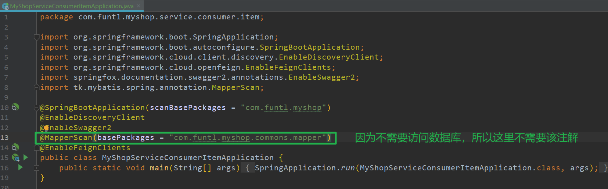

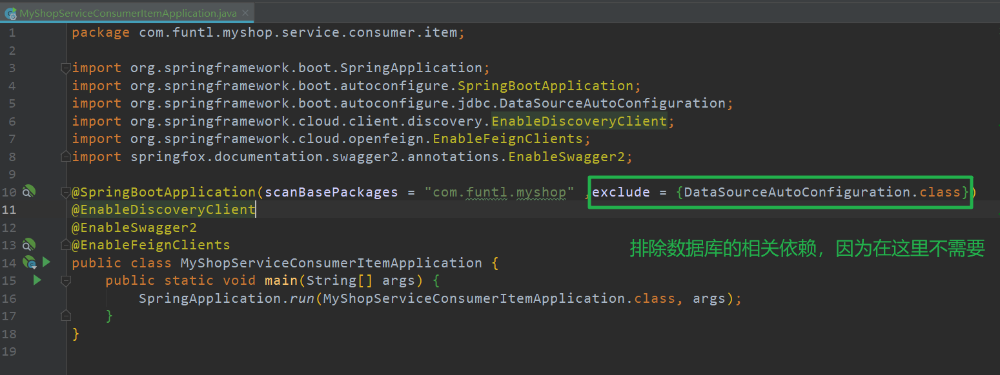

---

## 3. properties

```properties
spring.application.name=myshop-service-consumer-item-config
spring.cloud.nacos.config.file-extension=yaml
spring.cloud.nacos.config.server-addr=192.168.1.18:8848
```

## 4.新增nacos配置

**Data ID:**myshop-service-consumer-item-config.yaml

**Group:**DEFAULT_GROUP

**配置格式:**YAML

**配置内容:**

```yaml
spring:
  application:
    name: myshop-service-consumer-item
  cloud:
    nacos:
      discovery:
        server-addr: 192.168.1.18:8848
    sentinel:
      transport:
        port: 8719
        dashboard: 192.168.1.18:38080

server:
  port: 10205

management:
  endpoints:
    web:
      exposure:
        include: "*"
```

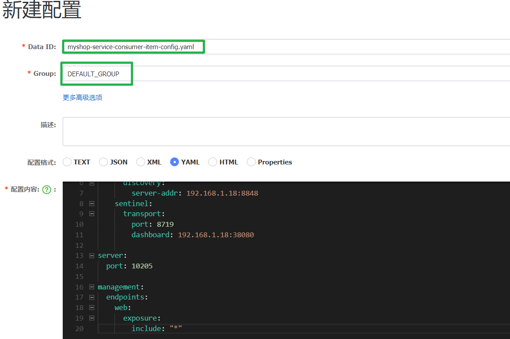


----


TbItemService

```java
package com.funtl.myshop.service.consumer.item.service;

import org.springframework.cloud.openfeign.FeignClient;
import org.springframework.web.bind.annotation.GetMapping;
import org.springframework.web.bind.annotation.PathVariable;

@FeignClient(value = "myshop-service-provider-item")
public interface TbItemService {

    @GetMapping(value = "/item/page/{pageNum}/{pageSize}")
    String page(@PathVariable(name = "pageNum") int pageNum, @PathVariable(name = "pageSize") int pageSize);
}

```

TbItemController

```java
package com.funtl.myshop.service.consumer.item.controller;

import com.fasterxml.jackson.databind.JavaType;
import com.funtl.myshop.commons.domain.TbItem;
import com.funtl.myshop.commons.dto.AbstractBaseResult;
import com.funtl.myshop.commons.utils.MapperUtils;
import com.funtl.myshop.commons.web.AbstractBaseController;
import com.funtl.myshop.service.consumer.item.service.TbItemService;
import com.github.pagehelper.PageInfo;
import io.swagger.annotations.ApiImplicitParam;
import io.swagger.annotations.ApiImplicitParams;
import io.swagger.annotations.ApiOperation;
import io.swagger.annotations.ApiParam;
import org.springframework.beans.factory.annotation.Autowired;
import org.springframework.web.bind.annotation.GetMapping;
import org.springframework.web.bind.annotation.PathVariable;
import org.springframework.web.bind.annotation.RequestMapping;
import org.springframework.web.bind.annotation.RestController;

@RestController
@RequestMapping(value = "item")
public class TbItemController extends AbstractBaseController<TbItem> {

    @Autowired
    private TbItemService tbItemService;

    @GetMapping(value = "page/{pageNum}/{pageSize}")
    public AbstractBaseResult page(
            @PathVariable int pageNum,
            @PathVariable int pageSize) {

        String json = tbItemService.page(pageNum, pageSize);
        System.out.println(json);
        return null;
    }
}

```

MyShopServiceConsumerItemApplication

```java
package com.funtl.myshop.service.consumer.item;

import com.alibaba.druid.spring.boot.autoconfigure.DruidDataSourceAutoConfigure;
import org.springframework.boot.SpringApplication;
import org.springframework.boot.autoconfigure.SpringBootApplication;
import org.springframework.boot.autoconfigure.jdbc.DataSourceAutoConfiguration;
import org.springframework.cloud.client.discovery.EnableDiscoveryClient;
import org.springframework.cloud.openfeign.EnableFeignClients;
import springfox.documentation.swagger2.annotations.EnableSwagger2;

@SpringBootApplication(scanBasePackages = "com.funtl.myshop" ,exclude = {DataSourceAutoConfiguration.class, DruidDataSourceAutoConfigure.class})
@EnableDiscoveryClient
@EnableSwagger2
@EnableFeignClients
public class MyShopServiceConsumerItemApplication {
    public static void main(String[] args) {
        SpringApplication.run(MyShopServiceConsumerItemApplication.class, args);
    }
}

```

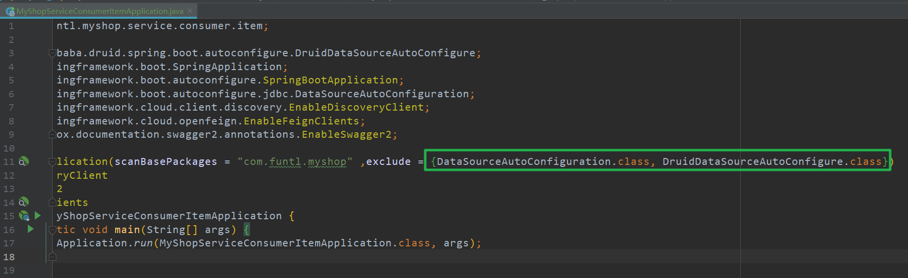

---

启动发现报错

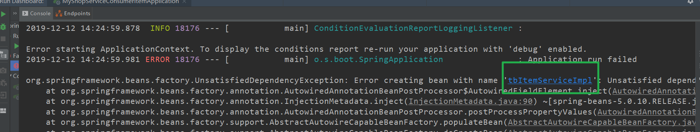

需要重构

---

# 重构商品服务消费者

## 1.myshop-commons-consumer


### pom

```xml
<?xml version="1.0" encoding="UTF-8"?>
<project xmlns="http://maven.apache.org/POM/4.0.0" xmlns:xsi="http://www.w3.org/2001/XMLSchema-instance"
         xsi:schemaLocation="http://maven.apache.org/POM/4.0.0 http://maven.apache.org/xsd/maven-4.0.0.xsd">
    <modelVersion>4.0.0</modelVersion>

    <parent>
        <groupId>com.funtl</groupId>
        <artifactId>myshop-dependencies</artifactId>
        <version>1.0.0-SNAPSHOT</version>
        <relativePath>../myshop-dependencies/pom.xml</relativePath>
    </parent>

    <artifactId>myshop-commons-consumer</artifactId>
    <packaging>jar</packaging>

    <name>myshop-commons-consumer</name>
    <url>http://www.funtl.com</url>
    <inceptionYear>2018-Now</inceptionYear>

    <dependencies>
        <dependency>
            <groupId>com.github.pagehelper</groupId>
            <artifactId>pagehelper-spring-boot-starter</artifactId>
        </dependency>
        <dependency>
            <groupId>io.springfox</groupId>
            <artifactId>springfox-swagger2</artifactId>
        </dependency>
        <dependency>
            <groupId>io.springfox</groupId>
            <artifactId>springfox-swagger-ui</artifactId>
        </dependency>
        <!-- Projects Begin -->
        <dependency>
            <groupId>com.funtl</groupId>
            <artifactId>myshop-commons-domain</artifactId>
            <version>${project.parent.version}</version>
        </dependency>
        <!-- Projects End -->
    </dependencies>
</project>

```


## 2.[myshop-service-consumer-item](https://github.com/funtl/spring-cloud-alibaba-my-shop/tree/master/myshop-service-consumer-item)

### pom

```xml
<?xml version="1.0" encoding="UTF-8"?>
<project xmlns="http://maven.apache.org/POM/4.0.0" xmlns:xsi="http://www.w3.org/2001/XMLSchema-instance"
         xsi:schemaLocation="http://maven.apache.org/POM/4.0.0 http://maven.apache.org/xsd/maven-4.0.0.xsd">
    <modelVersion>4.0.0</modelVersion>

    <parent>
        <groupId>com.funtl</groupId>
        <artifactId>myshop-dependencies</artifactId>
        <version>1.0.0-SNAPSHOT</version>
        <relativePath>../myshop-dependencies/pom.xml</relativePath>
    </parent>

    <artifactId>myshop-service-consumer-item</artifactId>
    <packaging>jar</packaging>

    <name>myshop-service-consumer-item</name>
    <url>http://www.funtl.com</url>
    <inceptionYear>2018-Now</inceptionYear>

    <dependencies>
        <!-- Spring Boot Begin -->
        <dependency>
            <groupId>org.springframework.boot</groupId>
            <artifactId>spring-boot-starter-web</artifactId>
        </dependency>
        <dependency>
            <groupId>org.springframework.boot</groupId>
            <artifactId>spring-boot-starter-actuator</artifactId>
        </dependency>
        <dependency>
            <groupId>org.springframework.boot</groupId>
            <artifactId>spring-boot-starter-test</artifactId>
            <scope>test</scope>
        </dependency>
        <!-- Spring Boot End -->

        <!-- Spring Cloud Begin -->
        <dependency>
            <groupId>org.springframework.cloud</groupId>
            <artifactId>spring-cloud-starter-alibaba-nacos-config</artifactId>
        </dependency>
        <dependency>
            <groupId>org.springframework.cloud</groupId>
            <artifactId>spring-cloud-starter-alibaba-nacos-discovery</artifactId>
        </dependency>
        <dependency>
            <groupId>org.springframework.cloud</groupId>
            <artifactId>spring-cloud-starter-alibaba-sentinel</artifactId>
        </dependency>
        <dependency>
            <groupId>org.springframework.cloud</groupId>
            <artifactId>spring-cloud-starter-openfeign</artifactId>
        </dependency>
        <!-- Spring Cloud End -->

        <!-- Projects Begin -->
        <dependency>
            <groupId>com.funtl</groupId>
            <artifactId>myshop-commons-consumer</artifactId>
            <version>${project.parent.version}</version>
        </dependency>
        <!-- Projects End -->
    </dependencies>

    <build>
        <plugins>
            <plugin>
                <groupId>org.springframework.boot</groupId>
                <artifactId>spring-boot-maven-plugin</artifactId>
                <configuration>
                    <mainClass>com.funtl.myshop.service.consumer.item.MyShopServiceConsumerItemApplication</mainClass>
                </configuration>
            </plugin>
        </plugins>
    </build>
</project>
```

---

### application

```java
package com.funtl.myshop.service.consumer.item;

import org.springframework.boot.SpringApplication;
import org.springframework.boot.autoconfigure.SpringBootApplication;
import org.springframework.boot.autoconfigure.jdbc.DataSourceAutoConfiguration;
import org.springframework.cloud.client.discovery.EnableDiscoveryClient;
import org.springframework.cloud.openfeign.EnableFeignClients;
import springfox.documentation.swagger2.annotations.EnableSwagger2;

@SpringBootApplication(scanBasePackages = "com.funtl.myshop" ,exclude = {DataSourceAutoConfiguration.class})
@EnableDiscoveryClient
@EnableSwagger2
@EnableFeignClients
public class MyShopServiceConsumerItemApplication {
    public static void main(String[] args) {
        SpringApplication.run(MyShopServiceConsumerItemApplication.class, args);
    }
}

```

---

再次启动

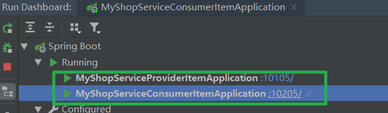

```
http://localhost:10205/item/page/1/10
```


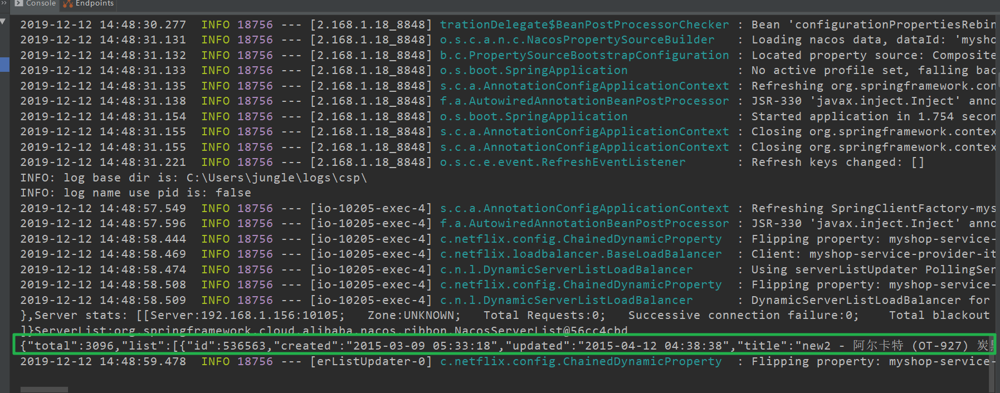

---

## 3.继续改进


```java
package com.funtl.myshop.service.consumer.item.controller;

import com.fasterxml.jackson.databind.JavaType;
import com.funtl.myshop.commons.domain.TbItem;
import com.funtl.myshop.commons.dto.AbstractBaseResult;
import com.funtl.myshop.commons.utils.MapperUtils;
import com.funtl.myshop.commons.web.AbstractBaseController;
import com.funtl.myshop.service.consumer.item.service.TbItemService;
import com.github.pagehelper.PageInfo;
import io.swagger.annotations.ApiImplicitParam;
import io.swagger.annotations.ApiImplicitParams;
import io.swagger.annotations.ApiOperation;
import io.swagger.annotations.ApiParam;
import org.springframework.beans.factory.annotation.Autowired;
import org.springframework.web.bind.annotation.GetMapping;
import org.springframework.web.bind.annotation.PathVariable;
import org.springframework.web.bind.annotation.RequestMapping;
import org.springframework.web.bind.annotation.RestController;

@RestController
@RequestMapping(value = "item")
public class TbItemController extends AbstractBaseController<TbItem> {

    @Autowired
    private TbItemService tbItemService;

    @GetMapping(value = "page/{pageNum}/{pageSize}")
    public AbstractBaseResult page(
            @PathVariable int pageNum,
            @PathVariable int pageSize) {

        String json = tbItemService.page(pageNum, pageSize);
        try {
            JavaType javaType = MapperUtils.getCollectionType(PageInfo.class, TbItem.class);
            PageInfo<TbItem> pageInfo = MapperUtils.getInstance().readValue(json, javaType);
            return success(request.getRequestURI(), pageInfo.getNextPage(), pageInfo.getPages(), pageInfo.getList());
        } catch (Exception e) {
            e.printStackTrace();
        }
        return null;
    }
}

```

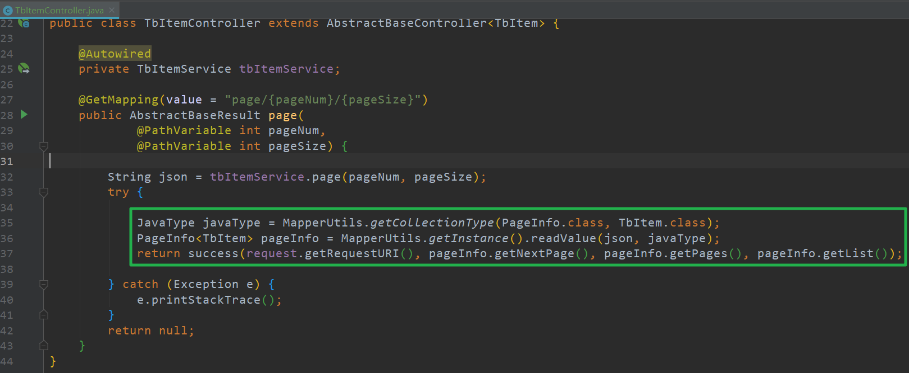

启动

```
http://localhost:10205/item/page/1/10
```

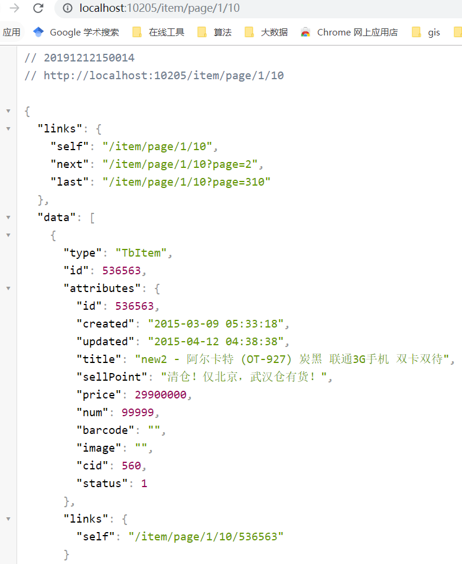

---

## 4.添加Swagger2

```java
package com.funtl.myshop.service.consumer.item.controller;

import com.fasterxml.jackson.databind.JavaType;
import com.funtl.myshop.commons.domain.TbItem;
import com.funtl.myshop.commons.dto.AbstractBaseResult;
import com.funtl.myshop.commons.utils.MapperUtils;
import com.funtl.myshop.commons.web.AbstractBaseController;
import com.funtl.myshop.service.consumer.item.service.TbItemService;
import com.github.pagehelper.PageInfo;
import io.swagger.annotations.ApiImplicitParam;
import io.swagger.annotations.ApiImplicitParams;
import io.swagger.annotations.ApiOperation;
import io.swagger.annotations.ApiParam;
import org.springframework.beans.factory.annotation.Autowired;
import org.springframework.web.bind.annotation.GetMapping;
import org.springframework.web.bind.annotation.PathVariable;
import org.springframework.web.bind.annotation.RequestMapping;
import org.springframework.web.bind.annotation.RestController;

@RestController
@RequestMapping(value = "item")
public class TbItemController extends AbstractBaseController<TbItem> {

    @Autowired
    private TbItemService tbItemService;

    @ApiOperation(value = "商品分页查询")
    @ApiImplicitParams({
            @ApiImplicitParam(name = "pageNum", value = "页码", required = true, paramType = "path"),
            @ApiImplicitParam(name = "pageSize", value = "笔数", required = true, paramType = "path")
    })
    @GetMapping(value = "page/{pageNum}/{pageSize}")
    public AbstractBaseResult page(
            @PathVariable int pageNum,
            @PathVariable int pageSize) {

        String json = tbItemService.page(pageNum, pageSize);
        try {

            JavaType javaType = MapperUtils.getCollectionType(PageInfo.class, TbItem.class);
            PageInfo<TbItem> pageInfo = MapperUtils.getInstance().readValue(json, javaType);
            return success(request.getRequestURI(), pageInfo.getNextPage(), pageInfo.getPages(), pageInfo.getList());

        } catch (Exception e) {
            e.printStackTrace();
        }
        return null;
    }
}

```

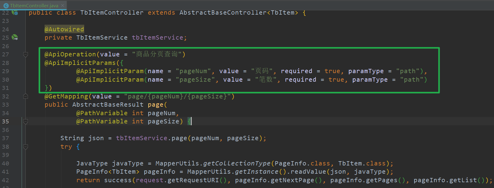

---

```
http://localhost:10205/swagger-ui.html
```

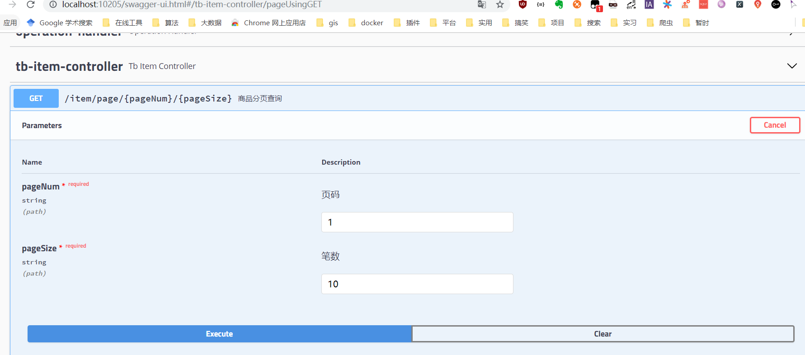

----


# 创建路由网关统一访问接口

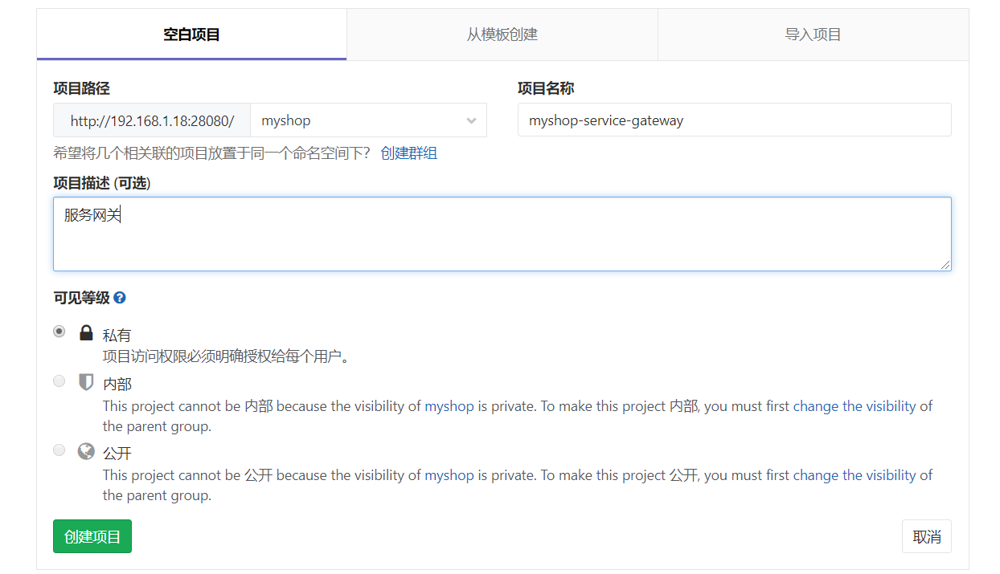

## 1.MyShopServiceGatewayApplication

```java
package com.funtl.myshop.service.gateway;

import org.springframework.boot.SpringApplication;
import org.springframework.boot.autoconfigure.SpringBootApplication;
import org.springframework.cloud.client.discovery.DiscoveryClient;
import org.springframework.cloud.client.discovery.EnableDiscoveryClient;
import org.springframework.cloud.gateway.discovery.DiscoveryClientRouteDefinitionLocator;
import org.springframework.cloud.gateway.discovery.DiscoveryLocatorProperties;
import org.springframework.cloud.gateway.route.RouteDefinitionLocator;
import org.springframework.cloud.openfeign.EnableFeignClients;
import org.springframework.context.annotation.Bean;
import org.springframework.http.HttpHeaders;
import org.springframework.http.HttpMethod;
import org.springframework.http.HttpStatus;
import org.springframework.http.codec.ServerCodecConfigurer;
import org.springframework.http.codec.support.DefaultServerCodecConfigurer;
import org.springframework.http.server.reactive.ServerHttpRequest;
import org.springframework.http.server.reactive.ServerHttpResponse;
import org.springframework.web.cors.reactive.CorsUtils;
import org.springframework.web.server.ServerWebExchange;
import org.springframework.web.server.WebFilter;
import org.springframework.web.server.WebFilterChain;
import reactor.core.publisher.Mono;

@SpringBootApplication
@EnableDiscoveryClient
@EnableFeignClients
public class MyShopServiceGatewayApplication {

    // ----------------------------- 解决跨域 Begin -----------------------------

    private static final String ALL = "*";
    private static final String MAX_AGE = "18000L";

    @Bean
    public RouteDefinitionLocator discoveryClientRouteDefinitionLocator(DiscoveryClient discoveryClient, DiscoveryLocatorProperties properties) {
        return new DiscoveryClientRouteDefinitionLocator(discoveryClient, properties);
    }

    @Bean
    public ServerCodecConfigurer serverCodecConfigurer() {
        return new DefaultServerCodecConfigurer();
    }

    @Bean
    public WebFilter corsFilter() {
        return (ServerWebExchange ctx, WebFilterChain chain) -> {
            ServerHttpRequest request = ctx.getRequest();
            if (!CorsUtils.isCorsRequest(request)) {
                return chain.filter(ctx);
            }
            HttpHeaders requestHeaders = request.getHeaders();
            ServerHttpResponse response = ctx.getResponse();
            HttpMethod requestMethod = requestHeaders.getAccessControlRequestMethod();
            HttpHeaders headers = response.getHeaders();
            headers.add(HttpHeaders.ACCESS_CONTROL_ALLOW_ORIGIN, requestHeaders.getOrigin());
            headers.addAll(HttpHeaders.ACCESS_CONTROL_ALLOW_HEADERS, requestHeaders.getAccessControlRequestHeaders());
            if (requestMethod != null) {
                headers.add(HttpHeaders.ACCESS_CONTROL_ALLOW_METHODS, requestMethod.name());
            }
            headers.add(HttpHeaders.ACCESS_CONTROL_ALLOW_CREDENTIALS, "true");
            headers.add(HttpHeaders.ACCESS_CONTROL_EXPOSE_HEADERS, ALL);
            headers.add(HttpHeaders.ACCESS_CONTROL_MAX_AGE, MAX_AGE);
            if (request.getMethod() == HttpMethod.OPTIONS) {
                response.setStatusCode(HttpStatus.OK);
                return Mono.empty();
            }
            return chain.filter(ctx);
        };
    }

    // ----------------------------- 解决跨域 End -----------------------------

    public static void main(String[] args) {
        SpringApplication.run(MyShopServiceGatewayApplication.class, args);
    }
}

```

---

## 2.application.yml

```yaml
spring:
  application:
    name: myshop-service-gateway
  jackson:
    date-format: yyyy-MM-dd HH:mm:ss
    time-zone: GMT+8
    default-property-inclusion: non_null
  cloud:
    nacos:
      discovery:
        server-addr: 192.168.1.18:8848
    sentinel:
      transport:
        port: 8721
        dashboard: 192.168.1.18:38080
    gateway:
      discovery:
        locator:
          enabled: true
      routes:
        - id: MYSHOP-SERVICE-CONSUMER-ITEM
          uri: lb://myshop-service-consumer-item
          predicates:
            # 路径匹配，以 api 开头，直接配置是不生效的，看 filters 配置
            - Path=/api/item/**
          filters:
            # 前缀过滤，默认配置下，我们的请求路径是 http://localhost:9000/myshop-service-consumer-item/** 这时会路由到指定的服务
            # 此处配置去掉 1 个路径前缀，再配置上面的 Path=/api/**，就能按照 http://localhost:9000/api/** 的方式访问了
            - StripPrefix=1
        - id: MYSHOP-SERVICE-REG
          uri: lb://myshop-service-reg
          predicates:
            - Path=/api/reg/**
          filters:
            - StripPrefix=1

server:
  port: 9000

feign:
  sentinel:
    enabled: true

management:
  endpoints:
    web:
      exposure:
        include: "*"

logging:
  level:
    org.springframework.cloud.gateway: debug

```


```
http://localhost:10105/item/page/1/10
```

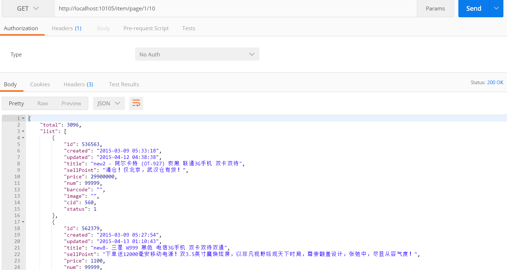

```
http://localhost:9000/api/item/page/1/10
```

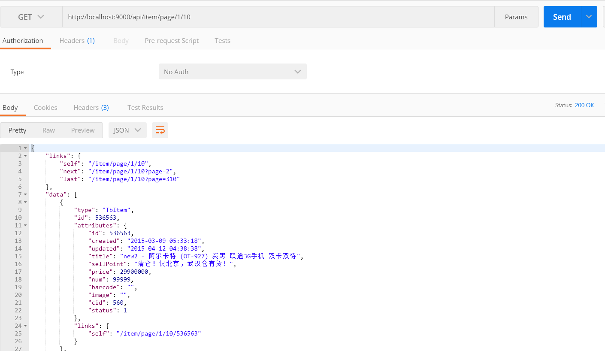


---

RegController

```java
package com.funtl.myshop.service.reg.controller;

import com.funtl.myshop.commons.domain.TbUser;
import com.funtl.myshop.commons.dto.AbstractBaseResult;
import com.funtl.myshop.commons.dto.BaseResultFactory;
import com.funtl.myshop.commons.service.TbUserService;
import com.funtl.myshop.commons.validator.BeanValidator;
import com.funtl.myshop.commons.web.AbstractBaseController;
import com.funtl.myshop.service.reg.service.RegService;
import io.swagger.annotations.ApiOperation;
import io.swagger.annotations.ApiParam;
import org.apache.commons.lang3.StringUtils;
import org.springframework.beans.factory.annotation.Autowired;
import org.springframework.util.DigestUtils;
import org.springframework.web.bind.annotation.*;


@RestController
@RequestMapping(value = "reg")

public class RegController extends AbstractBaseController<TbUser> {

    @Autowired
    private TbUserService tbUserService;

    @Autowired
    private RegService regService;

    @ApiOperation(value = "用户注册", notes = "以实体类为参数，注意用户名和邮箱不要重复")//value是方法是干什么的，notes是说明
    @PostMapping(value = "user")
   public AbstractBaseResult reg(@ApiParam(name = "tbUser", value = "用户模型")TbUser tbUser) {//参数说明

        //数据校验
        String message = BeanValidator.validator(tbUser);

        if (StringUtils.isNoneBlank(message)) {

            return error(message, null);
        }


        // 验证用户名是否重复
        if (!tbUserService.unique("username", tbUser.getUsername())) {

            return error("用户名已存在", null);
        }

        // 验证邮箱是否重复
        if (!tbUserService.unique("email", tbUser.getEmail())) {
            return error("邮箱重复，请重试", null);
        }

        //注册用户
        tbUser.setPassword(DigestUtils.md5DigestAsHex(tbUser.getPassword().getBytes()));
        TbUser user = tbUserService.save(tbUser);

        if (user != null) {

            regService.sendEmail(user);
            return success(request.getRequestURI(),user);
        }

        // 注册失败
        return error("注册失败，请重试", null);
    }
}

```

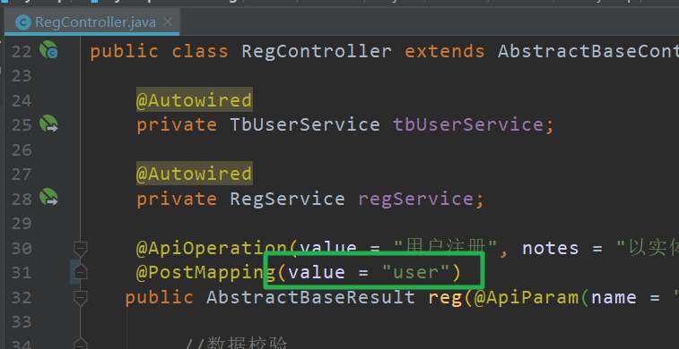


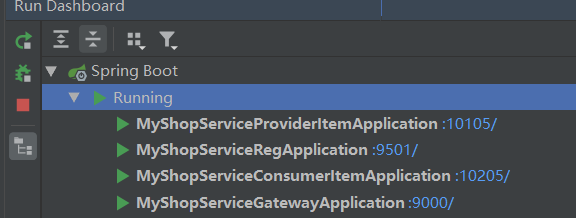

```
http://localhost:9000/api/reg/user
```

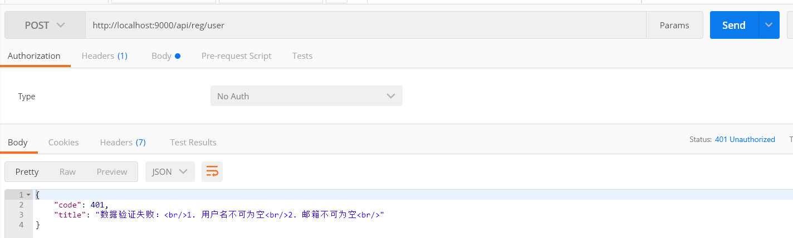

---

# 创建前后分离管理后台

## 1.克隆模板到本地

- 克隆 [vue-element-admin](https://github.com/PanJiaChen/vue-element-admin) 完整模板到本地，主要作用是方便我们直接拿组件到项目中使用

```bash
git clone https://github.com/PanJiaChen/vue-element-admin.git
```

- 克隆 [vue-admin-template](https://github.com/PanJiaChen/vue-admin-template) 基础模板到本地，主要作用是创建一个最简单的项目后台，再根据需求慢慢完善功能

```bash
git clone https://github.com/PanJiaChen/vue-admin-template.git
```

---

## 2.创建项目管理后台

### 创建项目管理后台

将 `vue-admin-template` 项目模板（除取.git）复制一份出来修改目录名为 `vue-admin-myshop`，进入 `vue-admin-myshop` 目录，修改 `package.json` 配置文件为如下内容：

```json
{
  "name": "vue-admin-myshop",
  "version": "1.0.0",
  "description": "",
  "author": "Jungle <junglegodlion@163.com>",
  "license": "MIT",
  "scripts": {
    "dev": "vue-cli-service serve",
    "build:prod": "vue-cli-service build",
    "build:stage": "vue-cli-service build --mode staging",
    "preview": "node build/index.js --preview",
    "lint": "eslint --ext .js,.vue src",
    "test:unit": "jest --clearCache && vue-cli-service test:unit",
    "test:ci": "npm run lint && npm run test:unit",
    "svgo": "svgo -f src/icons/svg --config=src/icons/svgo.yml"
  },
  "dependencies": {
    "axios": "0.18.1",
    "element-ui": "2.7.2",
    "js-cookie": "2.2.0",
    "normalize.css": "7.0.0",
    "nprogress": "0.2.0",
    "path-to-regexp": "2.4.0",
    "vue": "2.6.10",
    "vue-router": "3.0.6",
    "vuex": "3.1.0"
  },
  "devDependencies": {
    "@babel/core": "7.0.0",
    "@babel/register": "7.0.0",
    "@vue/cli-plugin-babel": "3.6.0",
    "@vue/cli-plugin-eslint": "^3.9.1",
    "@vue/cli-plugin-unit-jest": "3.6.3",
    "@vue/cli-service": "3.6.0",
    "@vue/test-utils": "1.0.0-beta.29",
    "autoprefixer": "^9.5.1",
    "babel-core": "7.0.0-bridge.0",
    "babel-eslint": "10.0.1",
    "babel-jest": "23.6.0",
    "chalk": "2.4.2",
    "connect": "3.6.6",
    "eslint": "5.15.3",
    "eslint-plugin-vue": "5.2.2",
    "html-webpack-plugin": "3.2.0",
    "mockjs": "1.0.1-beta3",
    "node-sass": "^4.9.0",
    "runjs": "^4.3.2",
    "sass-loader": "^7.1.0",
    "script-ext-html-webpack-plugin": "2.1.3",
    "script-loader": "0.7.2",
    "serve-static": "^1.13.2",
    "svg-sprite-loader": "4.1.3",
    "svgo": "1.2.2",
    "vue-template-compiler": "2.6.10"
  },
  "engines": {
    "node": ">=8.9",
    "npm": ">= 3.0.0"
  },
  "browserslist": [
    "> 1%",
    "last 2 versions"
  ]
}

```

说明：主要是将项目信息修改为自己的

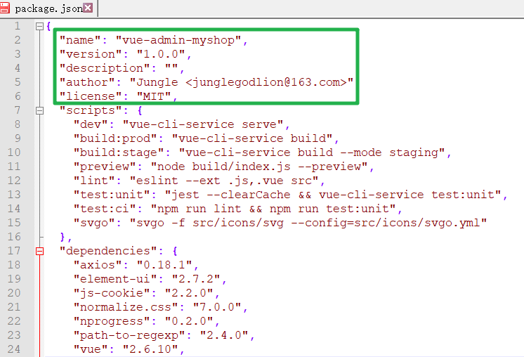

---

## 3.构建并运行

```shell
# 建议不要用 cnpm  安装有各种诡异的 bug 可以通过如下操作解决 npm 速度慢的问题
npm install --registry=https://registry.npm.taobao.org

# Serve with hot reload at localhost:9528
npm run dev
```

---

